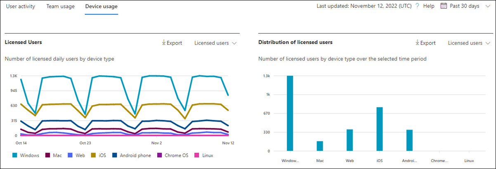

# Microsoft 365 Reports in the admin center - Microsoft Teams device usage

The Microsoft 365 **Reports** dashboard shows you the activity overview across the products in your organization. It enables you to drill in to individual product level reports to give you more granular insight about the activities within each product. Check out [the Reports overview topic](activity-reports.md). In the Microsoft Teams app usage report, you can gain insights into the Microsoft Teams apps that are used in your organization.
  
> [!NOTE]
> You must be a global administrator, global reader or reports reader in Microsoft 365 or an Exchange, SharePoint, Teams Service, Teams Communications, or Skype for Business administrator to see reports.  
 
## How to get to the Microsoft Teams app usage report

1. In the admin center, go to the **Reports** \> <a href="https://go.microsoft.com/fwlink/p/?linkid=2074756" target="_blank">Usage</a> page. 
2. From the dashboard homepage, click on the **View more** button on the Microsoft Teams activity card.
  
## Interpret the Microsoft Teams app usage report

You can view the device use in the Teams report by choosing the **Device usage** tab. 

Select **Choose columns** to add or remove columns from the report.    

You can also export the report data into an Excel .csv file by selecting the **Export** link. This exports data of all users and enables you to do simple sorting and filtering for further analysis. If you have less than 2000 users, you can sort and filter within the table in the report itself. If you have more than 2000 users, in order to filter and sort, you will need to export the data. 
  
|Item|Description|
|:-----|:-----|
|**Metric**|**Definition**|
|User name    |The display name of the user.    |
|Windows    |Selected if the user was active in the Teams desktop client on a Windows-based computer.    |
|Mac    |Selected if the user was active in the Teams desktop client on a macOS computer.    |
|iOS    |Selected if the user was active on the Teams mobile client for iOS.    |
|Android phone    | Selected if the user was active on the Teams mobile client for Android.    |
|Chrome OS    |Selected if the user was active in the Teams desktop client on a ChromeOS computer.|
|Linux    | Selected if the user was active in the Teams desktop client on a Linux computer.    |
|Web    |Selected if the user was active in the Teams web client on devices.|
|Last activity date (UTC)    |The last date (UTC) that the user participated in a Teams activity .    |
|Is licensed|Selected if the user is licensed to use Teams.|
|Total Teams activity|Total number of Teams activities over the selected time period. |
|||