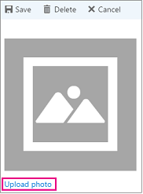

# Enter your business information

In Microsoft Bookings, the Business Information page within the web app contains all the details that you'd typically find on a business' "About us" page. These details include your a relevant name, address, phone number, web site URL, privacy policy URL, logo, and business hours.

The information you provide here will be displayed on the page customers and clients use to book appointments (known as the booking page) and in messages and reminders sent to them by Bookings. An example of this information on the booking page is highlighted below.

   

> [!NOTE]
> Bookings is turned on by default for customers who have the Microsoft 365 Business Standard, Microsoft 365 A3, or Microsoft 365 A5 subscriptions. Bookings is also available to customers who have Office 365 Enterprise E3 and Office 365 Enterprise E5, but it is turned off by default. To turn it on, see [Get access to Microsoft Bookings](get-access.md).

## Provide business name and contact information

1. In Microsoft 365, select the App launcher, and then select **Bookings**.

1. In the navigation pane, select **Business information**.

1. Enter the relevant name, address, and phone number you would like to use for your Bookings calendar.

1. In **Send customer replies to**, type the preferred email address where email replies to booking confirmations and reminders should be forwarded.

1. In the **Website URL** field, enter the URL of the home page for your business.

1. Enter the **privacy policy** and **terms & conditions** URLs.

1. Select **Save**.

   

## Set your business hours

By default, the business hours in the Bookings app are set to 8 a.m. to 5 p.m., Monday through Friday. Times are provided in 15-minute increments. The Bookings app uses the 12-hour clock.

Set **business hours** to your operational hours. These are the hours to which all bookings are restricted. Additional time restrictions of when appointments can be booked can be set for each service and for each staff member in the Services and Staff pages, respectively.

1. On the Business information page, under Business hours, use the dropdowns to select start and end times for each day.

1. Click **+** to add start- and end-time selectors.

## How to set hours for a split shift

You might need to block out a portion of each day or week to have staff meetings, update inventory, or take care of other rhythm-of-business details. The Bookings app allows you to limit customer appointments to your specified time slots.

For example, you have staff meetings every Thursday from 1 o'clock to 2:30 and want to block out that time so all of your staff members can attend. To do this:

1. On the Business information page, under Business hours, select a start and end time for Thursdays. In this example we'll set 8:00 a.m. to 1:00 p.m.

1. Select **+** to create a new row for Thursday.

   

1. In the new row, select 2:30 p.m. for the start time and 6:00 p.m. for the end time.

   

1. Select Save.

   

    When a customer goes to your booking page, he or she will see that your business is closed from 1 to 2:30 on Thursdays.

## Upload your logo

If you haven't already uploaded your business logo to the Bookings app, you can do it from the Business information page.

1. On the Business information page, under Upload logo, click **Change**.

1. Select **Upload photo**.

   

1. Select Save.
