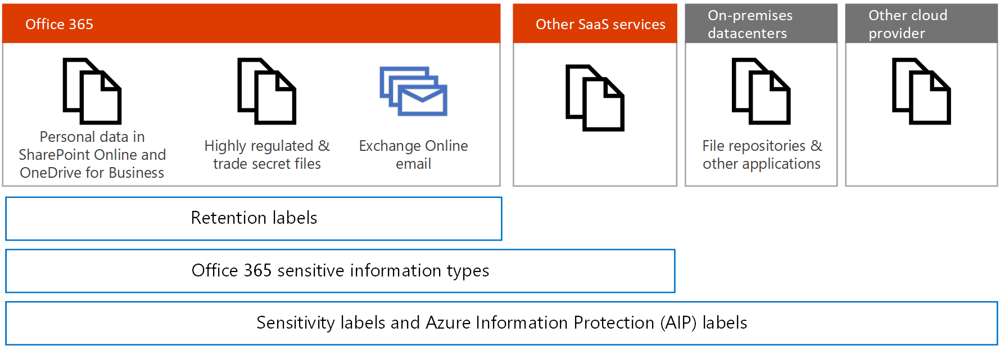
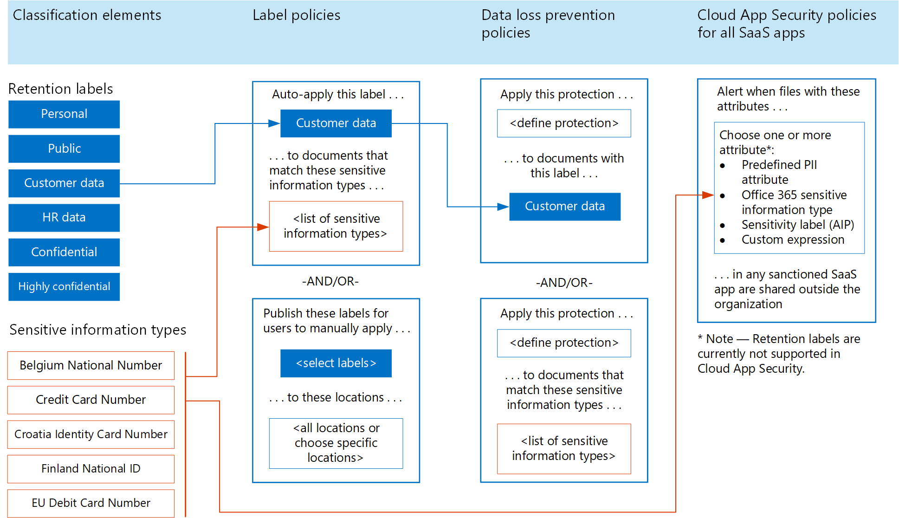
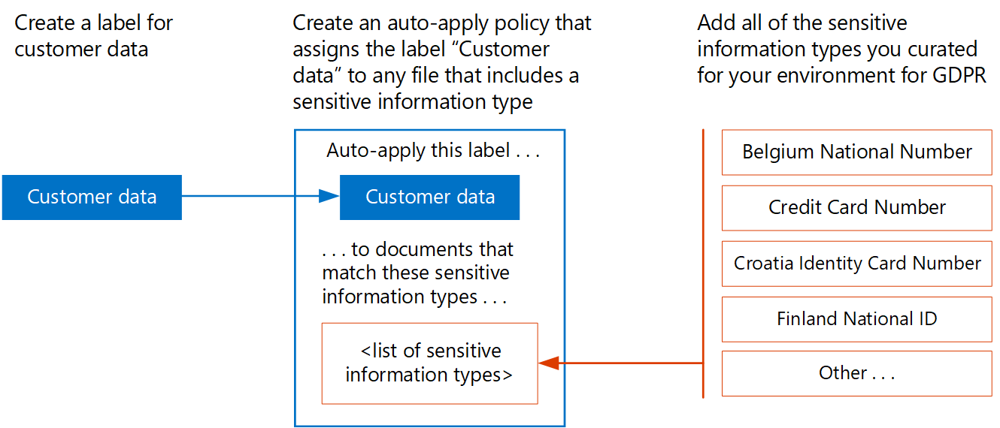

# Apply labels to personal data

 Use this topic if you're using classification labels as part of your GDPR protection plan. 

If you're using labels for protection of personal data in Microsoft 365, Microsoft recommends you start with [retention labels](retention.md). With retention labels, you can:
- Use Advanced Data Governance to automatically apply labels based on sensitive information types or other criteria.
- Use retention labels with data loss prevention to apply protection. 
- Use labels with eDiscovery and Content Search. 

Cloud App Security doesn't currently support retention labels, but you can use Microsoft 365 sensitive information types with Cloud App Security to monitor personal data that resides in other SaaS apps.

[Sensitivity labels](sensitivity-labels.md) are currently recommended for applying labels to files on premises and in other cloud services and providers. These are also recommended for files in Microsoft 365 that require Azure Information Protection encryption for data protection, such as trade secret files.

At this time, using Azure Information Protection to apply encryption is not recommended for files in Microsoft 365 with data that is subject to the GDPR. Microsoft 365 services currently cannot read into AIP-encrypted files. Therefore, the service can't find sensitive data in these files.

Retention labels can be applied to mail in Exchange Online and these labels work with Microsoft 365 data loss prevention. 

In the illustration:

-   Use retention labels for personal data and for highly regulated and trade secret files in SharePoint Online and OneDrive for Business.
-   Microsoft 365 sensitive information types can be used within Microsoft 365 and with Cloud App Security to monitor personal data that resides in other SaaS apps.
-   Use sensitivity labels for highly regulated and trade secret files, Exchange Online email, files in other SaaS services, files in on-premises datacenters, and files in other cloud providers.

## Use retention labels and sensitive information types across Microsoft 365 for information protection

The following illustration shows how retention labels and sensitive information types can be used in label policies, data loss prevention policies, and with Cloud App Security policies.

For accessibility, the following table provides the same examples in the illustration.

<table>
<thead>
<tr class="header">
<th align="left"><strong>Classification elements</strong></th>
<th align="left"><strong>Label policies — 2 examples</strong></th>
<th align="left"><strong>Data loss prevention policies — 2 examples</strong></th>
<th align="left"><strong>Cloud App Security policies for all SaaS apps — 1 example</strong></th>
</tr>
</thead>
<tbody>
<tr class="odd">
<td align="left">Retention labels. Examples: Personal, Public, Customer data, HR data, Confidential, Highly confidential</td>
<td align="left">
Auto apply this label . . .

Customer data

. . . to documents that match these sensitive information types . . .

&lt;list of example sensitive information types&gt;
</td>
<td align="left">
Apply this protection . . .

&lt;define protection&gt;

. . . to documents with this label . . .

Customer data
</td>
<td align="left">
Alert when files with these attributes . . .

Choose one or more attributes: predefined PII attribute, Microsoft 365 sensitive information type, sensitivity label (AIP), custom expression

. . . in any sanctioned SaaS app are shared outside the organization

Note: Retention labels are currently not supported in Cloud App Security.</td>
</tr>
<tr class="even">
<td align="left">Sensitive information types. Examples: Belgium National Number, Credit Card Number, Croatia Identity Cart Number, Finland National ID</td>
<td align="left">
Publish these labels for users to manually apply . . .

&lt;select labels&gt;

. . . to these locations . . .

&lt;all locations or choose specific locations&gt;
</td>
<td align="left">
Apply this protection . . .

&lt;define protection&gt;

. . . to documents that match these sensitive information types&gt;
</td>
<td align="left"></td>
</tr>
</tbody>
</table>

## Prioritize auto-apply label policies

For personal data that is subject to GDPR, Microsoft recommends auto-applying labels by using the sensitive information types you curated for your environment. It is important that auto-apply label policies are well designed and tested to ensure the intended behavior occurs.

The order that auto-apply policies are created and whether users are also applying these labels affect the result. So, it's important to carefully plan the roll-out. Here's what you need to know.

### One label at a time

You can only assign one label to a document.

### Older auto-apply policies win

If there are multiple rules that assign an auto-apply label and content meets the conditions of multiple rules, the label for the oldest rule is assigned. For this reason, it's important to plan the label policies carefully before configuring them. If an organization requires a change to the priority of the label policies, they'll need to delete and recreate them.

### Manual user-applied labels trump auto-applied labels

Manual user applied labels trump auto-applied labels. Auto-apply policies can't replace a label that is already applied by a user. Users can replace labels that are auto-applied.

### Auto-assigned labels can be updated

Auto-assigned labels can be updated by either newer label policies or by updates to existing policies.

Be sure your plan for implementing labels includes:

- Prioritizing the order that auto-apply policies are created.

- Allowing enough time for labels to be automatically applied before rolling these out for users to manually apply. It can take up to seven days for the labels to be applied to all content that matches the conditions.

### Example priority for creating the auto-apply policies

<table>
<thead>
<tr class="header">
<th align="left"><strong>Labels</strong></th>
<th align="left"><strong>Priority order to create auto-apply policies</strong></th>
</tr>
</thead>
<tbody>
<tr class="odd">
<td align="left">Human Resources — Employee Data</td>
<td align="left">1</td>
</tr>
<tr class="even">
<td align="left">Customer Data</td>
<td align="left">2</td>
</tr>
<tr class="odd">
<td align="left">Highly Confidential</td>
<td align="left">3</td>
</tr>
<tr class="even">
<td align="left">Human Resources — Salary Data</td>
<td align="left">4</td>
</tr>
<tr class="odd">
<td align="left">Confidential</td>
<td align="left">5</td>
</tr>
<tr class="even">
<td align="left">Public</td>
<td align="left">6</td>
</tr>
<tr class="odd">
<td align="left">Personal</td>
<td align="left">No auto-apply policy</td>
</tr>
</tbody>
</table>

## Create labels and auto-apply label policies

Create labels and policies in the security center or the compliance center.

<table>
<thead>
<tr class="header">
<th align="left"><strong>Step</strong></th>
<th align="left"><strong>Description</strong></th>
</tr>
</thead>
<tbody>
<tr class="odd">
<td align="left">
Give permissions to members of your compliance team.
</td>
<td align="left">
Members of your compliance team who will create labels need permissions to use the security center and/or the compliance center. Go to Permissions in the security center or the compliance center and modify the members of the Compliance Administrator group.

See <a href="https://docs.microsoft.com/microsoft-365/security/office-365-security/grant-access-to-the-security-and-compliance-center">Give users access to the security center and/or the compliance center</a>.
</td>
</tr>
<tr class="even">
<td align="left">
Create retention labels.
</td>
<td align="left">Go to Classifications in the Security center or the Compliance center, choose Retention labels, and create the labels for your environment.</td>
</tr>
<tr class="odd">
<td align="left">
Create auto-apply policies for labels.
</td>
<td align="left">Go to Classification in security center or the compliance center, choose Label policies, and create the policies for auto-applying labels. Be sure to create these policies in the prioritized order.</td>
</tr>
</tbody>
</table>

The following illustration shows how to create an auto-apply label for the Customer data label.

In the illustration:

- The "Customer data" label is created.

- The desired sensitive information types for GDPR are listed: Belgium National Number, Credit Card Number, Croatia Identity Card Number, Finland National ID.

- Create an auto-apply policy assigns the label "Customer data" to any file that includes one of the sensitive information types that you add to the policy.
