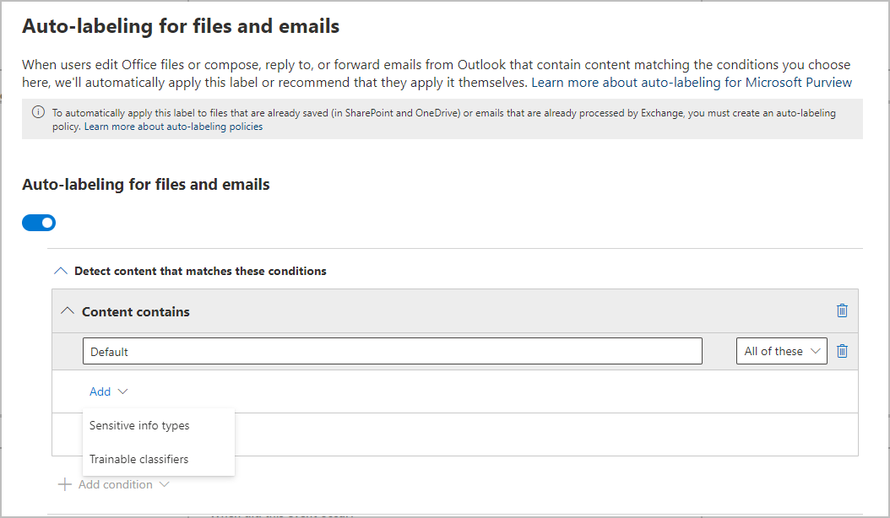
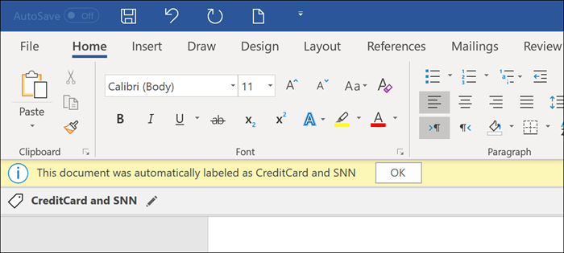

# Apply a sensitivity label to content automatically

When you create a sensitivity label, you can automatically assign that label to content when it contains sensitive information, or you can prompt users to apply the label that you recommend.

The ability to apply sensitivity labels to content automatically is important because:

- You don't need to train your users on all of your classifications.

- You don't need to rely on users to classify all content correctly.

- Users no longer need to know about your policies — they can instead focus on their work.

Automatic labeling in Office apps for Windows is supported by the Azure Information Protection unified labeling client. For built-in labeling in Office apps, this capability is [in preview for some apps](sensitivity-labels-office-apps.md#support-for-sensitivity-label-capabilities-in-apps).

The auto-labeling settings for Office apps are available when you [create or edit a sensitivity label](create-sensitivity-labels.md):

## How to configure auto-labeling for Office apps

One of the most powerful features of sensitivity labels is the ability to apply them automatically to content that matches certain conditions. In this case, people in your organization don't need to apply the sensitivity labels — Office 365 does the work for them.

You can choose to apply sensitivity labels to content automatically when that content contains specific types of sensitive information. Choose from a list of sensitive info types or classifers:

> [!NOTE]
> Currently, the option for **Classifers** is in preview and requires you to submit a form to Microsoft to enable this capability for your tenant. For more information, see the blog post [Machine Learning based Automatic and recommended labeling on Office Apps](https://microsoft-my.sharepoint.com/:w:/p/shpalta/EZ0miKtkub1DlqFXj8Drl-sBNQdrXfyRseeUnLR6d74wwA?e=d8zFge&CID=275B0D45-9CC7-4B12-A7C2-C3A595B3C230).

When this sensitivity label is automatically applied, the user sees a notification in their Office app. They can choose **OK** to dismiss the notification.

### Configuring sensitive info types for a label

When you select the **Sensitive info types** option, you see the same list of sensitive information types as when you create a data loss prevention (DLP) policy. So you can, for example, automatically apply a Highly Confidential label to any content that contains customers' personally identifiable information (PII), such as credit card numbers or social security numbers:

After you select your sensitive information types, you can refine your condition by changing the instance count or match accuracy. For more information, see [Tuning rules to make them easier or harder to match](data-loss-prevention-policies.md#tuning-rules-to-make-them-easier-or-harder-to-match).

Further, you can choose whether a condition must detect all sensitive information types, or just one of them. And to make your conditions more flexible or complex, you can add groups and use logical operators between the groups. For more information, see [Grouping and logical operators](data-loss-prevention-policies.md#grouping-and-logical-operators).

### Configuring classifers for a label

When you select the **Classifers** option, select one or more of the built-in classifiers:

For more information about these classifers, see [Getting started with trainable classifiers (preview)](classifier-getting-started-with.md).

During the preview period, the following apps support classifers for sensitivity labels:

- Office 365 ProPlus desktop apps for Windows, from [Office Insider](https://office.com/insider):
    - Word
    - Excel
    - PowerPoint

- Office for the web apps, when you have [enabled sensitivity labels for Office files in SharePoint and OneDrive (public preview)](sensitivity-labels-sharepoint-onedrive-files.md):
    - Word
    - Excel
    - PowerPoint
    - Outlook

## Recommend that the user apply a sensitivity label

If you prefer, you can recommend to your users that they apply the label. With this option, your users can accept the classification and any associated protection, or dismiss the recommendation if the label isn't suitable for their content.

Recommended labels are supported for Word, PowerPoint, and Excel.

Here's an example of a prompt when you configure a condition to apply a label as a recommended action, with a custom policy tip. You can choose what text is displayed in the policy tip.

## How automatic or recommended labels are applied

- Automatic labeling applies to Word, Excel, and PowerPoint when you save a document, and to Outlook when you send an email. These conditions detect sensitive information in the body text in documents and emails, and to headers and footers — but not in the subject line or attachments of email.

- You can't use automatic labeling for documents and emails that were previously manually labeled, or previously automatically labeled with a higher sensitivity. Remember, you can only apply a single sensitivity label to a document or email (in addition to a single retention label).

- Recommended labeling applies to Word, Excel, and PowerPoint when you save documents.

- You can't use recommended labeling for documents that were previously labeled with a higher sensitivity. When the content's already labeled with a higher sensitivity, the user won't see the prompt with the recommendation and policy tip.

## How multiple conditions are evaluated when they apply to more than one label

The labels are ordered for evaluation according to their position that you specify in the policy: The label positioned first has the lowest position (least sensitive) and the label positioned last has the highest position (most sensitive). For more information on priority, see [Label priority (order matters)](sensitivity-labels.md#label-priority-order-matters).

## Don't configure a parent label to be applied automatically or recommended

Remember, you can't apply a parent label (a label with sublabels) to content. Make sure that you don't configure a parent label to be auto-applied or recommended, because the parent label won't be applied to content in Office apps that use the Azure Information Protection unified labeling client. For more information on parent labels and sublabels, see [Sublabels (grouping labels)](sensitivity-labels.md#sublabels-grouping-labels).
