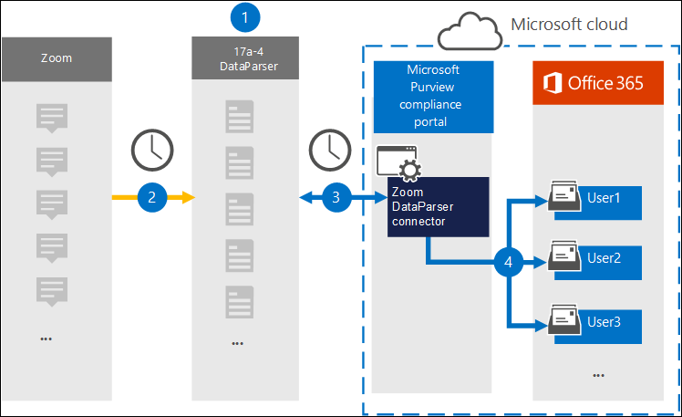

# Set up a connector to archive Zoom data

Use the [Zoom DataParser](https://www.17a-4.com/dataparser/) from 17a-4 LLC to import and archive data from the Zoom platform to user mailboxes in your Microsoft 365 organization. The DataParser includes a Zoom connector that's configured to capture items from a third-party data source and import those items to Microsoft 365. The Zoom DataParser connector converts Zoom data to an email message format and then imports those items to user mailboxes in Microsoft 365.

After Zoom data is stored in user mailboxes, you can apply Microsoft Purview features such as Litigation Hold, eDiscovery, retention policies and retention labels, and communication compliance. Using a Zoom connector to import and archive data in Microsoft 365 can help your organization stay compliant with government and regulatory policies.

[!INCLUDE [purview-preview](../includes/purview-preview.md)]

## Overview of archiving Zoom data

The following overview explains the process of using a data connector to archive Zoom data in Microsoft 365.

1. Your organization works with 17a-4 to set up and configure the Zoom DataParser.

2. Regularly, Zoom items are collected by the DataParser. The DataParser also converts the content of a message to an email message format.

3. The Zoom DataParser connector that you create in the Microsoft Purview compliance portal connects to DataParser and transfers the messages to a secure Azure Storage location in the Microsoft cloud.

4. A subfolder in the Inbox folder named **Zoom DataParser** is created in the user mailboxes, and the Zoom items are imported to that folder. The connector determines which mailbox to import items to by using the value of the *Email* property. Every Zoom item contains this property, which is populated with the email address of every participant.

## Before you set up a connector

- Create a DataParser account for Microsoft connectors. To do this, contact [17a-4 LLC](https://www.17a-4.com/contact/). You need to sign into this account when you create the connector in Step 1.

- The user who creates the Zoom DataParser connector in Step 1 (and completes it in Step 3) must be assigned the Data Connector Admin role. This role is required to add connectors on the **Data connectors** page in the compliance portal. This role is added by default to multiple role groups. For a list of these role groups, see [Roles in Microsoft Defender for Office 365 and Microsoft Purview compliance](../security/office-365-security/scc-permissions.md#roles-in-microsoft-defender-for-office-365-and-microsoft-purview-compliance). Alternatively, an admin in your organization can create a custom role group, assign the Data Connector Admin role, and then add the appropriate users as members. For instructions, see the "Create a custom Micosoft Purview role group" section in [Permissions in the Microsoft Purview compliance portal](microsoft-365-compliance-center-permissions.md#create-a-custom-microsoft-purview-role-group).

- This 17a-4 data connector is available in GCC environments in the Microsoft 365 US Government cloud. Third-party applications and services might involve storing, transmitting, and processing your organization's customer data on third-party systems that are outside of the Microsoft 365 infrastructure and therefore aren't covered by the Microsoft Purview and data protection commitments. Microsoft makes no representation that use of this product to connect to third-party applications implies that those third-party applications are FEDRAMP compliant.

## Step 1: Set up a Zoom DataParser connector

The first step is to access to the Data connectors page in the compliance portal and create a 17a-4 connector for Zoom data.

1. Go to <https://compliance.microsoft.com> and then select **Data connectors** > **Zoom DataParser**.

2. On the **Zoom DataParser** product description page, select **Add connector**.

3. On the **Terms of service** page, select **Accept**.

4. Enter a unique name that identifies the connector and then select **Next**.

5. Sign in to your 17a-4 account and complete the steps in the Zoom DataParser connection wizard.

## Step 2: Configure the Zoom DataParser connector

Work with 17a-4 Support to configure the Zoom DataParser connector.

## Step 3: Map users

The Zoom DataParser connector will automatically map users to their Microsoft 365 email addresses before importing data to Microsoft 365.

## Step 4: Monitor the Zoom DataParser connector

After you create a Zoom DataParser connector, you can view the connector status in the compliance portal.

1. Go to <https://compliance.microsoft.com> and select **Data connectors** in the left nav.

2. Select the **Connectors** tab and then select the Zoom DataParser connector that you created to display the flyout page, which contains the properties and information about the connector.

3. Under **Connector status with source**, select the **Download log** link to open (or save) the status log for the connector. This log contains information about the data that's been imported to the Microsoft cloud. For more information, see [View admin logs for data connectors](data-connector-admin-logs.md).

## Known issues

At this time, we don't support importing attachments or items that are larger than 10 MB. Support for larger items will be available at a later date.
