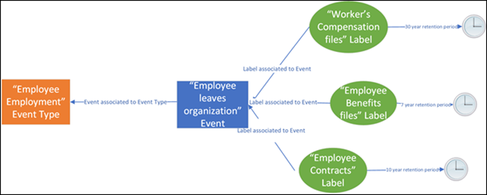
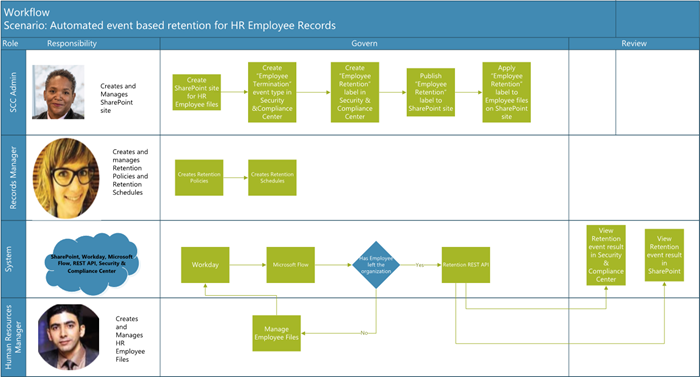
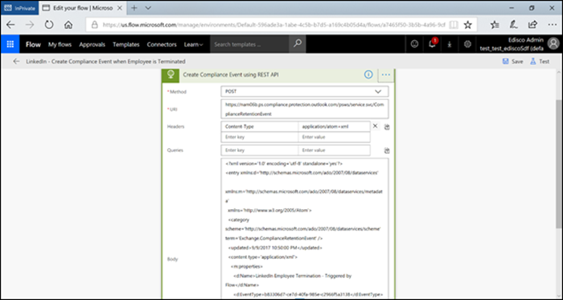
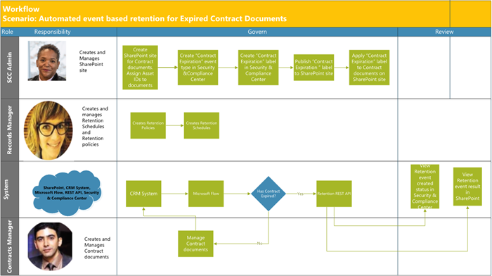
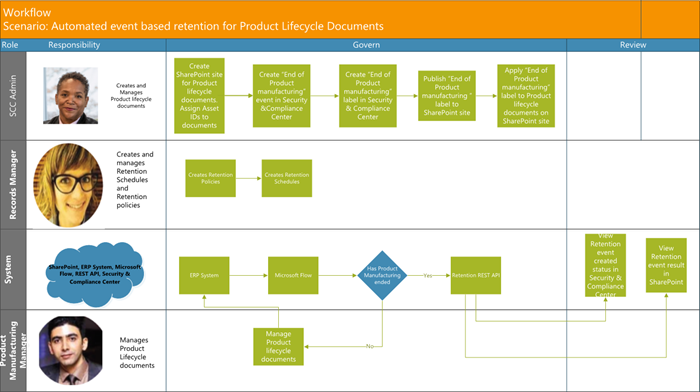

# Automate event-based retention

>*[Microsoft 365 licensing guidance for security & compliance](https://aka.ms/ComplianceSD).*

The explosion of content in organizations and how it can become ROT (redundant, obsolete, trivial) is serious business. To continue to meet legal, business, and regulatory compliance challenges, organizations must be able to keep and protect important information and quickly find what’s relevant. Retaining only important, pertinent information is key to an organization's success.

To help meet this need, organizations can take advantage of retention solutions in the Office 365 Security & Compliance Center. Retention can be triggered by using [retention labels](labels.md). A retention label has the option to [base the retention period on a specific event](event-driven-retention.md). Typically, the retention period is based on a known date, such as the creation date or last modified date for the content. However, organizations also have requirements to dispose of content based on the occurrence of an event, such as seven years after an employee leaves an organization.

To ensure compliant disposal of content, it's imperative to know when an event takes place. With the volume of content increasing rapidly, it's becoming challenging to retain and dispose content in a timely and compliant manner.

Event-based retention solves this problem. This topic explains how to set up your business process flows to automate retention through events by using the Microsoft 365 REST API.

## About event-based retention

An organization can be small, medium, or large. The number of business documents, legal documents, employee files, contracts, and product documents that get created and managed on a day-to-day basis is increasing dramatically.

For example, each day, tens and hundreds of employees are joining and leaving organizations. The HR department continues to create, update, or delete employee-related documents as per business requirements. This process is subject to the different retention policies outlined for the business:

- **The period of retention for content can be a known date** such as the date the content was created, last modified, or labeled. For example, you might retain documents for seven years after they're created and then delete them.

- **The period of retention of content can also be an unknown date**. For example, with retention labels, you can also base a retention period on when a specific type of event occurs, such as an employee leaving the organization.

The event triggers the start of the retention period, and all content with a label applied for that type of event get the label's retention actions enforced on them. This is called event-based retention. To learn more, see [Overview of event-driven retention](event-driven-retention.md).

## Set up event-based retention

This section describes what needs to be done before retaining content.

### Identify roles

Identify the different roles in an organization that perform Record Management tasks and would be responsible for effective and efficient retention of business documents.

  | **Persona**| **Role**|
  | - | - |
  | Admin | Creates Retention Event types, Retention labels and Record repositories in SharePoint |
  | Records Manager                                  | Provides Retention Policies and Retention Schedules guidance and compliance details   |
  | System Admin (business)                          | Sets up and manages external systems to work with Microsoft 365                       |
  | Information Worker                               | Manages the lifecycle of their business process (HR, Finance, IT, and so on)                 |

### Set up the Security & Compliance Center
  
1. Compliance admin creates an event type &ndash; for example, Employee Termination or Contract Expiration or End of Product Manufacturing. (See the step-by-step process in [Event-driven retention](event-driven-retention.md).
    
2. Compliance admin creates a retention label based on an event and associates the label with an event type.
    
    There are four types of triggers for retention labels:
            
    1. Create date
                
    2. Last modified
                
    3. Label date (when the content was labeled)
                
    4. Event-based
    
3. Compliance admin publishes the retention label.

### Set up SharePoint
   
To create a records repository, the compliance admin:

1. Creates a SharePoint site.

2. Does one of the following:
        
    - Creates a SharePoint library: Set event-based label at the library level. For more information, see [Applying a default retention label to all content in a SharePoint library, folder, or document set](labels.md#applying-a-default-retention-label-to-all-content-in-a-sharepoint-library-folder-or-document-set).
          
    - Sets up a document set in SharePoint. For more information, see [Introduction to document sets](https://support.office.com/article/3DBCD93E-0BED-46B7-B1BA-B31DE2BCD234).
      
3. Assigns an asset ID to each employee document set. An asset ID is a product name or code used by the organization, for example, Employee number can be an asset ID. By assigning the asset ID to the folder, every item in that folder automatically inherits the same asset ID. This means all the items can have their retention period triggered by the same event.

## Ways to trigger event-based retention

There are two ways in which event-based retention can be triggered:

- **Using the admin center UI** This is a process that can be used to retain less content at a time or the frequency to trigger retention isn't often, such as monthly or yearly. For more information about this method, see [Overview of event-driven retention](event-driven-retention.md). However, this method of triggering retention can be time consuming and prone to error, thus stunting scalability. Therefore, an automated, seamless solution to trigger retention can enhance data security and compliance.

- **Using a M365 REST API** This process can be used when large amounts of content are to be retained at a time and/or the frequency to trigger retention is often such as daily or weekly. The flow detects when an event occurs in your line-of-business system, and then automatically creates a related event in the Security & Compliance Center. You don't need to manually create an event in the UI each time one occurs.

There are two options for using the REST API:

- **Microsoft Flow or a similar application** can be used to trigger the occurrence of an event automatically. Microsoft Flow is an orchestrator for connecting to other systems. Using Microsoft Flow doesn't require a custom solution.

- **PowerShell or an HTTP client to call REST API** Using PowerShell (version 6 or higher) to call Microsoft 365 REST API to create events. 

A Rest API is a service endpoint that supports sets of HTTP operations (methods), which provide create/retrieve/update/delete access to the service's resources. For more information, see [Components of a REST API request/response](https://docs.microsoft.com/rest/api/gettingstarted/#components-of-a-rest-api-requestresponse). In this case, by using the Microsoft 365 REST API, events can be created and retrieved using operations (methods) POST and GET.

## Example scenarios

Let’s consider the following scenarios.

### Scenario 1: Employees leaving the organization 

An organization creates and stores numerous employee-related documents per employee. These documents are managed and retained during the employment of each employee. However, when the employee leaves the organization or the employment is terminated, the organization is obligated by legal and business requirements to retain the documents of that employee for a stipulated period.

Now if multiple employees leave the organization every day, the organization must trigger the retention clock of hundreds if not thousands of documents each day.

In addition to this, the retention period needs to be calculated for each of these employees as Employee termination date + number of days, months, or years based on the type of the employee record. For example, worker’s compensation of the employee vs. benefits filings of the same employee may need different retention.

The diagram below shows how there can be multiple labels that are associated with a single event. Here all the files under Worker’s compensation label and all the files under Employee benefits label are both associated with a single event, which is the employee leaving the organization. Each of these different files has different retention clocks. So, when an employee leaves the organization, these files within each label experience a different retention period. Triggering all these different retention clocks for each file type or label for each employee is a very challenging task. Imagine doing this for multiple employees.

Hence an automated process to trigger these different retention clocks for multiple employees will be time-saving, error-free, and extremely efficient.

**Configuring Automated Event Based Retention for this scenario:**

  - Admin creates employee folders to the Document set such as Jane Doe, John Smith.

  - Admin adds employee files such as Benefits, Payroll, Worker’s Compensation to each employee folder.

  - Admin assigns Asset ID to each employee folder. 

  - SCC Admin logs into the Security & Compliance Center.

  - SCC Admin creates employee-related events types such as “Employee Termination”, “Employee Hire” events.

  - SCC Admin creates “Employee Retention” label.

  - This “Employee Retention” label is published and applied manually or automatically to the employee files in SharePoint.

  - HR Management System like Workday can work with Microsoft Flow to run periodically to manage employee files.

  - If an employee has left the organization, the Flow will trigger the M365 Event Based Retention REST API that will begin the retention clock on the specific employee’s files.

#### Using Microsoft Flow

Step 1- Create a flow to create an event using the Microsoft 365 REST API

##### Create an event

Sample code to call the REST API

<table>
<thead>
<tr class="header">
<th>Method</th>
<th>POST</th>
<th></th>
</tr>
</thead>
<tbody>
<tr class="odd">
<td>URL</td>
<td>https://ps.compliance.protection.outlook.com/psws/service.svc/ComplianceRetentionEvent</td>
<td></td>
</tr>
<tr class="even">
<td>Headers</td>
<td>Content-Type</td>
<td>application/atom+xml</td>
</tr>
<tr class="odd">
<td>Body</td>
<td>
&lt;?xml version='1.0' encoding='utf-8' standalone='yes'?&gt;

&lt;entry xmlns:d='http://schemas.microsoft.com/ado/2007/08/dataservices'

xmlns:m='http://schemas.microsoft.com/ado/2007/08/dataservices/metadata'

xmlns='https://www.w3.org/2005/Atom'&gt;

&lt;category scheme='http://schemas.microsoft.com/ado/2007/08/dataservices/scheme' term='Exchange.ComplianceRetentionEvent' /&gt;

&lt;updated&gt;9/9/2017 10:50:00 PM&lt;/updated&gt;

&lt;content type='application/xml'&gt;

&lt;m:properties&gt;

&lt;d:Name&gt;Employee Termination &lt;/d:Name&gt;

&lt;d:EventType&gt;99e0ae64-a4b8-40bb-82ed-645895610f56&lt;/d:EventType&gt;

&lt;d:SharePointAssetIdQuery&gt;1234&lt;/d:SharePointAssetIdQuery&gt;

&lt;d:EventDateTime&gt;2018-12-01T00:00:00Z &lt;/d:EventDateTime&gt;

&lt;/m:properties&gt;

&lt;/content&gt;

&lt;/entry&gt;
</td>
<td></td>
</tr>
<tr class="even">
<td>Authentication</td>
<td>Basic</td>
<td></td>
</tr>
<tr class="odd">
<td>Username</td>
<td>“Complianceuser”</td>
<td></td>
</tr>
<tr class="even">
<td>Password</td>
<td>“Compliancepassword”</td>
<td></td>
</tr>
</tbody>
</table>

##### Available parameters

<table>
<thead>
<tr class="header">
<th><strong>Parameters</strong></th>
<th><strong>Description</strong></th>
<th><strong>Notes</strong></th>
</tr>
</thead>
<tbody>
<tr class="odd">
<td>&lt;d:Name&gt;&lt;/d:Name&gt;</td>
<td>Provide a unique name for the event,</td>
<td>Cannot contain trailing spaces, and the following characters: % * \ &amp; &lt; &gt; | # ? , : ;</td>
</tr>
<tr class="even">
<td>&lt;d:EventType&gt;&lt;/d:EventType&gt;</td>
<td>Enter event type name (or Guid),</td>
<td>Example: “Employee termination”. Event type has to be associated with a retention label.</td>
</tr>
<tr class="odd">
<td>&lt;d:SharePointAssetIdQuery&gt;&lt;/d:SharePointAssetIdQuery&gt;</td>
<td>Enter “ComplianceAssetId:” + employee Id</td>
<td>Example:&quot;ComplianceAssetId:12345&quot;</td>
</tr>
<tr class="even">
<td>&lt;d:EventDateTime&gt;&lt;/d:EventDateTime&gt;</td>
<td>Event Date and Time</td>
<td>
Format: yyyy-MM-ddTHH:mm:ssZ, Example:

2018-12-01T00:00:00Z
</td>
</tr>
</tbody>
</table>

##### Response codes

| **Response Code** | **Description**       |
| ----------------- | --------------------- |
| 302               | Redirect              |
| 201               | Created               |
| 403               | Authorization Failed  |
| 401               | Authentication Failed |

##### Get Events based on time range

<table>
<thead>
<tr class="header">
<th>Method</th>
<th>GET</th>
<th></th>
</tr>
</thead>
<tbody>
<tr class="odd">
<td>URL</td>
<td><ol start="4" type="1">
<li>
https://ps.compliance.protection.outlook.com/psws/service.svc/ComplianceRetentionEvent?BeginDateTime=2019-01-11&amp;EndDateTime=2019-01-16
</li>
</ol></td>
<td></td>
</tr>
<tr class="even">
<td>Headers</td>
<td>Content-Type</td>
<td>application/atom+xml</td>
</tr>
<tr class="odd">
<td></td>
<td></td>
<td></td>
</tr>
<tr class="even">
<td>Authentication</td>
<td>Basic</td>
<td></td>
</tr>
<tr class="odd">
<td>Username</td>
<td>“Complianceuser”</td>
<td></td>
</tr>
<tr class="even">
<td>Password</td>
<td>“Compliancepassword”</td>
<td></td>
</tr>
</tbody>
</table>

##### Response codes

| **Response Code** | **Description**                   |
| ----------------- | --------------------------------- |
| 200               | OK, A list of events in atom+ xml |
| 404               | Not found                         |
| 302               | Redirect                          |
| 401               | Authorization Failed              |
| 403               | Authentication Failed             |

##### Get an event by ID

| Method         | GET   |                      |
| -------------- | ------------------------------------------------------------------------------------------------------------------------------------------------------------------------------------------------------------------------------------------------------------------ | -------------------- |
| URL            | [https://ps.compliance.protection.outlook.com/psws/service.svc/ComplianceRetentionEvent(‘174e9a86-74ff-4450-8666-7c11f7730f66’)](https://ps.compliance.protection.outlook.com/psws/service.svc/ComplianceRetentionEvent\('174e9a86-74ff-4450-8666-7c11f7730f66'\)) |                      |
| Header         | Content-Type                                                                                                                                                                                                                                                       | application/atom+xml |
| Authentication | Basic                                                                                                                                                                                                                                                              |                      |
| Username       | “Complianceuser”                                                                                                                                                                                                                                                   |                      |
| Password       | “Compliancepassword”                                                                                                                                                                                                                                               |                      |

##### Response codes

| **Response Code** | **Description**                                      |
| ----------------- | ---------------------------------------------------- |
| 200               | OK, The response body contains the event in atom+xml |
| 404               | Not found                                            |
| 302               | Redirect                                             |
| 401               | Authorization Failed                                 |
| 403               | Authentication Failed                                |

##### Get an event by name

| Method         | GET       |                      |
| -------------- | -------------------------------------------------------------------------------------------------------------------------------------------- | -------------------- |
| URL            | <https://ps.compliance.protection.outlook.com/psws/service.svc/ComplianceRetentionEvent('EventByRESTPost-2226bfebcc2841a8968ba71f9516b763')> |                      |
| Headers        | Content-Type                                                                                                                                 | application/atom+xml |
| Authentication | Basic                                                                                                                                        |                      |
| Username       | “Complianceuser”                                                                                                                             |                      |
| Password       | “Compliancepassword”                                                                                                                         |                      |

##### Response codes

| **Response Code** | **Description**                                      |
| ----------------- | ---------------------------------------------------- |
| 200               | OK, The response body contains the event in atom+xml |
| 404               | Not found                                            |
| 302               | Redirect                                             |
| 401               | Authorization Failed                                 |
| 403               | Authentication Failed                                |

#### Using PowerShell (ver.6 or higher) or any HTTP client

Step 1: Connect to PowerShell.

Step 2: Run the following script.

<table>
<tbody>
<tr class="odd">
<td>
param([string]$baseUri)

$userName = &quot;UserName&quot;

$password = &quot;Password&quot;

$securePassword = ConvertTo-SecureString $password -AsPlainText -Force

$credentials = New-Object System.Management.Automation.PSCredential($userName, $securePassword)

$EventName=&quot;EventByRESTPost-$(([Guid]::NewGuid()).ToString('N'))&quot;

Write-Host &quot;Start to create an event with name: $EventName&quot;

$body = &quot;&lt;?xml version='1.0' encoding='utf-8' standalone='yes'?&gt;

&lt;entry xmlns:d='http://schemas.microsoft.com/ado/2007/08/dataservices'

xmlns:m='http://schemas.microsoft.com/ado/2007/08/dataservices/metadata'

xmlns='https://www.w3.org/2005/Atom'&gt;

&lt;category scheme='http://schemas.microsoft.com/ado/2007/08/dataservices/scheme' term='Exchange.ComplianceRetentionEvent' /&gt;

&lt;updated&gt;7/14/2017 2:03:36 PM&lt;/updated&gt;

&lt;content type='application/xml'&gt;

&lt;m:properties&gt;

&lt;d:Name&gt;$EventName&lt;/d:Name&gt;

&lt;d:EventType&gt;e823b782-9a07-4e30-8091-034fc01f9347&lt;/d:EventType&gt;

&lt;d:SharePointAssetIdQuery&gt;'ComplianceAssetId:123'&lt;/d:SharePointAssetIdQuery&gt;

&lt;/m:properties&gt;

&lt;/content&gt;

&lt;/entry&gt;&quot;

$event = $null

try

{

$event = Invoke-RestMethod -Body $body -Method 'POST' -Uri &quot;$baseUri/ComplianceRetentionEvent&quot; -ContentType &quot;application/atom+xml&quot; -Authentication Basic -Credential $credentials -MaximumRedirection 0

}

catch

{

$response = $_.Exception.Response

if($response.StatusCode -eq &quot;Redirect&quot;)

{

$url = $response.Headers.Location

Write-Host &quot;redirected to $url&quot;

$event = Invoke-RestMethod -Body $body -Method 'POST' -Uri $url -ContentType &quot;application/atom+xml&quot; -Authentication Basic -Credential $credentials -MaximumRedirection 0

}

}

$event | fl *
</td>
</tr>
</tbody>
</table>

#### Verify the outcome in both options

Step 1: Go to the Security & Compliance Center.

Step 2: Select **Events** under **Information governance**.

Step 3: Verify Event has been created.

Similarly, the above options to automate event-based retention can be used for the following scenarios as well.

### Scenario 2: Contracts Expiring

An organization can have multiple records for a single contract with customers, vendors, and partners. These documents can reside in a document library like SharePoint. The end of a contract determines the start of the retention period of the documents associated with the contract. For example, all records related to contracts need to be retained for five years from the time the contract expires. The event that triggers the five-year retention period is the expiration of the contract.

A Customer Relationship Management (CRM) system can work with Microsoft 365 and trigger retention of Contract documents

**Configuring Automated Event Based Retention for this scenario:**

  - Admin creates a SharePoint library with various folders for each contract type.

  - Admin adds contract files such as License Contracts, Development Contracts to each contract folder.

  - Admin assigns Asset ID to each contract folder.

  - SCC Admin logs into the Security & Compliance Center.

  - SCC Admin creates contract-related events types such as “Contract Creation”, “Contract Expiration” events.

  - SCC Admin creates “Contract Expiration” label.

  - This “ Contract Expiration” label is published and applied manually or automatically to the contract files in SharePoint.

  - Contract Management System can work with Microsoft Flow or a similar application to run periodically to manage contract files.

  - If a contract expires, Microsoft Flow will trigger the M365 Event Based Retention REST API that will begin the retention clock on the specific contract’s files.

### Scenario 3: End of Product Manufacturing

A manufacturing company that produces different lines of products creates many manufacturing specifications and pricing documents. When the product is no longer manufactured, all specifications and documents linked to this product need to be retained for a specific period after the end of the lifetime of the product.

An Enterprise Resource Planning (ERP) system can work with Microsoft 365 and Microsoft Flow to trigger retention.

**Configuring Automated Event Based Retention for this scenario:**

  - Admin creates product folders in the Document set such as Product 1, Product 2, and so on.

  - Admin adds product files such as Manufacturing Specifications, Product Pricing, Product licensing to each product folder.

  - Admin assigns Asset ID to each product folder.

  - SCC Admin logs into the Security & Compliance Center.

  - SCC Admin creates employee-related events types such as “Start of Product Manufacturing”, “End of Product Manufacturing” events.

  - SCC Admin creates “End of Product Manufacturing” label.

  - This “ End of Product Manufacturing” label is published and applied manually or automatically to the product files in SharePoint.

  - ERP Systems can work with Microsoft Flow or similar applications to run periodically to manage product files.

  - If the manufacturing of a product ends, Microsoft Flow will trigger the M365 Event Based Retention REST API that will begin the retention clock on the specific product’s files.

## Appendix

### Using Redirect 302 response results to call the REST API

1. Invoke a POST retention event call using the REST API URL <https://ps.compliance.protection.outlook.com/psws/service.svc/ComplianceRetentionEvent> (Global Admin permissions are required)

2. Check the response code. If it’s 302, then get the redirected URL from Location property of the response header

3. Invoke the POST retention event call again using the redirected URL.

## Credits

This topic was reviewed by:

Antonio Maio Microsoft Office Apps and Services MVP  Antonio.Maio@Protiviti.com
