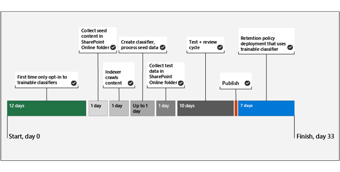
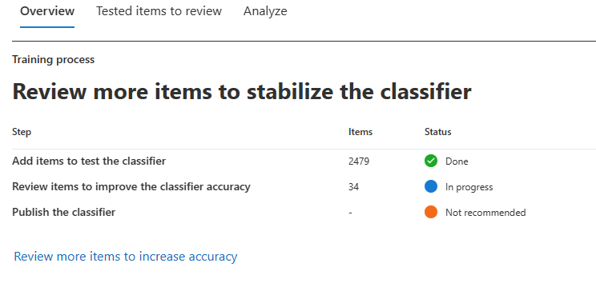

# Get started with trainable classifiers (preview)

A Microsoft 365 trainable classifier is a tool you can train to recognize various types of content by giving it samples to look at. Once trained, you can use it to identify item for application of Office sensitivity labels, Communications compliance policies, and retention label policies.

Creating a custom trainable classifier first involves giving it samples that are human picked and positively match the category. Then, after it has processed those, you test the classifiers ability to predict by giving it a mix of positive and negative samples. This article shows you how to create and train a custom classifier and how to improve the performance of custom trainable classifiers and pre-trained classifiers over their lifetime through retraining.

To learn more about the different types of classifiers, see [Learn about trainable classifiers (preview)](classifier-learn-about.md).

## Prerequisites

### Licensing requirements

Classifiers are a Microsoft 365 E5, or E5 Compliance feature. You must have one of these subscriptions to make use of them.

### Permissions

To access classifiers in the UI: 

- the Global admin needs to opt in for the tenant to create custom classifiers.
- Compliance Administrator role is required to train a classifier.

You'll need accounts with these permissions to use classifiers in these scenarios:

- Retention label policy scenario: Record Management and Retention Management roles 
- Sensitivity label policy scenario: Security Administrator, Compliance Administrator, Compliance Data Administrator
- Communication compliance policy scenario: Insider Risk Management Admin, Supervisory Review Administrator 

> [!IMPORTANT]
> By default, only the user who creates a custom classifier can train and review predictions made by that classifier.

## Prepare for a custom trainable classifier 

It's helpful to understand what's involved in creating a custom trainable classifier before you dive in. 

### Timeline

This timeline reflects a sample deployment of trainable classifiers.

> [!TIP]
> Opt-in is required the first time for trainable classifiers. It takes twelve days for Microsoft 365 to complete a baseline evaluation of your organizations content. Contact your global administrator to kick off the opt-in process.

### Overall workflow

To understand more about the overall workflow of creating custom trainable classifiers, see [Process flow for creating customer trainable classifiers](classifier-learn-about.md#process-flow-for-creating-custom-classifiers).

### Seed content

When you want a trainable classifier to independently and accurately identify an item as being in particular category of content, you first have to present it with many samples of the type of content that are in the category. This feeding of samples to the trainable classifier is known as *seeding*. Seed content is selected by a human and is judged to represent the category of content.

> [!TIP]
> You need to have at least 50 positive samples and as many as 500. The trainable classifier will process up to the 500 most recent created samples (by file created date/time stamp). The more samples you provide, the more accurate the predictions the classifier will make.

### Testing content

Once the trainable classifier has processed enough positive samples to build a prediction model, you need to test the predictions it makes to see if the classifier can correctly distinguish between items that match the category and items that don't. You do this by selecting another, hopefully larger, set of human picked content that consists of samples that should fall into the category and samples that won't. You should test with different data than the initial seed data you first provided. Once it processes those, you manually go through the results and verify whether each prediction is correct, incorrect, or you aren't sure. The trainable classifier uses this feedback to improve its prediction model.

> [!TIP]
> For best results, have at least 200 items in your test sample set with an even distribution of positive and negative matches.

## How to create a trainable classifier

1. Collect between 50-500 seed content items. These must be only samples that strongly represent the type of content you want the trainable classifier to positively identify as being in the classification category. See, [Default crawled file name extensions and parsed file types in SharePoint Server](https://docs.microsoft.com/sharepoint/technical-reference/default-crawled-file-name-extensions-and-parsed-file-types) for the supported file types.

   > [!IMPORTANT]
   > The seed and test sample items must not be encrypted and they must be in English.

   > [!IMPORTANT]
   > Make sure the items in your seed set are **strong** examples of the category. The trainable classifier initially builds its model based on what you seed it with. The classifier assumes all seed samples are strong positives and has no way of knowing if a sample is a weak or negative match to the category.

2. Place the seed content in a SharePoint Online folder that is dedicated to holding *the seed content only*. Make note of the site, library, and folder URL.

   > [!TIP]
   > If you create a new site and folder for your seed data, allow at least an hour for that location to be indexed before creating the trainable classifier that will use that seed data.

3. Sign in to Microsoft 365 compliance center with compliance admin or security admin role access and open **Microsoft 365 compliance center** or **Microsoft 365 security center** > **Data classification**.

4. Choose the **Trainable classifiers** tab.

5. Choose **Create trainable classifier**.

6. Fill in appropriate values for the `Name` and `Description` fields of the category of items you want this trainable classifier to identify.

7. Pick the SharePoint Online site, library, and folder URL for the seed content site from step 2. Choose `Add`.

8. Review the settings and choose `Create trainable classifier`.

9. Within 24 hours the trainable classifier will process the seed data and build a prediction model. The classifier status is `In progress` while it processes the seed data. When the classifier is finished processing the seed data, the status changes to `Need test items`.

10. You can now view the details page by choosing the classifier.

    > [!div class="mx-imgBorder"]
    > 

11. Collect at least 200 test content items (10,000 max) for best results. These should be a mix of items that are strong positives, strong negatives and some that are a little less obvious in their nature. See, [Default crawled file name extensions and parsed file types in SharePoint Server](https://docs.microsoft.com/sharepoint/technical-reference/default-crawled-file-name-extensions-and-parsed-file-types) for the supported file types.

    > [!IMPORTANT]
    > The sample items must not be encrypted and they must be in English.

12. Place the test content in a SharePoint Online folder that is dedicated to holding *the test content only*. Make note of the SharePoint Online site, library, and folder URL.

    > [!TIP]
    > If you create a new site and folder for your test data, allow at least an hour for that location to be indexed before creating the trainable classifier that will use that seed data.

13. Choose `Add items to test`.

14. Pick the SharePoint Online site, library, and folder URL for the test content site from step 12. Choose `Add`.

15. Finish the wizard by choosing `Done`. Your trainable classifier will take up to an hour to process the test files.

16. When the trainable classifier is done processing your test files, the status on the details page will change to `Ready to review`. If you need to increase the test sample size, choose `Add items to test` and allow the trainable classifier to process the additional items.

    > [!div class="mx-imgBorder"]
	> 

17. Choose `Tested items to review` tab to review items.

18. Microsoft 365 will present 30 items at a time. Review them and in the `We predict this item is "Relevant". Do you agree?` box choose either `Yes` or `No` or `Not sure, skip to next item`. Model accuracy is automatically updated after every 30 items.

    > [!div class="mx-imgBorder"]
	> 

19. Review *at least* 200 items. Once the accuracy score has stabilized, the **publish** option will become available and the classifier status will say `Ready to use`.

    > [!div class="mx-imgBorder"]
	> 

20. Publish the classifier.

21. Once published your classifier will be available as a condition in [Office auto-labeling with sensitivity labels](apply-sensitivity-label-automatically.md), [auto-apply retention label policy based on a condition](apply-retention-labels-automatically.md#configuring-conditions-for-auto-apply-retention-labels) and in [Communication compliance](communication-compliance.md).
