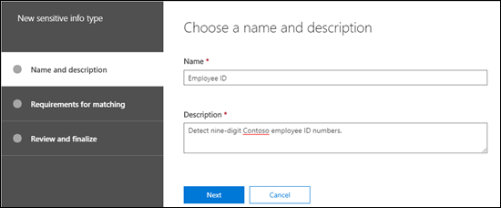
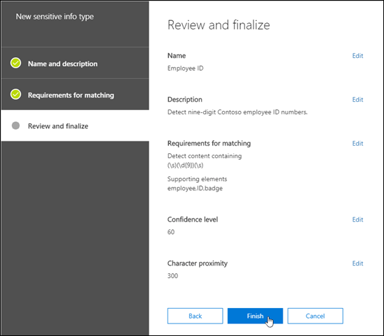

<!--		a. Two options to Creating a new SIT 
			i. Start from scratch 
Copy a OOB SIT 

			vii. Additional check
				1) List of additional checks & their descriptions(look at the help text in code)

-->

<!-- rename md file to match the display name -->
# Create a custom sensitive information type in the Compliance Center

If the pre-configured sensitive information types don't meet your needs, you can create your own custom sensitive information types that you fully define or you can copy one of the pre-configured ones and modify it.

The custom sensitive information types that you create by using this method are added to the rule package named `Microsoft.SCCManaged.CustomRulePack`.

## Before you begin

- You should be familiar with sensitive information types and what they are composed of. See, [Learn about sensitive information types](sensitive-information-type-learn-about.md). It is critical to understand the roles of:
    - [regular expressions](https://www.boost.org/doc/libs/1_68_0/libs/regex/doc/html/) - Microsoft 365 sensitive information types uses the Boost.RegEx 5.1.3 engine
    - keyword lists - you can create your own as you define your sensitive information type or choose from existing keyword lists
    - [keyword dictionary](create-a-keyword-dictionary.md)
    - [functions](what-the-dlp-functions-look-for.md)
    - [confidence levels](sensitive-information-type-learn-about.md#more-on-confidence-levels)
 
- You must have Global admin or Compliance admin permissions to create, test, and deploy a custom sensitive information type through the UI. See [About admin roles](https://docs.microsoft.com/office365/admin/add-users/about-admin-roles?view=o365-worldwide) in Office 365.

- Your organization must have a subscription, such as Office 365 Enterprise, that includes Data Loss Prevention (DLP). See [Messaging Policy and Compliance ServiceDescription](https://docs.microsoft.com/office365/servicedescriptions/exchange-online-protection-service-description/messaging-policy-and-compliance-servicedesc). 

> [!IMPORTANT]
> Microsoft Customer Service & Support can't assist with creating custom classifications or regular expression patterns. Support engineers can provide limited support for the feature, such as, providing sample regular expression patterns for testing purposes, or assisting with troubleshooting an existing regular expression pattern that's not triggering as expected, but can't provide assurances that any custom content-matching development will fulfill your requirements or obligations.

## Create custom sensitive information types in the Compliance Center

Use this procedure to create a new sensitive information type that you fully define. 

1. In the Compliance Center, go to **Data classification** \> **Sensitive info types** and choose **Create info type**.
2. Fill in values for **Name** and **Description** and choose **Next**.
3. Choose **Create pattern**. You can create multiple patterns, each with different elements and confidence levels, as you define your new sensitive information type.
4. Choose the default confidence level for the pattern. The values are **Low confidence**, **Medium confidence**, and **High confidence**.
5. Choose and define **Primary element**. The primary element can be a **Regular expression**, a **Keyword list**, a **Keyword dictionary**, or one of the pre-configured **Functions**.
6. Fill in a value for **Character proximity**.
7. (Optional) If you have **Supporting elements** or any **Additional checks** add them. If needed you can group your **Supporting elements**.
8. Choose **Create**.
9. Choose **Next**.
10. Choose the **recommended confidence level** for this sensitive information type.
11. Check your setting and choose **Submit**.   

> [!IMPORTANT]
> Microsoft 365 uses the search crawler to identify and classify sensitive information in SharePoint Online and OneDrive for Business sites. To identify your new custom sensitive information type in existing content, the content must be re-crawled. Content is crawled based on a schedule, but you can manually re-crawl content for a site collection, list, or library. For more information, see [Manually request crawling and re-indexing of a site, a library or a list](https://docs.microsoft.com/sharepoint/crawl-site-content).

<!-- Here's a scenario: You want a custom sensitive information type that detects 9-digit employee numbers in content, along with the keywords "employee" "ID" and "badge". To create this custom sensitive information type, do the following steps:

1. In the Security & Compliance Center, go to **Classifications** \> **Sensitive info types** and click **Create**.

    

2. In the **Choose a name and description** page that opens, enter the following values:

  - **Name**: Employee ID.

  - **Description**: Detect nine-digit Contoso employee ID numbers.

    

    When you're finished, click **Next**.

3. In the **Requirements for matching** page that opens, click **Add an element** configure the following settings:

    - **Detect content containing**:
 
      a. Click **Any of these** and select **Regular expression**.

      b. In the regular expression box, enter `(\s)(\d{9})(\s)` (nine-digit numbers surrounded by white space).
  
    - **Supporting elements**: Click **Add supporting elements** and select **Contains this keyword list**.

    - In the **Contains this keyword list** area that appears, configure the following settings:

      - **Keyword list**: Enter the following value: employee,ID,badge.

      - **Minimum count**: Leave the default value 1.

    - Leave the default **Confidence level** value 60. 

    - Leave the default **Character proximity** value 300.

    

    When you're finished, click **Next**.

4. On the **Review and finalize** page that opens, review the settings and click **Finish**.

     -->

12. On the **Data classification** page, you'll see all the sensitive information types listed. Choose **Refresh** and then browse for or use the search tool to find the sensitive information type you just created.

## Test a sensitive information type

You can test any sensitive information type in the list. We suggest that you test every sensitive information type that you create before using it in a police

1. Prepare two files, like a Word document. One with content that matches the elements you specified in your sensitive information type and one that doesn't match.
2. In the Compliance Center, go to **Data classification** \> **Sensitive info types** and choose the sensitive information type from the list to open the details pane and choose **Test**.
3. Upload a file and choose **Test**.
4. On the **Matches results** page, review the results and choose **Finish**.

##

## Modify custom sensitive information types in the Compliance Center

<!-- check to see if this note contradicts the guidance in "customize a built in sensitive information type customize-a-built-in-sensitive-information-type it sure seems like it does-->
<!-- - You can only modify custom sensitive information types; you can't modify built-in sensitive information types. But you can use PowerShell to export built-in custom sensitive information types, customize them, and import them as custom sensitive information types. For more information, see [Customize a built-in sensitive information type](customize-a-built-in-sensitive-information-type.md).

- You can only modify custom sensitive information types that you created in the UI. If you used the [PowerShell procedure](create-a-custom-sensitive-information-type-in-scc-powershell.md) to import a custom sensitive information type rule package, you'll get an error. -->

1. In the Compliance Center, go to **Data classification** \> **Sensitive info types** and choose the sensitive information type from the list that you want to modify choose **Edit**.
2. You can add 

The same options are available here as when you created the custom sensitive information type. For more information, see [Create custom sensitive information types in the Compliance Center](#create-custom-sensitive-information-types-in-the-compliance-center).

## Remove custom sensitive information types in the Compliance Center 

- You can only remove custom sensitive information types; you can't remove built-in sensitive information types.

- Before your remove a custom sensitive information type, verify that no DLP policies or Exchange mail flow rules (also known as transport rules) still reference the sensitive information type.

1. In the Security & Compliance Center, go to **Classifications** \> **Sensitive info types** and select one or more custom sensitive information types that you want to remove.

2. In the fly-out that opens, click **Delete** (or **Delete sensitive info types** if you selected more than one).

    

3. In the warning message that appears, click **Yes**.

### How do you know this worked?

To verify that you've successfully removed a custom sensitive information type, go to **Classifications** \> **Sensitive info types** to verify the custom sensitive information type is no longer listed.

You can also create custom sensitive information types by using PowerShell and Exact Data Match capabilities. To learn more about those methods, see:
- [Create a custom sensitive information type in Security & Compliance Center PowerShell](create-a-custom-sensitive-information-type-in-scc-powershell.md)
- [Create a custom sensitive information type for DLP with Exact Data Match (EDM)](create-custom-sensitive-information-types-with-exact-data-match-based-classification.md)
 
> [!NOTE]
> Microsoft 365 Information Protection supports, in preview, double byte character set languages for:
> - Chinese (simplified)
> - Chinese (traditional)
> - Korean
> - Japanese
> 
>This preview is only in the commercial cloud and the rollout is limited to:
> - Japan
> - Korea
> - China
> - Hong Kong
> - Macau
> - Taiwan
>
>This support is available for sensitive information types. See, [Information protection support for double byte character sets release notes (preview)](mip-dbcs-relnotes.md) for more information.