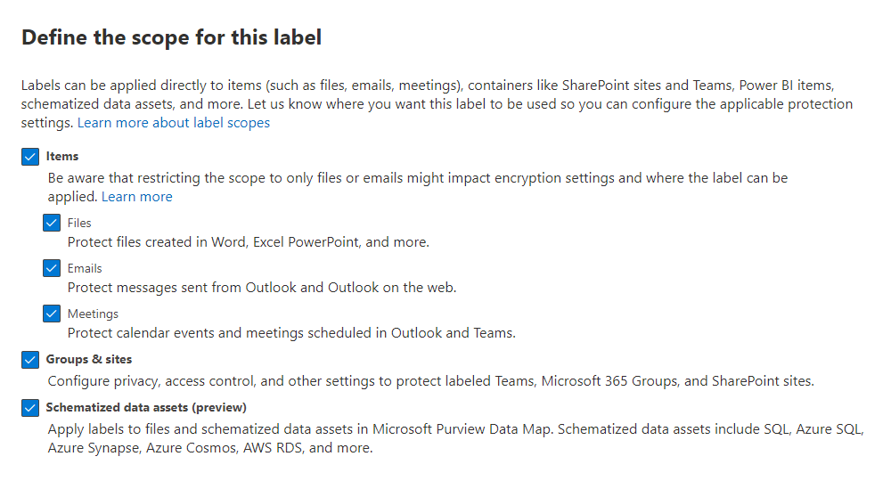
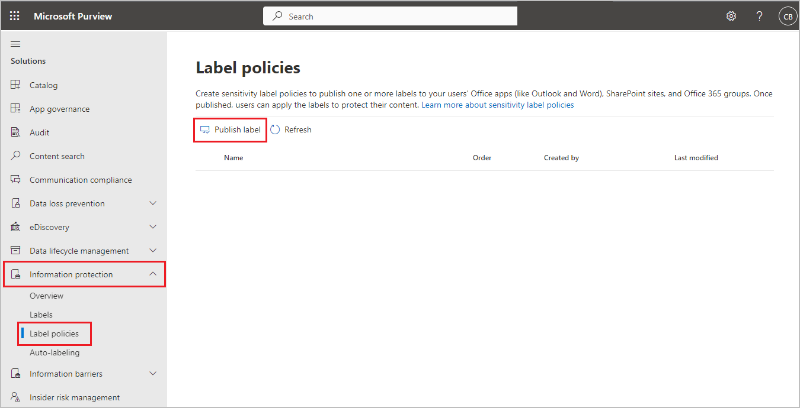
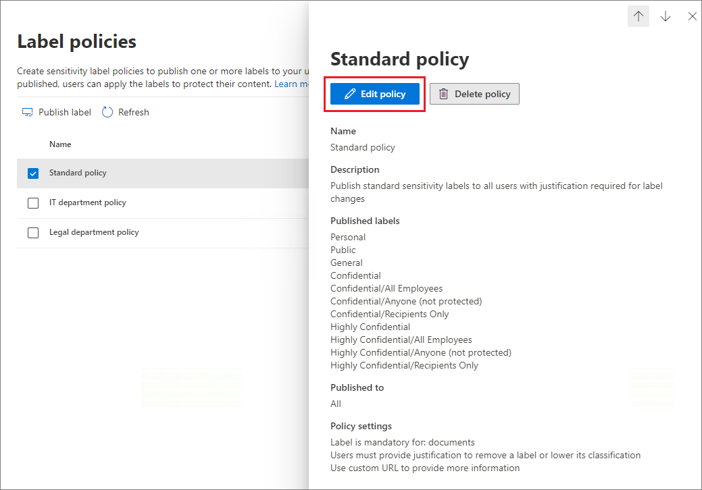

# Create and configure sensitivity labels and their policies

>*[Microsoft 365 licensing guidance for security & compliance](https://aka.ms/ComplianceSD).*

All Microsoft Information Protection solutions (sometimes abbreviated to MIP) are implemented by using [sensitivity labels](sensitivity-labels.md). To create and publish these labels, go to your labeling admin center, such as the [Microsoft 365 compliance center](https://compliance.microsoft.com/). You can also use the Microsoft 365 security center, or the Security & Compliance Center.

First, create and configure the sensitivity labels that you want to make available for apps and other services. For example, the labels you want users to see and apply from Office apps. 

Then, create one or more label policies that contain the labels and policy settings that you configure. It's the label policy that publishes the labels and settings for your chosen users and locations.

## Before you begin

The global admin for your organization has full permissions to create and manage all aspects of sensitivity labels. If you aren't signing in as a global admin, see [Permissions required to create and manage sensitivity labels](get-started-with-sensitivity-labels.md#permissions-required-to-create-and-manage-sensitivity-labels).

## Create and configure sensitivity labels

1. In your labeling admin center, navigate to sensitivity labels:
    
    - Microsoft 365 compliance center: 
        - **Solutions** > **Information protection**
        
        If you don't immediately see this option, first select **Show all**. 
    
    - Microsoft 365 security center: 
        - **Classification** > **Sensitivity labels**
    
    - Security & Compliance Center:
        - **Classification** > **Sensitivity labels**

2. On the **Labels** page, select **+ Create a label** to start the New sensitivity label wizard. 
    
    For example, from the Microsoft 365 compliance center:
    
    
    
    Note: By default, tenants don't have any labels and you must create them. The labels in the example picture show default labels that were [migrated from Azure Information Protection](https://docs.microsoft.com/azure/information-protection/configure-policy-migrate-labels).

3. On the **Decide where this label will be used** page, the options selected determine the label's scope for the settings that you can configure and where they will be visible when they are published:
    
    
    
    - If **Files and emails** is selected, you can configure settings in this wizard that apply to apps that support sensitivity labels, such as Office Word and Outlook. If this option isn't selected, the wizard displays the settings but you can't configure them and the labels won't be available for users to select in these apps.
    
    - If **Groups and sites** is selected, you can configure settings in this wizard that apply to Microsoft 365 groups and sites. If this option isn't selected, the wizard displays the settings but you can't configure them and the labels won't be available for users to select for groups and site.

4. Follow the prompts in the wizard for the label settings.
    
    For more information about the label settings, see [What sensitivity labels can do](sensitivity-labels.md#what-sensitivity-labels-can-do) from the overview information and use the help in the wizard for individual settings.

5. Repeat these steps to create more labels. However, if you want to create a sublabel, first select the parent label and select **...** for **More actions**, and then select **Add sub label**.

6. When you have created all the labels you need, review their order and if necessary, move them up or down. To change the order of a label, select **...** for **More actions**, and then select **Move up** or **Move down**. For more information, see [Label priority (order matters)](sensitivity-labels.md#label-priority-order-matters) from the overview information.

To edit an existing label, select it, and then select the **Edit label** button:


This button starts the **Edit sensitivity label** wizard, which lets you change all the label settings in step 4.

Don't delete a label unless you understand the impact for users. For more information, see the [Removing and deleting labels](#removing-and-deleting-labels) section. 

> [!NOTE]
> If you edit a label that's already published by using a label policy, no extra steps are needed when you finish the wizard. For example, you don't need to add it to a new label policy for the changes to become available to the same users. However, allow up to 24 hours for the changes to replicate to users and services.

Until you publish your labels, they won't be available to select in apps or for services. To publish the labels, they must be [added to a label policy](#publish-sensitivity-labels-by-creating-a-label-policy).

> [!IMPORTANT]
> On this **Labels** tab, do not select the **Publish labels** tab (or the **Publish label** button when you edit a label) unless you need to create a new label policy. You need multiple label policies only if users need different labels or different policy settings. Aim to have as few label policies as possible—it's not uncommon to have just one label policy for the organization.

### Additional label settings with Security & Compliance Center PowerShell

Additional label settings are available with the [Set-Label](https://docs.microsoft.com/powershell/module/exchange/set-label?view=exchange-ps) cmdlet from [Security & Compliance Center PowerShell](https://docs.microsoft.com/powershell/exchange/office-365-scc/office-365-scc-powershell?view=exchange-ps).

For example:

- Use the *LocaleSettings* parameter for multinational deployments so that users see the label name and tooltip in their local language. The [following section](#example-configuration-to-configure-a-sensitivity-label-for-different-languages) has an example configuration that specifies the label name and tooltip text for French, Italian, and German.

- Use the *ApplyContentMarkingFooterFontName* parameter to specify your choice of font for your specified footer. Calibri is the default font for headers, footers, and watermark text. If your alternative font name is not available to the service or device that displays the labels, the font falls back to Calibri.

- Use the *ApplyContentMarkingHeaderFontColor* parameter to specify your custom color choice for your specified header, using a hex triplet code for the red, green, and blue (RGB) components. For example, #40e0d0 is the RGB hex value for turquoise. You'll find these codes in many applications that let you edit pictures. For example, Microsoft Paint lets you choose a custom color from a palette and the RGB values are automatically displayed, which you can then copy.

For the Azure Information Protection unified labeling client only, you can also specify [advanced settings](https://docs.microsoft.com/azure/information-protection/rms-client/clientv2-admin-guide-customizations) that include setting a label color, and applying a custom property when a label is applied. For the full list, see [Available advanced settings for labels](https://docs.microsoft.com/azure/information-protection/rms-client/clientv2-admin-guide-customizations#available-advanced-settings-for-labels) from this client's admin guide.

#### Example configuration to configure a sensitivity label for different languages

The following example shows the PowerShell configuration for a label named "Public" with placeholder text for the tooltip. In this example, the label name and tooltip text are configured for French, Italian, and German.

As a result of this configuration, users who have Office apps that use those display languages see their label names and tooltips in the same language. Similarly, if you have the Azure Information Protection unified labeling client installed to label files from File Explorer, users who have those language versions of Windows see their label names and tooltips in their local language when they use the right-click actions for labeling.

For the languages that you need to support, use the Office [language identifiers](https://docs.microsoft.com/deployoffice/office2016/language-identifiers-and-optionstate-id-values-in-office-2016#language-identifiers) (also known as language tags), and specify your own translation for the label name and tooltip.

Before you run the commands in PowerShell, you must first [connect to Security & Compliance Center PowerShell](https://docs.microsoft.com/powershell/exchange/office-365-scc/connect-to-scc-powershell/connect-to-scc-powershell?view=exchange-ps).


```powershell
$Languages = @("fr-fr","it-it","de-de")
$DisplayNames=@("Publique","Publico","Oeffentlich")
$Tooltips = @("Texte Français","Testo italiano","Deutscher text")
$label = "Public"
$DisplayNameLocaleSettings = [PSCustomObject]@{LocaleKey='DisplayName';
Settings=@(
@{key=$Languages[0];Value=$DisplayNames[0];}
@{key=$Languages[1];Value=$DisplayNames[1];}
@{key=$Languages[2];Value=$DisplayNames[2];})}
$TooltipLocaleSettings = [PSCustomObject]@{LocaleKey='Tooltip';
Settings=@(
@{key=$Languages[0];Value=$Tooltips[0];}
@{key=$Languages[1];Value=$Tooltips[1];}
@{key=$Languages[2];Value=$Tooltips[2];})}
Set-Label -Identity $Label -LocaleSettings (ConvertTo-Json $DisplayNameLocaleSettings -Depth 3 -Compress),(ConvertTo-Json $TooltipLocaleSettings -Depth 3 -Compress)
```

## Publish sensitivity labels by creating a label policy

1. In your labeling admin center, navigate to sensitivity labels:
    
    - Microsoft 365 compliance center: 
        - **Solutions** > **Information protection**
        
        If you don't immediately see this option, first select **Show all**. 
    
    - Microsoft 365 security center: 
        - **Classification** > **Sensitivity labels**
    
    - Security & Compliance Center:
        - **Classification** > **Sensitivity labels**

2. Select the **Label policies** tab, and then **Publish labels** to start the Create policy wizard:
    
    For example, from the Microsoft 365 compliance center:
        
    
    
    Note: By default, tenants don't have any label policies and you must create them. 

3. In the wizard, select **Choose sensitivity labels to publish**. Select the labels that you want to make available in apps and to services, and then select **Add**.
    
    > [!IMPORTANT]
    > If you select a sublabel, make sure you also select its parent label.
    
4. Review the selected labels and to make any changes, select **Edit**. Otherwise, select **Next**.

5. Follow the prompts to configure the policy settings.
    
    For more information about these settings, see [What label policies can do](sensitivity-labels.md#what-label-policies-can-do) from the overview information and use the help in the wizard for individual settings.

7. Repeat these steps if you need different policy settings for different users or locations. For example, you want additional labels for a group of users, or a different default label for a subset of users.

8. If you create more than one label policy that might result in a conflict for a user or location, review the policy order and if necessary, move them up or down. To change the order of a label policy, select **...** for **More actions**, and then select **Move up** or **Move down**. For more information, see [Label policy priority (order matters)](sensitivity-labels.md#label-policy-priority-order-matters) from the overview information.

Completing the wizard automatically publishes the label policy. To make changes to a published policy, simply edit it. There is no specific publish or republish action for you to select.

To edit an existing label policy, select it, and then select the **Edit Policy** button: 



This button starts the **Create policy** wizard, which lets you edit which labels are included and the label settings. When you complete the wizard, any changes are automatically replicated to the selected users and services.

Users see new labels in their Office apps within one hour. However, allow up to 24 hours for changes to existing labels to replicate to all users and services.

### Additional label policy settings with Security & Compliance Center PowerShell

Additional label policy settings are available with the [Set-LabelPolicy](https://docs.microsoft.com/powershell/module/exchange/set-labelpolicy?view=exchange-ps) cmdlet from [Security & Compliance Center PowerShell](https://docs.microsoft.com/powershell/exchange/office-365-scc/office-365-scc-powershell?view=exchange-ps).

For the Azure Information Protection unified labeling client only, you can specify [advanced settings](https://docs.microsoft.com/azure/information-protection/rms-client/clientv2-admin-guide-customizations) that include setting a different default label for Outlook, and implement pop-up messages in Outlook that warn, justify, or block emails being sent. For the full list, see [Available advanced settings for label policies](https://docs.microsoft.com/azure/information-protection/rms-client/clientv2-admin-guide-customizations#available-advanced-settings-for-label-policies) from this client's admin guide.

## Use PowerShell for sensitivity labels and their policies

You can now use [Security & Compliance Center PowerShell](https://docs.microsoft.com/powershell/exchange/office-365-scc/office-365-scc-powershell?view=exchange-ps) to create and configure all the settings you see in your labeling admin center. This means that in addition to using PowerShell for settings that aren't available in the labeling admin centers, you can now fully script the creation and maintenance of sensitivity labels and sensitivity label policies. 

See the following documentation for supported parameters and values:

- [New-Label](https://docs.microsoft.com/powershell/module/exchange/new-label?view=exchange-ps)
- [New-LabelPolicy](https://docs.microsoft.com/powershell/module/exchange/new-labelpolicy?view=exchange-ps)
- [Set-Label](https://docs.microsoft.com/powershell/module/exchange/set-label?view=exchange-ps)
- [Set-LabelPolicy](https://docs.microsoft.com/powershell/module/exchange/set-labelpolicy?view=exchange-ps)

You can also use [Remove-Label](https://docs.microsoft.com/powershell/module/exchange/remove-label?view=exchange-ps) and [Remove-LabelPolicy](https://docs.microsoft.com/powershell/module/exchange/remove-labelpolicy?view=exchange-ps) if you need to script the deletion of sensitivity labels or sensitivity label policies. However, before you delete sensitivity labels, make sure you read the following section.

## Removing and deleting labels

In a production environment, it's unlikely that you will need to remove sensitivity labels from a label policy, or delete sensitivity labels. It's more likely that you might need to do one or either of these actions during an initial testing phase. Make sure you understand what happens when you do either of these actions.

Removing a label from a label policy is less risky than deleting it, and you can always add it back to a label policy later if needed:

- When you remove a label from a label policy so that the label is no longer published to the originally specified users, the next time the label policy is refreshed, users no longer see that label to select in their Office app. However, if the label has been applied to documents or emails, the label isn't removed from that content. Any encryption that was applied by the label remains and the underlying protection template remains published. 

- For labels that are removed but have previously been applied to content, users who are using built-in labeling for Word, Excel, and PowerPoint, still see the applied label name on the status bar. Similarly, labels that are removed that were applied to SharePoint sites still display the label name in the **Sensitivity** column.

In comparison, when you delete a label:

- If the label applied encryption, the underlying protection template is archived so that previously protected content can still be opened. Because of this archived protection template, you won't be able to create a new label with the same name. Although it's possible to delete a protection template by using [PowerShell](https://docs.microsoft.com/powershell/module/aipservice/remove-aipservicetemplate), don't do this unless you're sure you don't need to open content that was encrypted with the archived template.

- For desktop apps: The label information in the metadata remains, but because a label ID to name mapping is no longer possible, users don't see the applied label name displayed (for example, on the status bar) so users will assume the content isn't labeled. If the label applied encryption, the encryption remains and when the content is opened, uses still see the name and description of the now archived protection template.

- For Office on the web: Users don't see the label name on status bar or in the **Sensitivity** column. The label information in the metadata remains only if the label didn't apply encryption. If the label applied encryption, and you've enabled [sensitivity labels for SharePoint and OneDrive](sensitivity-labels-sharepoint-onedrive-files.md), the label information in the metadata is removed and the encryption is removed. 

When you remove a sensitivity label from a label policy, or delete a sensitivity label, these changes can take up to one hour to replicate to all users and services.

## Next steps

To configure and use your sensitivity labels for specific scenarios, use the following articles:

- [Restrict access to content by using encryption in sensitivity labels](encryption-sensitivity-labels.md)

- [Apply a sensitivity label to content automatically](apply-sensitivity-label-automatically.md)

- [Use sensitivity labels with teams, groups, and sites](sensitivity-labels-teams-groups-sites.md)

- [Enable sensitivity labels for Office files in SharePoint and OneDrive](sensitivity-labels-sharepoint-onedrive-files.md)

To monitor how your labels are being used, see [View label usage with label analytics](label-analytics.md).
