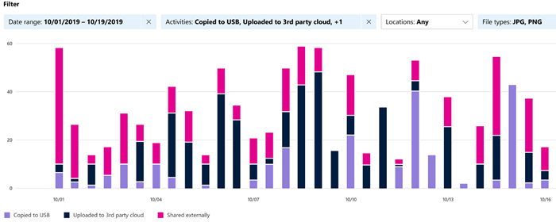

# Get started with activity explorer

The data classification overview and content explorer tabs give you visibility into what content has been discovered and labeled, and where that content is. Activity explorer rounds out this suite of functionality by allowing you to monitor what's being done with your labeled content. Activity explorer provides a historical view.

There are over 30 different filters available for use, some are:

- date range
- activity type
- location
- user
- sensitivity label
- retention label
- file path
- DLP policy

## Prerequisites

Every account that accesses and uses data classification must have a license assigned to it from one of these subscriptions:

- Microsoft 365 (E5)
- Office 365 (E5)
- Advanced Compliance (E5) add-on
- Advanced Threat Intelligence (E5) add-on

### Permissions

 In order to get access to the activity explorer tab, an account must be assigned membership in any one of these roles or role groups.

**Microsoft 365 role groups**

- Global administrator
- Compliance administrator
- Security administrator
- Compliance data administrator

## Activity type

Microsoft 365 monitors and reports on types of activities across SharePoint Online, and OneDrive like:

- label applied
- label changed (upgraded, downgraded, or removed)
- auto-labeling simulation

The value of understanding what actions are being taken with your sensitive labeled content is that you can see if the controls that you have already put into place, such as [data loss prevention policies](data-loss-prevention-policies.md) are effective or not. If not, or if you discover something unexpected, such as a large number of items that are labeled `highly confidential` and are downgraded `general`, you can manage your various policies and take new actions to restrict the undesired behavior.

> [!NOTE]
> Activity explorer doesn't currently monitor retention activities for Exchange Online.

## See also
- [Sensitivity labels](sensitivity-labels.md)
- [Retention labels](retention.md)
- [Sensitive information type entity definitions](sensitive-information-type-entity-definitions.md)
- [Learn about retention policies and retention labels](retention.md)
