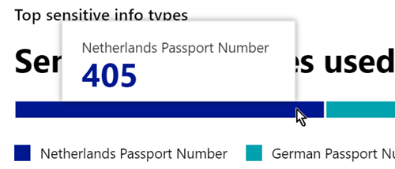
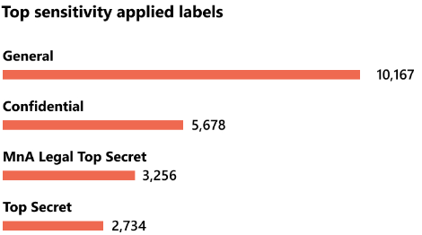
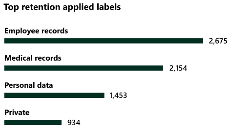

# Learn about data classification

As a Microsoft 365 administrator or compliance administrator, you can evaluate and then tag content in your organization in order to control where it goes, protect it no matter where it is and to ensure that it is preserved and deleted according to your organizations needs. You do this through the application of [sensitivity labels](sensitivity-labels.md), [retention labels](retention.md#retention-labels), and sensitive information type classification. There are various ways to do the discovery, evaluation and tagging, but the end result is that you may have very large number of documents and emails that are tagged and classified with one or both of these labels. After you apply your retention labels and sensitivity labels, you'll want to see how the labels are being used across your tenant and what is being done with those items. The data classification page provides visibility into that body of content, specifically:

- the number items that have been classified as a sensitive information type and what those classifications are
- the top applied sensitivity labels in both Microsoft 365 and Azure Information Protection
- the top applied retention labels
- a summary of activities that users are taking on your sensitive content
- the locations of your sensitive and retained data

You also manage these features on the data classification page:

- [trainable classifiers](classifier-learn-about.md)
- [sensitive information types](sensitive-information-type-learn-about.md)
- [Learn about exact data match based sensitive information types](sit-learn-about-exact-data-match-based-sits.md#learn-about-exact-data-match-based-sensitive-information-types)
- [content explorer](data-classification-content-explorer.md)
- [activity explorer](data-classification-activity-explorer.md)

You can find data classification in the <a href="https://go.microsoft.com/fwlink/p/?linkid=2077149" target="_blank">Microsoft 365 compliance center</a> or <a href="https://go.microsoft.com/fwlink/p/?linkid=2077139" target="_blank">Microsoft 365 Defender portal</a> > **Classification** > **Data Classification**.

Take a video tour of our data classification features.

> [!VIDEO https://www.microsoft.com/videoplayer/embed/RE4vx8x]

Data classification will scan your sensitive content and labeled content before you create any policies. This is called **zero change management**. This lets you see the impact that all the retention and sensitivity labels are having in your environment and empower you to start assessing your protection and governance policy needs.

## Prerequisites

### Permissions

 In order to get access to the data classification page, an account must be assigned membership in any one of these roles or role groups.

**Microsoft 365 role groups**

- Global administrator
- Compliance administrator
- Security administrator
- Compliance data administrator

> [!NOTE]
> As a best practice, always use the role with least privilege to grant access to Microsoft 365 data classification.

#### Roles and Role Groups in preview

There are roles and role groups in preview that you can test out to fine tune your access controls.

Here's a list of applicable roles that are in preview. To learn more about them, see [Roles in the Security & Compliance Center](../security/office-365-security/permissions-in-the-security-and-compliance-center.md#roles-in-the-security--compliance-center)

- Information Protection Admin
- Information Protection Analyst
- Information Protection Investigator
- Information Protection Reader

Here's a list of applicable role groups that are in preview. To learn more about them, see [Role groups in the Security & Compliance Center](../security/office-365-security/permissions-in-the-security-and-compliance-center.md#role-groups-in-the-security--compliance-center)

- Information Protection
- Information Protection Admins
- Information Protection Analysts
- Information Protection Investigators
- Information Protection Readers

## Sensitive information types used most in your content

Microsoft 365 comes with many definitions of sensitive information types, such as an item containing a social security number or a credit card number. For more information on sensitive information types, see [Sensitive information type entity definitions](sensitive-information-type-entity-definitions.md).

The sensitive information type card shows the top sensitive information types that have been found and labeled across your organization.

To find out how many items are in any given classification category, hover over the bar for the category.

> [!NOTE]
> If the card displays the message "No data found with sensitive information", it means that there are no items in your organization that have been classified as being a sensitive information type or no items that have been crawled. To get started with labels, see:
>- [Get started with sensitivity labels](get-started-with-sensitivity-labels.md)
>- [Get started with records-management](get-started-with-records-management.md)
>- [Sensitive information type entity definitions](sensitive-information-type-entity-definitions.md)

## Top sensitivity labels applied to content

When you apply a sensitivity label to an item either through Microsoft 365 or Azure Information Protection (AIP), two things happen:

- A tag that indicates the value of the item to your org is embedded in the document and will follow it everywhere it goes.
- The presence of the tag enables various protective behaviors, such as mandatory watermarking or encryption. With end point protection enabled you can even prevent an item from leaving your organizational control.

For more information on sensitivity labels, see: [Learn about sensitivity labels](sensitivity-labels.md)

Sensitivity labels must be enabled for files that are in SharePoint and OneDrive in order for the corresponding data to surface in the data classification page. For more information, see [Enable sensitivity labels for Office files in SharePoint and OneDrive](sensitivity-labels-sharepoint-onedrive-files.md).

The sensitivity label card shows the number of items (email or document) by sensitivity level.

> [!NOTE]
> If you haven't created or published any sensitivity labels or no content has had a sensitivity label applied, this card will display the message "No sensitivity labels detected". To get started with sensitivity labels, see:
>- [Get started with sensitivity labels](get-started-with-sensitivity-labels.md) or for AIP [Configure the Azure information protection policy](/azure/information-protection/configure-policy)

## Top retention labels applied to content

Retention labels are used to manage the retention and disposition of content in your organization. When applied, they can be used to control how long an item will be kept before deletion, whether it should be reviewed prior to deletion, when its retention period expires, and whether it should be marked as a record. For more information, see [Learn about retention policies and retention labels](retention.md).

The top applied retention labels card shows you how many items have a given retention label.

> [!NOTE]
> If this card displays the message, "No retention labels detected", it means you haven't created or published any retention labels or no content has had a retention label applied. To get started with retention labels, see:
>- [Get started with information governance](get-started-with-information-governance.md)

## Top activities detected

This card provides a quick summary of the most common actions that users are taking on the sensitivity labeled items. You can use the [Activity explorer](data-classification-activity-explorer.md) to drill deep down on the different activities that Microsoft 365 tracks on labeled content and content that is located on Windows 10 endpoints.

> [!NOTE]
> If this card displays the message, "No activity detected" it means that there's been no activity on the files or that user and admin auditing isn't turned on. To turn the audit logs on , see:
>- [Search the audit log in security & compliance center](search-the-audit-log-in-security-and-compliance.md)

## Sensitivity and retention labeled data by location

The point of the data classification reporting is to provide visibility into the number of items that have which label as well as their location. These cards let you know how many labeled items the are in Exchange, SharePoint, and OneDrive etc.

> [!NOTE]
> If this card displays the message, "No locations detected, it means you haven't created or published any sensitivity labels or no content has had a retention label applied. To get started with sensitivity labels, see:
>- [Sensitivity labels](sensitivity-labels.md)

## Public preview release notes 

> [!NOTE]
> **Exchange mailbox count**:
>You will notice a small tool tip appear when you drill into Exchange mailboxes. This is to call out the fact that the aggregate count displayed for sensitive information type, sensitivity label and retention label may not exactly match the number of items that you will find inside the mailbox. This is because the drill-down into the folder fetches the live view of content, which is classified, while the aggregated count is calculated.Information the user should notice even if skimming

> [!NOTE]
> **Rendering of encrypted documents**:
>SharePoint, Exchange, and OneDrive files that are encrypted don't render in the content explorer. This is a sensitive issue that requires a balance between the need to see file contents in content explorer and the need to keep the contents encrypted. With the permissions granted by **Content Explorer List Viewer**, and **Content Explorer Content Viewer** role groups, you will see a list view of the files, the file  metadata, and a link you can use to access the content via the web client.Information the user should notice even if skimming

> [!NOTE]
> **Supported characters in retention label names in SharePoint search**:
>SharePoint search doesn't support retention label names with `-`, or `_` in them. For example, `Label-MIP` and `Label_MIP` aren't supported. SharePoint search does support those characters in sensitivity label names and sensitive information type names.

> [!NOTE]
> **OneDrive remains in preview**:
>Thanks for your valuable feedback on OneDrive integration during our preview program. As we work through the specifics, you may run into inconsistent data / flows. We'll continue to showcase OneDrive in preview until all fixes are in place. We appreciate your continued support.

## See also

- [View label activity](data-classification-activity-explorer.md)
- [View labeled content](data-classification-content-explorer.md)
- [Learn about sensitivity labels](sensitivity-labels.md)
- [Learn about retention policies and retention labels](retention.md)
- [Learn about sensitive information types](sensitive-information-type-learn-about.md)
- [Sensitive information type entity definitions](sensitive-information-type-entity-definitions.md)
- [Learn about trainable classifiers (preview)](classifier-learn-about.md)

To learn how to use data classification to comply with data privacy regulations, see [Deploy information protection for data privacy regulations with Microsoft 365](../solutions/information-protection-deploy.md)  (aka.ms/m365dataprivacy).
