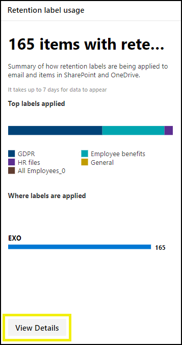
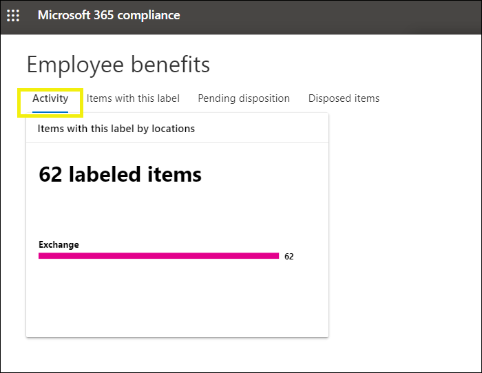
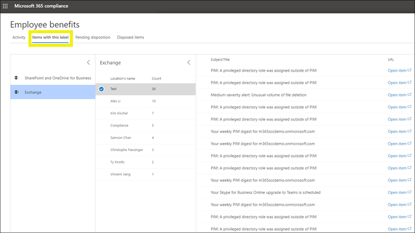

# Data classification overview page

You can evaluate and then tag content in your organization in order to control where it goes, protect it no matter where it is and to ensure that it is preserved and deleted according your your organizations needs. You do this through the application of [sensitivity labels](sensitivity-labels.md), [retention labels](labels.md), and sensitive information types. There are various ways to do the discovery, evaluation and tagging, but the end result is that you may have very large numbers of documents and emails that are tagged with one or both of these labels. After you apply  your retention labels and sensitivity labels, you’ll want to see how they’re being used across your tenant. With the data classification blade provides visibility into that body of content, specifically:

- the volume of content that has been classified and what those classifications are
- the top applied sensitivity labels
- the top applied retention labels
- the locations of your sensitive and retained data
- a summary of activities that meet the action criteria for sensitive content, be that monitor, notify or block access

placeholder image and text

You can find data classification in the [Microsoft 365 compliance center](https://compliance.microsoft.com/dataclassification?viewid=overview) or [Microsoft 365 security center](https://security.microsoft.com/dataclassification?viewid=overview) > **Classification** > **Data Classification**.

## Sensitive information types classification

A sensitive information type is a pre-defined type of information, such as a social security number or a credit card number that comes with Microsoft 365. For more information on sensitive information types, see [What the sensitive information types look for](what-the-sensitive-information-types-look-for).

The sensitive information type widget shows the top sensitive information types that have been found and labeled across your organization.

to find out how many items are in any given classification category, hover over the bar for the category.

## Top applied sensitivity labels

When you apply a sensitivity label to an item, two things happen:

- a tag that indicates the value of the item to your org is embedded in the document and will follow it everywhere it goes
- the presence of the tag enables various protective behaviors, such as mandatory watermarking or encryption. With end point protection enabled you can even prevent an item from leaving your organizational control.

for more information on sensitivity labels, see: [Overview of sensitivity labels](https://docs.microsoft.com/en-us/microsoft-365/compliance/sensitivity-labels)

The sensitivity label widget shows the number of items (email or document) by sensitivity level.

## Top applied retention labels

Retention labels are used to manage the disposition of critical content in your organization. When applied, they can be used to control how long a document will be kept before deletion, whether it should be reviewed prior to deletion when it's retention period expires or whether it should be marked as a record which can never be deleted. For more information see, [Overview of retention labels](labels.md)
 
The top applied retention labels widget show you how many items have a given retention lable applied.

## Sensitive data by location
<!--

Note that the Azure Information Protection reports have [prerequisites](https://docs.microsoft.com/en-us/azure/information-protection/reports-aip#prerequisites-for-azure-information-protection-analytics) that also apply to label analytics on sensitivity labels in the Microsoft 365 compliance center and Microsoft 365 security center. For example, you need an Azure subscription that includes the Log Analytics because these reports are a result of sending information protection audit events from Azure Information Protection clients and scanners to a centralized location based on Azure Log Analytics service.

For sensitivity label usage:

- There is no latency in the data. This is a real-time report.
- To see the count for each top label, point to the bar graph and read the tool tip that appears.
- The report shows where sensitivity labels are applied per app (whereas retention labels are shown per location).

 -->

<!-- This report shows a quick view of what the top labels are and where they’re applied. For more detailed information on how content in SharePoint and OneDrive is labeled, see [View label activity for documents](view-label-activity-for-documents.md).

For retention label usage:

- Data is aggregated weekly, so it may take up to seven days for data to appear in the report.
- To see the count for each top label, point to the bar graph and read the tool tip that appears.
- The report shows where retention labels are applied per location (whereas sensitivity labels are shown per app).
- For retention labels, this is a summary of the all-time data in your tenant; it’s not filtered to a specific date range. By contrast, the [Label Activity Explorer](view-label-activity-for-documents.md) shows data from only the past 30 days.

From the retention label usage report, you can quickly explore all content with that label applied. (Note that we're currently working on this feature, so that it will take fewer steps to view all the labeled content.)

First, choose **View Details** at the bottom of the report.

Then choose a retention label > **Explore items** in the right pane.

For that label, you can choose the **Activity** tab to view a count of items with that label by location.

You can also choose the **Items with this label** tab. Then you can drill into specific locations:

- For Exchange Online, you see a list of mailboxes with the count of labeled items in each mailbox.
- For SharePoint Online and OneDrive for Business, you see a list of site collections and OneDrive accounts with the count of labeled items in each location.

When you choose a mailbox or site collection, you can view a list of items with that retention label in that location.

 -->

<!-- To view label analytics, you must be assigned one of the following roles in Azure Active Directory:

- Global administrator
- Compliance administrator
- Security administrator
- Security reader

In addition, note these reports use Azure Monitor to store the data in a Log Analytics workspace that your organization owns. Therefore, the user should be added as a reader to the Azure Monitoring worksapce that holds the data - for more information, see [Permissions required for Azure Information Protection analytics](https://docs.microsoft.com/en-us/azure/information-protection/reports-aip#permissions-required-for-azure-information-protection-analytics). -->

## Potential risky activity