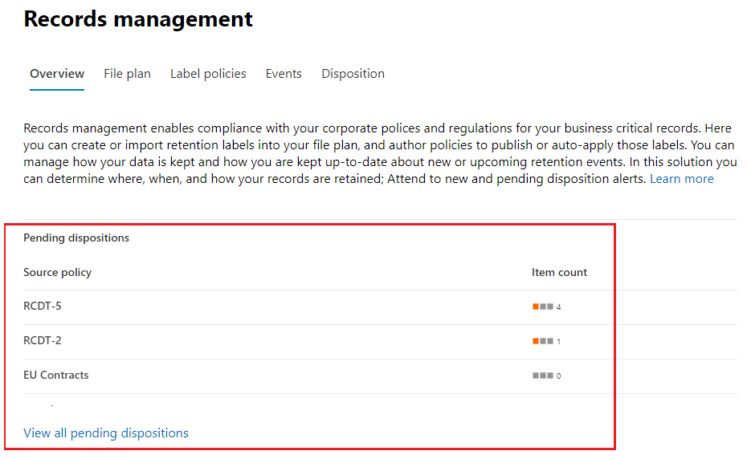
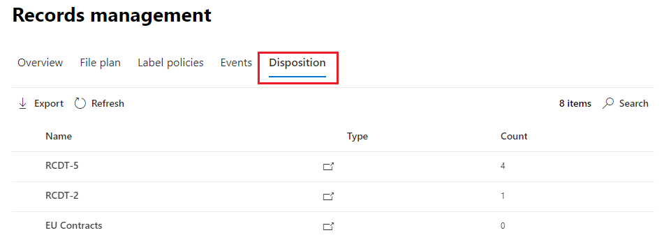

# Disposition of content

>*[Microsoft 365 licensing guidance for security & compliance](https://aka.ms/ComplianceSD).*

Use the **Disposition** tab from **Records Management** in the Microsoft 365 compliance center to manage disposition reviews and view [records](records-management.md#records) that have been automatically deleted at the end of their retention period.

> [!NOTE]
> Rolling out in preview: multi-staged disposition. Now, an administrator can add up to five stages of disposition and reviewers can forward disposition requests to additional users. For more information, see the information that follows.

## Prerequisites for viewing content dispositions

To manage disposition reviews and confirm that records have been deleted, you must have sufficient permissions and auditing must be enabled.

### Permissions for disposition

To successfully access the **Disposition** tab in the Microsoft 365 compliance center, users must have the **Disposition Management** admin role. From December 2020, this role is now included in the **Records Management** default admin role group.

> [!NOTE]
> By default, a global admin isn't granted the **Disposition Management** role. 

To grant users just the permissions they need for disposition reviews without granting them permissions to view and configure other features for retention and records management, create a custom role group (for example, named "Disposition Reviewers") and grant this group the Disposition Management role.

Additionally, to view the contents of items during the disposition process, add users to the following two role groups: **Content Explorer Content Viewer** and **Content Explorer List Viewer**. If users don't have the permissions from these role groups, they can still select a disposition review action to complete the disposition review, but must do so without being able to view the item's contents from the compliance center.

For instructions to configure these permissions, see [Give users access to the Office 365 Security & Compliance Center](../security/office-365-security/grant-access-to-the-security-and-compliance-center.md).

### Enable auditing

Make sure that auditing is enabled at least one day before the first disposition action. For more information, see [Search the audit log in the Office 365 Security &amp; Compliance Center](search-the-audit-log-in-security-and-compliance.md). 

## Disposition reviews

When content reaches the end of its retention period, there are several reasons why you might want to review that content and confirm whether it can be permanently deleted ("disposed"). For example, instead of deleting the content, you might need to:
  
- Suspend the deletion of relevant content in the event of litigation or an audit.

- Assign a different retention period to the content, perhaps because the original retention settings were a temporary or provisional solution.

- Move the content from its existing location to an archive location, for example, if that content has research or historical value.

When a disposition review is triggered at the end of the retention period:
  
- The people you choose receive an email notification that they have content to review. These reviewers can be individual users or mail-enabled security groups. New in preview:
   - You can customize the email that they receive, including a link for your organization-specific information, and instructions in different languages. For multi-language support, you must specify the translations yourself and this text is displayed to users when the languages you select match their Windows locale setting.
   - Users receive an initial email notification at the end of the item's retention period, with a reminder per label once a week of all disposition reviews that they are assigned.
    
- The reviewers go to the **Disposition** tab in the Microsoft 365 compliance center to review the content and decide whether to permanently delete it, extend its retention period, or apply a different retention label. New in preview:
- Reviewers see only the disposition reviews that are assigned to them, whereas administrators see all disposition reviews.
- Reviewers can add new users to the same disposition review, which generates a new auditing event and notifies the administrator.
- For the disposition review process, a details pane for each item shows a preview of the content if they have permissions to see, and a link to request permissions if not. This details pane also has a History tab to display indexed properties, where it's located, who created it and when, who last modified it and when, matched sensitive info types, and any disposition review actions to date.

A disposition review can include content in Exchange mailboxes, SharePoint sites, and OneDrive accounts. Content awaiting a disposition review in those locations is permanently deleted only after a reviewer for the final stage of disposition chooses to permanently delete the content.

> [!NOTE]
> A mailbox must have at least 10 MB data to support disposition reviews.

An administrator can see an overview of all pending dispositions in the **Overview** tab. For example:

When you select the **View all pending dispositions**, you're taken to the **Disposition** page. For example:

### Workflow for a disposition review

The following diagram shows the basic workflow for a disposition review when a retention label is published and then manually applied by a user. Alternatively, a retention label configured for a disposition review can be automatically applied to content.
  

  
Triggering a disposition review at the end of the retention period is a configuration option that's available only with a retention label. This option is not available for a retention policy. For more information about these two retention solutions, see [Learn about retention policies and retention labels](retention.md).

From the **Define retention settings** page for a retention label:

 
After you select this **Trigger a disposition review** option, on the next page of the wizard, you specify how many stages of disposition you want and the disposition reviewers for each stage:

Select **Add stages**, and name your stage for identification purposes. Then specify the reviewers for that stage.

For the reviewers, specify a user or mail-enabled security group. Microsoft 365 groups ([formerly Office 365 groups](https://techcommunity.microsoft.com/t5/microsoft-365-blog/office-365-groups-will-become-microsoft-365-groups/ba-p/1303601)) are not supported for this option.

If you need more than one person to review an item at the end of its retention period, select **Add stages** again and repeat the configuration process for the number of stages that you need, with a maximum of five stages. 

Within each individual stage of disposition, any of the users you specify for that stage are authorized to take the next action for the item at the end of it's retention period. These users can also forward the disposition review to other users.

> [!NOTE]
> Multi-stage disposition is currently in preview. Existing disposition reviews can be upgraded to multi-staged disposition reviews by selecting **Add Stages**.

For each stage specified, you can rename it, reorder it, or remove it by selecting the Stage actions option (**...**): 

After you have specified your reviewers, remember to grant them the **Disposition Management** admin role. For more information, see the [Permissions for disposition](#permissions-for-disposition) section on this page.

### Viewing and disposing of content

When a reviewer is notified by email that content is ready to review, they go to the **Disposition** tab from **Records Management** in the Microsoft 365 compliance center. The reviewers can see how many items for each retention label are awaiting disposition, and then select a retention label to see all content with that label.

After they select a retention label, they then see all pending dispositions for that label from the **Pending disposition** tab. When they select one or more items, they can then choose an action and enter a justification comment:

As you can see from the picture, the actions supported are: 
  
- **Permanently delete the item**:
    - When this action is selected for an interim stage of disposition review when you have configured multiple stages: The item moves to the next disposition stage.
    - When this action is selected for the final stage of disposition review, or there is only one stage of disposition: The item is permanently deleted.
- **Extend the retention period**:
    - When this action is selected, disposition review is effectively suspended until the end of the extended period and then disposition review resumes for the same disposition stage (interim, final, or the only stage).
- **Apply a different retention label**:
    -When this action is selected, the item exits the disposition review process for the original label. The item is then subject to any new disposition review settings from the newly selected retention label.

During a disposition review, the content never moves from its original location, and it's never permanently deleted until this action is selected by a reviewer for the final or only disposition stage. Then, the content becomes eligible for the standard cleanup process for that workload. For more information, see [How retention settings work with content in place](retention.md#how-retention-settings-work-with-content-in-place).

All disposition actions can be audited and the justification text entered by the reviewer is saved and displayed in the **Comment** column on the **Disposed items** page.

## Disposition of records

Use the **Disposition** tab from the **Records Management** page to identify records that are now deleted, either automatically or after a disposition review. These items display **Records Disposed** in the **Type** column. For example:

Items that are shown in the **Disposed Items** tab for record labels are kept for up to seven years after the item was disposed, with a limit of one million items per record for that period. If you see the **Count** number nearing this limit of one million, and you need proof of disposition for your records, contact [Microsoft Support](https://docs.microsoft.com/office365/admin/contact-support-for-business-products). Extending this limit is currently in preview.

> [!NOTE]
> This functionality is based on information from the [unified audit log](search-the-audit-log-in-security-and-compliance.md) and therefore requires auditing to be [enabled and searchable](turn-audit-log-search-on-or-off.md) so the corresponding events are captured.

For auditing, search for **Deleted file marked as a record** in the **File and page activities** category. This audit event is applicable to documents and emails.

## Filter and export the views

When you select a retention label from the **Disposition** page, the **Pending disposition** tab (if applicable) and the **Disposed items** tab let you filter the views to help you more easily find items. 

For pending dispositions, the time range is based on the expiration date. For disposed items, the time range is based on the deletion date.
  
You can export information about the items in either view as a .csv file that you can then sort and manage using Excel:

