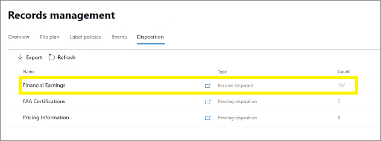
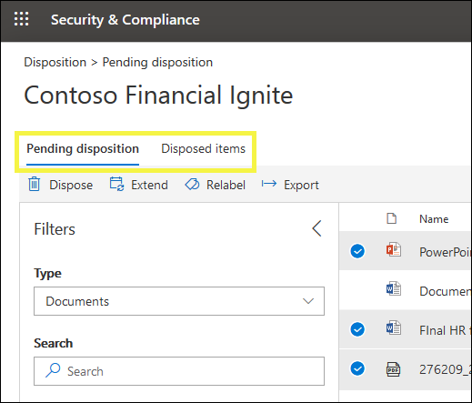

# Disposition of content

>*[Microsoft 365 licensing guidance for security & compliance](https://aka.ms/ComplianceSD).*

Use the **Disposition** tab from **Records Management** in the Microsoft 365 compliance center to manage and view content that's been deleted as a result of a retention policy or retention label. 

These deletions can be a result of automatically deleting the content at the end of the configured retention period, or after a disposition review. 

> [!NOTE]
> Rolling out to tenants during April and May 2020, you can now view all content that has been deleted at the end of its retention period, and not just the labeled content that was deleted as a result of a disposition review.

## Prerequisites for viewing content dispositions

To review documents and emails that are marked for a disposition review and see which content has been deleted, you must have sufficient permissions.

### Permissions for disposition

To successfully access the **Disposition** tab in the Microsoft 365 compliance center, you must be members of the **Disposition Management** role and the **View-Only Audit Logs** role. We recommend creating a new role group called **Disposition Reviewers**, and add these two roles to that role group. 

Specific to the **View-Only Audit Logs** role:

- Because the underlying cmdlet used to search the audit log is an Exchange Online cmdlet, you must assign users this role by using the [Exchange admin center in Exchange Online](https://docs.microsoft.com/Exchange/exchange-admin-center), rather than by using the **Permissions** page in the Security & Compliance Center. For instructions, see [Manage role groups in Exchange Online](https://docs.microsoft.com/Exchange/permissions-exo/role-groups).

- Microsoft 365 Groups ([formerly Office 365 Groups](https://techcommunity.microsoft.com/t5/microsoft-365-blog/office-365-groups-will-become-microsoft-365-groups/ba-p/1303601)) aren't supported for this role. Instead, assign user mailboxes, mail users, or mail-enabled security groups.

For instructions to grant users the **Disposition Management** role and create your new **Disposition Reviewers** role, see [Give users access to the Office 365 Security &amp; Compliance Center](../security/office-365-security/grant-access-to-the-security-and-compliance-center.md).

## Automatic disposition and disposition review

Different from a retention policy, when you configure a retention label and specify an end period, your deletion options at the end of that period are to automatically delete the content or trigger a disposition review.

If you choose the option **Delete the content automatically**, no further action is needed from you. However, you can confirm that the content was deleted.  For more information, see the [View pending dispositions and disposed items](#view-pending-dispositions-and-disposed-items) section on this page.

If you choose the option **Trigger a disposition review**, additional action is needed before the content is deleted. For more information, see the next section.

### Disposition reviews

When content reaches the end of its retention period, there are several reasons why you might want to review that content to decide whether it can be safely deleted ("disposed"). For example, you might need to:
  
- Suspend the deletion of relevant content in the event of litigation or an audit.
    
- Remove content from the disposition list to store in an archive, if that content has research or historical value.
    
- Assign a different retention period to the content, perhaps because the original retention settings were a temporary or provisional solution.
    
- Return the content to clients or transfer it to another organization.

When a disposition review is triggered at the end of the retention period:
  
- The people you choose receive an email notification that they have content to review. These reviewers can be individual users, distribution or security groups, or Office 365 groups. Note that notifications are sent on a weekly basis.
    
- The reviewers go to the **Disposition** tab in the Microsoft 365 compliance center to review the content. The reviewers can see how many items for each retention label are awaiting disposition, and then select a retention label to see all content with that label.
    
- For each document or email, the reviewer can:
    
  - Apply a different retention label.
    
  - Extend its retention period.
    
  - Permanently delete it.
    
- Reviewers can view either pending or completed dispositions, and export that list as a .csv file.

A disposition review can include content in Exchange mailboxes, SharePoint sites, OneDrive accounts, and Microsoft 365 groups. Content awaiting a disposition review in those locations is deleted only after a reviewer chooses to permanently delete the content.
  

### Workflow for a disposition review

This is the basic workflow for a disposition review when a retention label is published and then manually applied by a user. Alternatively, a retention label configured for a disposition review can be auto-applied to content.
  

  
Triggering a disposition review at the end of the retention period is a configuration option that's available only with a retention label. This option is not available in a retention policy.
  
For more information about retention labels, see [Overview of retention labels](labels.md).
  

 
> [!NOTE]
> When you specify the option **Notify these people when there are items ready to review**, specify a user or mail-enabled security group. Office 365 groups are not supported for this option.

### Viewing and disposing of content

When a reviewer is notified by email that content is ready to review, they go to the **Disposition** tab from **Records Management** in the Microsoft 365 compliance center. The reviewers can see how many items for each retention label are awaiting disposition, and then select a retention label to see all content with that label.

After you select a retention label, you then see all pending dispositions for that label.

You can then: 
  
- Apply a different retention label.
    
- Extend the retention period.
    
- Permanently delete the item.

Note that you can select multiple items and dispose them at the same time.
    
You can also use the link to view the document in its original location, if you have permissions for that location. During a disposition review, the content never moves from its original location, and it's never deleted until the reviewer chooses to do so.
  
Note that the email notifications are sent automatically to reviewers on a weekly basis. Therefore, when content reaches the end of its retention period, it may take up to seven days for reviewers to receive the email notification that content is awaiting disposition.
  
All disposition actions can be audited. Turn on auditing at least one day before the first disposition action. For more information, see [Search the audit log in the Office 365 Security &amp; Compliance Center](search-the-audit-log-in-security-and-compliance.md). 
  
### How long until disposed content is permanently deleted

Content awaiting a disposition review is deleted only after a reviewer chooses to permanently delete the content. When the reviewer chooses this option, the content in the SharePoint site or OneDrive account becomes eligible for the standard cleanup process described in [How a retention policy works with content in place](retention-policies.md#how-a-retention-policy-works-with-content-in-place).
  

## View pending dispositions and disposed items

From the **Pending disposition** page, you can view both pending and completed dispositions: 
  
- The **Pending disposition** shows items that have reached the end of their retention period and require a disposition review. After reviewing each item, decide if you want to apply a different retention label to it, extend its retention period, or permanently delete it. You can select multiple items.

- The **Disposed items** tab shows permanently-deleted items that have already been through a disposition review, or deleted content that didn't go through a disposition review. They show here because the permanent deletion process can take several days. Items that had a different retention label applied, or had their retention period extended, won't appear here.

### Viewing automatic disposal of content

Content that was automatically deleted without a disposition review are identified by the type **Records Disposed**. For example:

Because this feature is gradually rolling out to tenants during April and May 2020, you might not see these items immediately. When you do, this disposition information is kept for up to 7 years after the item was disposed, with a limit of one million items per record for that period.

If you see the **Count** number nearing this limit of one million, and you need proof of disposition for the item, contact [Microsoft Support](https://docs.microsoft.com/office365/admin/contact-support-for-business-products).

    
## Filter the disposition views

You can filter these views by retention label or time range. For pending dispositions, the time range is based on the expiration date. For disposed items, the time range is based on the deletion date.
  

### Export the disposition items

In addition, you can export the items in either view as a .csv file that you can open in Excel.
  

## Auditing content disposal
 
When content is automatically deleted as a result of a retention policy or retention label, an audit entry with the operation name of **RecordDelete** is added to the audit log.

For more information about auditing, see [Search the audit log in the Security & Compliance Center](search-the-audit-log-in-security-and-compliance.md).

