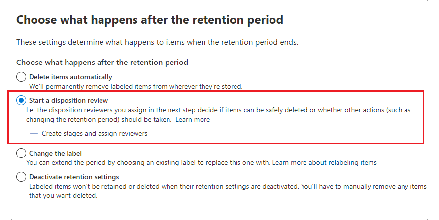
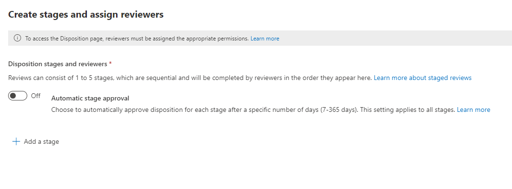
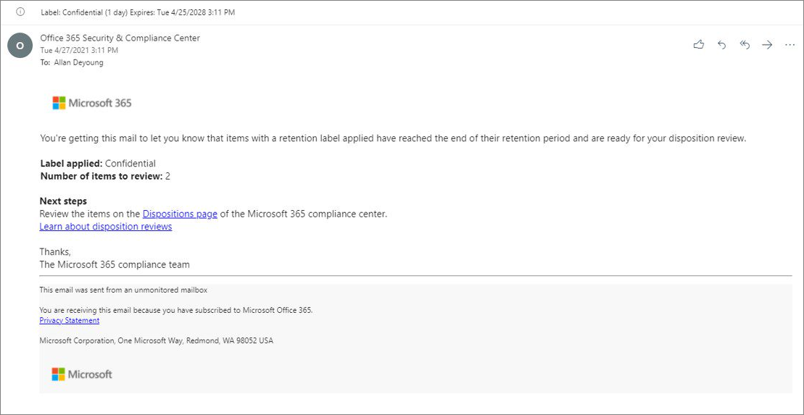

# Disposition of content

>*[Microsoft 365 licensing guidance for security & compliance](/office365/servicedescriptions/microsoft-365-service-descriptions/microsoft-365-tenantlevel-services-licensing-guidance/microsoft-365-security-compliance-licensing-guidance).*

Use the **Disposition** page from **Records Management** in the Microsoft 365 compliance center to manage disposition reviews and view the metadata of [records](records-management.md#records) that have been automatically deleted at the end of their retention period.

> [!NOTE]
> Rolling out in preview: **multi-stage disposition review**
> 
> An administrator can now add up to five consecutive stages of disposition review in a retention label, and reviewers can add others users to their disposition review stage. You can also customize the email notifications and reminders. The following sections have more information about the changes in this preview.

## Prerequisites for viewing content dispositions

To manage disposition reviews and confirm that records have been deleted, you must have sufficient permissions and auditing must be enabled.

### Permissions for disposition

To successfully access the **Disposition** tab in the Microsoft 365 compliance center, users must have the **Disposition Management** role. From December 2020, this role is now included in the **Records Management** default role group.

> [!NOTE]
> By default, a global admin isn't granted the **Disposition Management** role. 

To grant users just the permissions they need for disposition reviews without granting them permissions to view and configure other features for retention and records management, create a custom role group (for example, named "Disposition Reviewers") and grant this group the **Disposition Management** role.

For instructions to configure these permissions, see [Give users access to the Office 365 Security & Compliance Center](../security/office-365-security/grant-access-to-the-security-and-compliance-center.md).

Additionally:

- To view the contents of items during the disposition process, add users to the **Content Explorer Content Viewer** role group. If users don't have the permissions from this role group, they can still select a disposition review action to complete the disposition review, but must do so without being able to view the item's contents from the mini-preview pane in the compliance center.

- In preview: By default, each person that accesses the **Disposition** page sees only items that they are assigned to review. For a records management administrator to see all items assigned to all users, and all retention labels that are configured for disposition review: Navigate to **Records management settings** > **General** > **Record Manager Security Group** to select and then enable a mail-enabled security group that contains the administrator accounts.
    
    Microsoft 365 groups and security groups that aren't mail-enabled doesn't support this feature and wouldn't be displayed in the list to select. If you need to create a new mail-enabled security group, use the link to the Microsoft 365 admin center to create the new group. 
    
    > [!IMPORTANT]
    > You can't disable this permission or replace the group that you enabled from the compliance center. However, you can enable another mail-enabled security group by using the [Enable-ComplianceTagStorage](/powershell/module/exchange/enable-compliancetagstorage) cmdlet.
    > 
    > For example: `Enable-ComplianceTagStorage -RecordsManagementSecurityGroupEmail dispositionreviewers@contosoi.com`

- In preview: The **Records management settings** option is visible only to record management administrators. 

### Enable auditing

Make sure that auditing is enabled at least one day before the first disposition action. For more information, see [Search the audit log in the Office 365 Security &amp; Compliance Center](search-the-audit-log-in-security-and-compliance.md). 

## Disposition reviews

When content reaches the end of its retention period, there are several reasons why you might want to review that content and confirm whether it can be permanently deleted ("disposed"). For example, instead of deleting the content, you might need to:
  
- Suspend the deletion of relevant content for litigation or an audit.

- Assign a different retention period to the content, perhaps because the original retention settings were a temporary or provisional solution.

- Move the content from its existing location to an archive location, for example, if that content has research or historical value.

When a disposition review is triggered at the end of the retention period:
  
- The reviewers you choose receive an email notification that they have content to review. These reviewers can be individual users or mail-enabled security groups. New in preview:
   - You can customize the email that they receive, including instructions in different languages. For multi-language support, you must specify the translations yourself and this custom text is displayed to all reviewers irrespective of their locale.
   - Users receive an initial email notification per label at the end of the item's retention period, with a reminder per label once a week of all disposition reviews that they are assigned. They can click the link in the notification and reminder emails to go to the **Disposition** page in the Microsoft 365 compliance center to review the content and take an action. Alternately, the reviewers can go directly to the **Disposition** page in the compliance center.
   - Reviewers see only the disposition reviews that are assigned to them, whereas administrators who are added to the selected Record Manager Security Group see all disposition reviews.
   - Reviewers can add new users to the same disposition review. Currently, this action doesn't automatically grant these added users the [required permissions](#permissions-for-disposition).
   - For the disposition review process, a mini-review pane for each item shows a preview of the content if they have permissions to see it. If they don't have permissions, they can select the content link and request permissions. This mini-review pane also has tabs for additional information about the content:
       - **Details** to display indexed properties, where it's located, who created it and when, and who last modified it and when.
       - **History** that shows the history of any disposition review actions to date, with reviewer comments if available.

A disposition review can include content in Exchange mailboxes, SharePoint sites, and OneDrive accounts. Content pending a disposition review in those locations is permanently deleted only after a reviewer for the final stage of disposition chooses to permanently delete the content.

> [!NOTE]
> A mailbox must have at least 10 MB data to support disposition reviews.

Administrators can see an overview of all pending dispositions in the **Overview** tab. Reviewers see only their items pending disposition. For example:


When you select the **View all pending dispositions**, you're taken to the **Disposition** page. For example:


### Workflow for a disposition review

The following diagram shows the basic workflow for a disposition review when a retention label is published and then manually applied by a user. Alternatively, a retention label configured for a disposition review can be automatically applied to content.
  


### How to configure a retention label for disposition review

Triggering a disposition review at the end of the retention period is a configuration option that's available only with a retention label. Disposition review is not available for a retention policy. For more information about these two retention solutions, see [Learn about retention policies and retention labels](retention.md).

From the **Define retention settings** page for a retention label:


 
After you select this **Trigger a disposition review** option, on the next page of the wizard, you specify how many consecutive stages of disposition you want and the disposition reviewers for each stage:

 

Select **Add a stage**, and name your stage for identification purposes. Then specify the reviewers for that stage.

For the reviewers, specify a user or a mail-enabled security group. Microsoft 365 groups ([formerly Office 365 groups](https://techcommunity.microsoft.com/t5/microsoft-365-blog/office-365-groups-will-become-microsoft-365-groups/ba-p/1303601)) are currently not supported for this option.

If you need more than one person to review an item at the end of its retention period, select **Add a stage** again and repeat the configuration process for the number of stages that you need, with a maximum of five stages. 

Within each individual stage of disposition, any of the users you specify for that stage are authorized to take the next action for the item at the end of its retention period. These users can also add other users to their disposition review stage.

> [!NOTE]
> Existing retention labels that are configured for disposition review can be upgraded to use multi-staged disposition review by configuring the label. In the label wizard, select **Add a stage**, or edit the existing reviewers or add new reviewers.

During the configuration phase, for each stage specified, you can rename it, reorder it, or remove it by selecting the Stage actions option (**...**): 


However, you can't reorder or remove a stage after you have created the retention label.

After you have specified your reviewers, remember to grant them the **Disposition Management** role permission. For more information, see the [Permissions for disposition](#permissions-for-disposition) section on this page.

### How to customize email messages for disposition review

Example default email notification sent to a reviewer:



Also in preview, you can customize the email messages that are sent to disposition reviewers for the initial notification and then reminders.

From any of the Disposition pages in the compliance center, select **Record management settings**:  


Then select the **Email templates** tab, and specify whether you want to use just the default email templates, or add your own text to the default template. Your custom text is added to the email instructions after the information about the retention label and before the next steps instructions.

Text for all languages can be added, but formatting and images are currently unsupported. URLs and email addresses can be entered as text and depending on the email client, display as hyperlinks or unformatted text in the customized email.

Example text to append:

```console
If you need additional information, visit the helpdesk website (https://support.contoso.com) or send them an email (helpdesk@contoso.com).
```

Select **Save** to save any changes.

### Viewing and disposing of content

When a reviewer is notified by email that content is ready to review, they go to the **Disposition** tab from **Records Management** in the Microsoft 365 compliance center. The reviewers can see how many items for each retention label are awaiting disposition with the **Type** displaying **Pending disposition**. They then select a retention label, and **Open in new window** to see all content with that label:


From the **Pending dispositions** page, they see all pending dispositions for that label. When one or more items are selected, they can use the mini-preview pane and the **Source**, **Details**, and **History** tab to inspect the content before taking action on it:


If you use the horizontal scroll bar, or close the min-review pane, you see more columns that include the expiry date and the name of the disposition review stage.

As you can see from the example shown, the actions supported are: 
  
- **Approve disposal**:
    - When this action is selected for an interim stage of disposition review (you have configured multiple stages): The item moves to the next disposition stage.
    - When this action is selected for the final stage of disposition review, or there is only one stage of disposition: The item is marked as eligible for permanent deletion. The exact timing for that deletion depends on the workload. For more information, see [How retention settings work with content in place](retention.md#how-retention-settings-work-with-content-in-place).
- **Relabel**:
    - When this action is selected, the item exits the disposition review process for the original label. The item is then subject to the retention settings of the newly selected retention label.
- **Extend**:
    - When this action is selected, disposition review is effectively suspended until the end of the extended period and then disposition review is triggered again from the first stage.
- **Add reviewers**:
    - When this action is selected, the user is prompted to specify and add other users for review.
    
    > [!NOTE]
    > This action doesn't automatically grant the [required permissions](#permissions-for-disposition) to the users who are added. If they don't have these permissions, they won't be able to participate in the disposition review.

Each action taken is saved and stored although you can't yet search for them in the audit log.

During a disposition review, the content never moves from its original location, and it's not marked for permanent deletion until this action is selected by a reviewer for the final or only disposition stage.

## Disposition of records

Use the **Disposition** tab from the **Records Management** page to identify:

- Items deleted as a result of a disposition review.
- Items marked as a record or regulatory record that were automatically deleted at the end of their retention period.

These items display **Records Disposed** in the **Type** column. For example:


Items that are shown in the **Disposed Items** tab are kept for up to seven years after the item was disposed, with a limit of one million items per record for that period. If you see the **Count** number nearing this limit of one million, and you need proof of disposition for your records, contact [Microsoft Support](../business-video/get-help-support.md).

> [!NOTE]
> This functionality uses information from the [unified audit log](search-the-audit-log-in-security-and-compliance.md) and therefore requires auditing to be [enabled and searchable](turn-audit-log-search-on-or-off.md) so the corresponding events are captured.

For auditing of deleted items that were marked as records or regulatory records, search for **Deleted file marked as a record** in the **File and page activities** category. This audit event is applicable to documents and emails.

## Filter and export the views

When you select a retention label from the **Disposition** page, the **Pending disposition** tab (if applicable) and the **Disposed items** tab let you filter the views to help you more easily find items.

For pending dispositions, the time range is based on the expiration date. For disposed items, the time range is based on the deletion date.
  
You can export information about the items in either view as a .csv file that you can then sort and manage using Excel.
