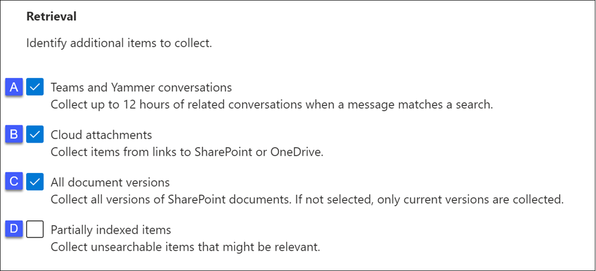
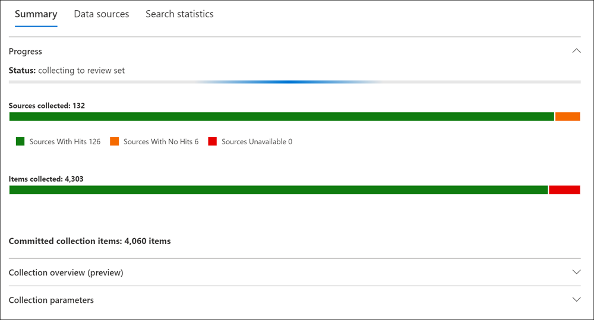

# Commit a collection estimate to a review set in eDiscovery (Premium)

When you're satisfied with the items you've collected in a collection estimate and are ready to analyze, tag, and review them, you can commit a collection to a review set in the case. When you commit a collection estimate to a review set, collected items are copied from their original content location in Microsoft 365 services and added to a review set. A review set is a secure, Microsoft-provided Azure Storage location in the Microsoft cloud.

[!INCLUDE [purview-preview](../includes/purview-preview.md)]

## Commit a collection estimate to a review set

1. In the [Microsoft Purview compliance portal](https://compliance.microsoft.com/), navigate to **eDiscovery** > **Premium**.

2. Select the **Cases** tab and open an eDiscovery (Premium) case, and then select the **Collections** tab.

   

   > [!TIP]
   > A value of `Estimated` in the **Status** column identifies the collection estimates that can be added to a review set. A status of `Committed` indicates that a collection has already been added to a review set.

3. On the **Collections** page, select the collection estimate that you want to commit to a review set.

4. On the bottom of the flyout page, select **Actions** > **Commit collection**.

5. Configure the following settings:

   1. Decide whether to **Add to a new review set** (which is created after you submit the collection) or **Add to an existing review set**. Complete this section based on your decision.

   2. Configure the **Retrieval** settings:

      .

       A. **Teams and Viva Engage conversations**: Select this option to add conversation threads to the collection that include the chat items returned by the search query in the collection. This means that the chat conversation that contains items that match the search criteria is reconstructed. This lets you review chat items in the context of the back and forth conversation. Collect up to 12 hours of related conversations when a message matches a search. For more information, see [Conversation threading in eDiscovery (Premium)](ediscovery-conversation-review-sets.md).

       B. **Cloud attachments**: Select this option to include modern attachments or linked files when the collection results are added to the review set. This means the target file of a modern attachment or linked file is added to the review set.

       D. **All document versions**: Select this option to enable the collection of all versions of a SharePoint document per the version limits and search parameters of the collection. Selecting this option will significantly increase the size of items that are added to the review set.

       C. **Partially indexed items**: Select this option to add partially indexed items from additional data sources to the review set. If the collection searched additional data sources (as specified on the **Additional locations** page in the collections wizard), there may be partially indexed items from these locations that you want to add to the review set. Custodial and non-custodial data sources typically don't have partially indexed items. That's because the Advanced indexing process reindexes items when custodial and non-custodial data sources are added to a case. Also, Adding partially indexed items will increase the number of items added to the review set.

       > [!NOTE]
       > The options to select retrieval options are configured on the global eDiscovery **Settings** > **Collections** page. Retrieval options selected on the **Collections** setting page will be selected as the default retrieval settings for all collections.

6. Configure the settings to define the scale of the collection to add to the review set:

      - **Add all of collection to review set**: Select this option to add all the items that match the search criteria of the collection to the review set.

      - **Add only collection sample to review set**: Select this option to add a sample of the collection results to the review set instead of adding all results. If you select this option, select **Edit sample parameters** and choose one of the following options:

         - **Sample based on confidence**: Items from the collection are added to the review set will be determined by the statistical parameters that you set. If you typically use a confidence level and confidence interval when sampling results, specify them in the drop-down boxes. Otherwise, use the default settings.
         - **Randomly sample**: Items from the collection are added to the review set based on a random selection of the specified sample size percentage of the total number of items returned by the search.

7. Select **Submit** to commit the collection to the review set.

## What happens after you commit a collection estimate

When you commit a collection estimate to a review set, the following things happen:

- If you created a new review set to commit the collection to, the review set is created and displayed on the **Review sets** tab in the case. This status value means the review set has been created; it doesn't mean that the collection has been added to the review set. The status of adding items in the collection to the review set is displayed on the **Collections** tab and in the **Summary** tab on the collection flyout page.

- The collection search query is run again. This means the actual search results copied to the review set may be different than the estimated results that were returned when the collection search was last run.

- The progress of the collection commitment is displayed on the collection estimate flyout page. From here, you can monitor the progress and status of the collection, including information about sources and items collected. During the collection process, the status of the collection is shown as *Adding to review set* on the **Collection** tab.

    .

- All items in the search results are copied from the original data source in the live service, and copied to a secure Azure Storage location in the Microsoft cloud.

- Encrypted SharePoint and OneDrive documents and encrypted files attached email messages that's returned in the search results are decrypted when you commit the collection to a review set. You can review and query the decrypted files in the review set. For more information, see [Decryption in Microsoft 365 eDiscovery tools](ediscovery-decryption.md).

- Optical character recognition (OCR) functionality extracts text from images, and includes the image text with the content that's added to a review set. For more information, see the [Optical character recognition](#optical-character-recognition) section in this article.

- After the commit is successfully completed, the value of the status column of on the **Collections** tab is changed to *Committed* and the **Summary** tab on the collection flyout page is updated with the full results of the committed collection. A link to the review set for the collection is added to the **Review set** column for the collection. Select this link to open the review set results.

## Optical character recognition

When you commit a collection to a review set, optical character recognition (OCR) functionality in eDiscovery (Premium) automatically extracts text from images, and includes the image text with the content that's added to a review set. You can view the extracted text in the Text viewer of the selected image file in the review set. This lets you conduct further review and analysis on text in images. OCR supports loose files, email attachments, and embedded images. For a list of OCR-supported image file formats, see [Supported file types in eDiscovery (Premium)](ediscovery-supported-file-types.md#image).

You have to enable OCR functionality for each case that you create in eDiscovery (Premium). For more information, see [Configure search and analytics settings](ediscovery-configure-search-and-analytics-settings.md#optical-character-recognition-ocr).
