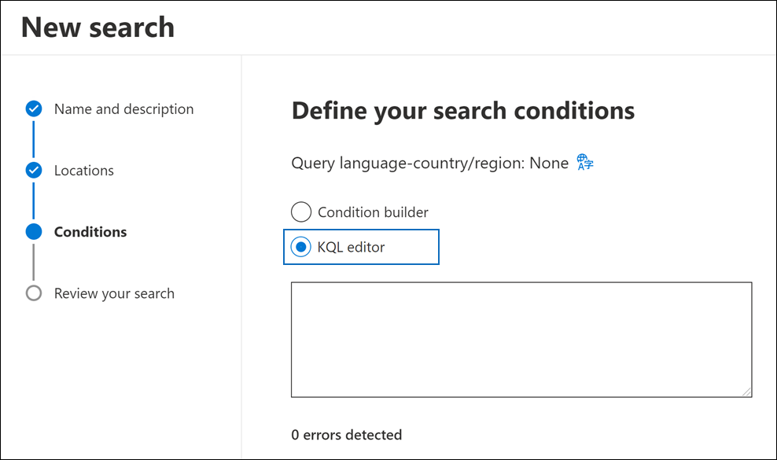
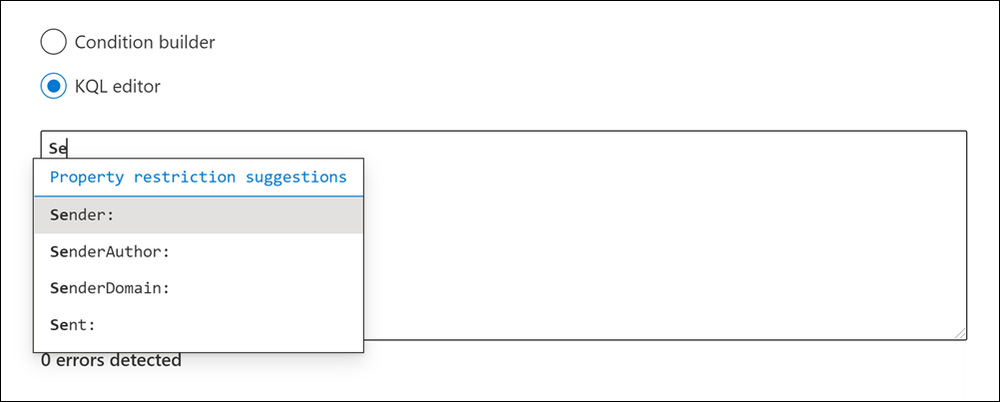
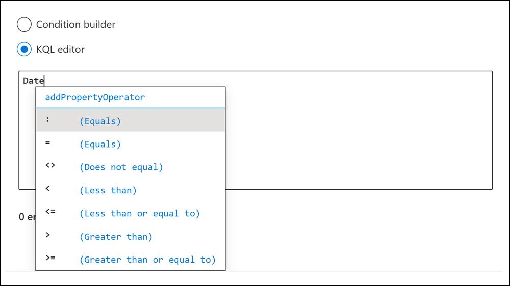

# Use the KQL editor to build search queries

The Keyword Query Language (KQL) query option in Microsoft Purview eDiscovery tools search provides feedback and guidance when you build search queries in Content search, Microsoft Purview eDiscovery (Standard), and eDiscovery (Premium). When you enter queries in the editor, it provides autocompletion for supported searchable properties and conditions and provides lists of supported values for standard properties and conditions. For example, if you specify the `kind` email property in your query, the editor will present a list of supported values that you can select. The KQL editor also displays potential query errors in real time that you can fix before you run the search. Best of all, you can paste complex queries directly into the editor without having to manually build queries using the keywords and conditions cards in the standard condition builder.
  
Here are the key benefits to using the KQL editor:

- Provides guidance and helps you build search queries from scratch.
- Lets you quickly paste long, complex queries directly into the editor. For example, if you receive a complex query from opposing counsel, you can paste that into the KQL editor instead of having to use the condition builder.
- Quickly identifies potential errors and displays hints about how to resolve issues.

The KQL editor is also available when you create query-based holds in eDiscovery (Standard) and eDiscovery (Premium).

[!INCLUDE [purview-preview](../includes/purview-preview.md)]

## Displaying the KQL editor

When you create or edit an eDiscovery search, the option to display and use the KQL editor is located on the **Conditions** page in the search or collections wizard.

### KQL editor in Content search and eDiscovery (Standard)

### KQL editor in eDiscovery (Premium)

## Using the KQL editor

The following sections show examples of how the KQL editor provides suggestions and detects potential errors.

### Autocompletion of search properties and operators

When you start to enter a search query in the KQL editor, the editor displays suggested autocompletion of supported search properties (also called *property restrictions*) that you can select. You have to type a minimum of two characters to display a list of supported properties that begin with those two characters. For example, the following screenshot shows the suggested search properties that begin with `Se`.

Additionally, the editor also suggests provides a list of supported operators (such as `:`, `=` and `<>`) when you type in a complete property name. For example, the following screenshot shows the suggested operators for the `Date` property.

For more information about the supported search properties and operators, see [Keyword queries and search conditions for eDiscovery](ediscovery-keyword-queries-and-search-conditions.md).

### Property value suggestions

The KQL editor provides suggestions for possible values of some properties. For example, the following screenshot shows the suggested values for the `Kind` property.

The editor also suggests a list of users (in UPN format) when you type email recipient properties, such as `From`, `To`, `Recipients` and `Participants`.

### Detection of potential errors

The KQL editor detects potential errors in search queries, and provides a hint of what is causing the error to help you resolve the error. The editor also indicates a potential error when a property doesn't have a corresponding operation or value. Potential errors in the query are highlighted in red text, and explanations and possible fixes for the error are displayed in the **Potential errors** drop-down section. For example, if you pasted the following query into the KQL editor, four potential errors would be detected.

In this case, you can use the potential error hints to troubleshoot and fix the query.

## More information

- You can toggle between the condition builder and the KQL editor. For example, if you use the condition builder to configure a query using the Keywords box and multiple condition cards, you can display the resulting query in the KQL editor. However, if you create a complex query (with keywords and conditions) in the KQL editor, the resulting query is displayed only in the Keywords box when you view it in the condition builder.

- If you paste a complex query into the KQL editor, the editor detects potential errors and suggests possible solutions to resolve errors.
