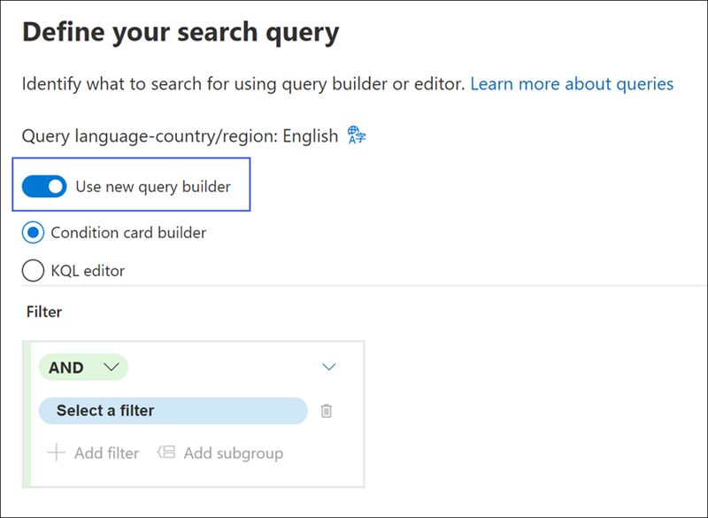

# Use the query builder to build search queries (preview)

The query builder option in Microsoft Purview eDiscovery tools search provides a visual filtering experience when you build search queries in eDiscovery (Premium). MORE INFO....
  
Here are the key benefits to using the query builder:

- AND/OR filtering.....
- Subgroups....

[!INCLUDE [purview-preview](../includes/purview-preview.md)]

## Displaying the query builder

When you create or edit an eDiscovery search for a collection, the option to display and use the query builder is located on the **Search query** page in the collections wizard. Select **Use new query builder** to display and use the query builder.

## Using the query builder

The following sections outline the steps to get started with the query builder and examples of how the query builder can create custom filtering for your search queries.

### Create filters in the query builder

### Create filters with subgroups in the query builder

### Using the AND / OR operators

### Scenario example 1

### Scenario example 2
