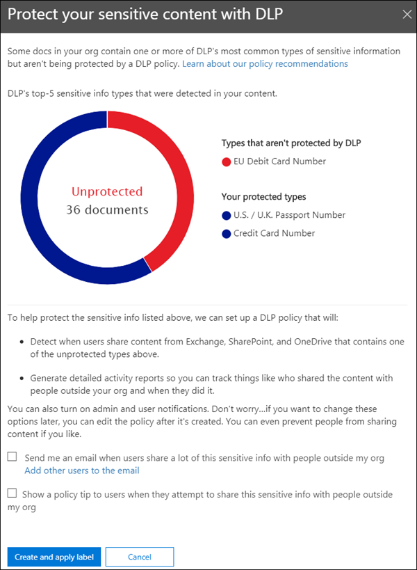
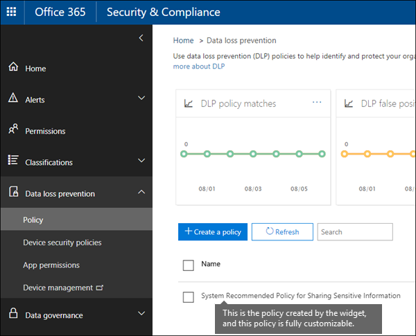

# Get started with DLP policy recommendations

This insight-driven recommendation helps your organization keep sensitive content secure when it's stored and shared in Office 365 by informing you when there's a possible gap in your DLP policy coverage. You'll see this recommendation on the **Home** page of the Security &amp; Compliance Center, if your documents contain any of the top-five most common types of sensitive information but aren't protected by a data loss prevention (DLP) policy. 
  
You can use this widget to quickly create a customized DLP policy in just a click or two, and after you create this DLP policy, it's fully customizable. Note that if you don't see the recommendation at first, try clicking **+More** at the bottom of the **Recommended for you** section. 
  

  
## Create the recommended DLP policy

When the widget shows you unprotected sensitive information, choose **Get started** at the bottom to quickly create a DLP policy. 
  
To help protect the sensitive information, this DLP policy:
  
- Detects when content in Exchange, SharePoint, and OneDrive that contains one of the unprotected types of sensitive information is shared with people outside your organization.
    
- Generates detailed activity reports so that you can track things like who shared the content with people outside your organization and when they did it. You can use the [DLP reports](view-the-dlp-reports.md) and [audit log data](search-the-audit-log-in-security-and-compliance.md) (where **Activity** = **DLP**) to see this information.
    
You can also choose to have the DLP policy:
  
- Send you an incident report email when users share a lot of this sensitive information with people outside your organization.
    
- Add other users to the email incident report.
    
- Show a policy tip and send an email notification to users when they attempt to share this sensitive information with people outside your organization. For more information on these options, see [Send email notifications and show policy tips for DLP policies](use-notifications-and-policy-tips.md).
    
If you want to change these options later, you can edit the DLP policy after it's created. For example, you can make the policy more restrictive by even blocking people from sharing content that contains sensitive information in the first place - see the next section.
  

  
## Edit the recommended DLP policy

After you use the widget to create a DLP policy, the policy appears under **Data loss prevention** on the **Policy** page of the Security &amp; Compliance Center. 
  
By default, the policy is named **System Recommended Policy for Sharing Sensitive Information**. This policy is fully customizable, the same as any DLP policy that you create yourself from scratch. For example, if you decided not to turn on incident reports and policy tips when you used the widget, you can always edit the policy and turn on those options at any time.
  

  
## When the widget does and does not appear

The widget named **Unprotected Sensitive Information** appears in the **Recommended for you** section of the **Home** page of the Security &amp; Compliance Center. 
  
This widget appears only when:
  
- New documents containing any of the five most common types of sensitive information are detected in SharePoint or OneDrive over the past 30 days.
    
- That sensitive information is not already protected by an existing DLP policy.
    
Unlike DLP policies that are constantly scanning your data, this recommendation scans for gaps in your DLP policy coverage roughly every 48 hours, so after new content is uploaded, it may take up to two days for the recommendation to appear.
  
Finally, after you use the widget to create a recommended DLP policy, the widget disappears from the **Home** page. 
  

