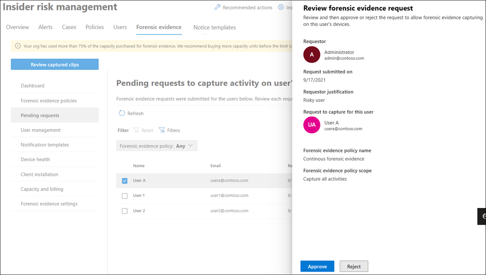
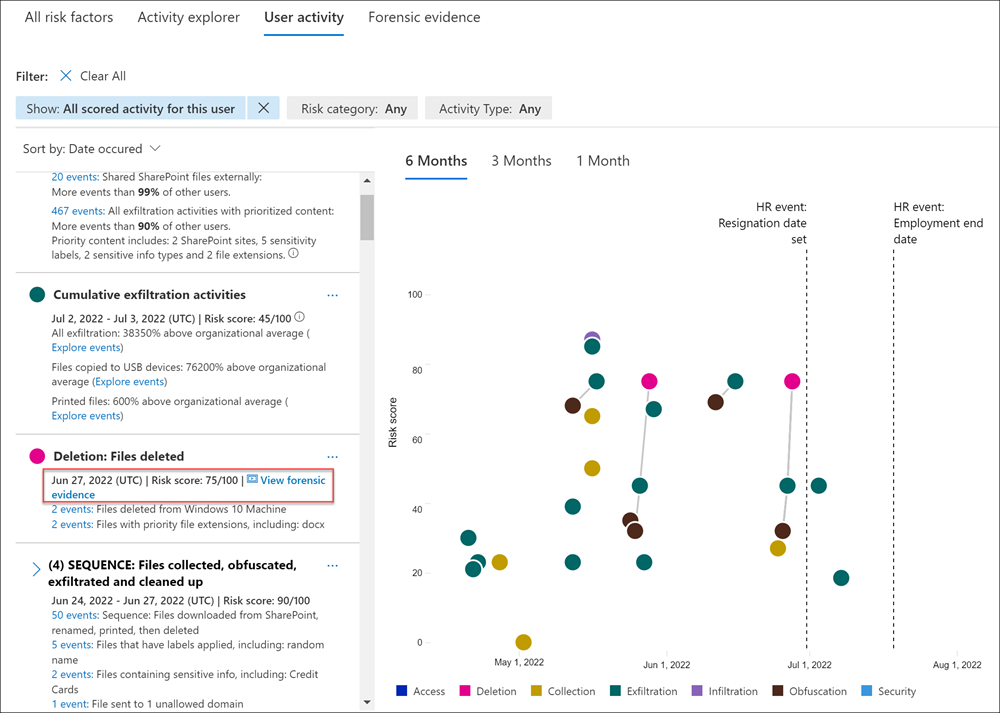
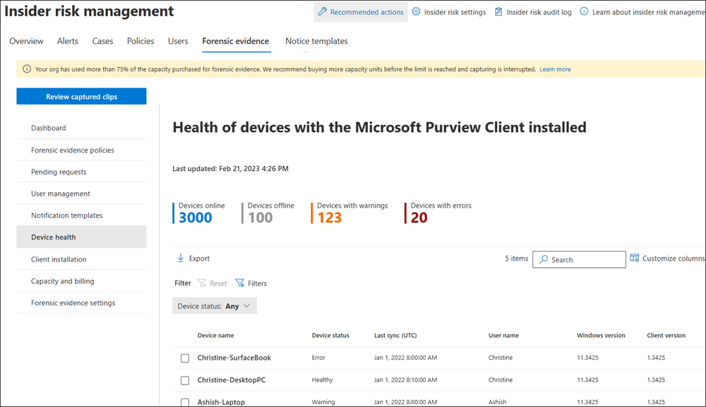

# Manage insider risk management forensic evidence (preview)

>[!IMPORTANT]
>Microsoft Purview Insider Risk Management correlates various signals to identify potential malicious or inadvertent insider risks, such as IP theft, data leakage and security violations. Insider risk management enables customers to create policies to manage security and compliance. Built with privacy by design, users are pseudonymized by default, and role-based access controls and audit logs are in place to help ensure user-level privacy.

After you've completed the configuration steps and created your forensic evidence policy, you'll start to see alerts for potentially risky security-related user activities that meet the conditions for indicators that are defined in the policy.

[!INCLUDE [purview-preview](../includes/purview-preview.md)]

## Dashboard

The forensic evidence dashboard is the summary view of key areas of the forensic evidence configuration in your organization. For the preview, the dashboard includes only a **Forensic evidence device health** section. Select **View device health report** to open the **Device health** tab and report. Other sections will be included in future releases.

## Managing users

You must request and approve specific users before they're eligible for forensic evidence capturing. Simply adding users to a forensic evidence policy doesn't automatically make those users eligible for capturing. You can request and approve users before or after forensic evidence policies are created, but the clip captures associated with policy indicators will only be created and available for reviewing once the users are approved.

Users assigned to the *Insider Risk Management* or *Insider Risk Management Admins* role groups can submit approval requests to users assigned to the *Insider Risk Management Approvers* role group.

### Request capturing approvals

You must request that forensic evidence capturing be turned on for specific users. When a request is submitted, approvers in your organization are notified in email and can approve or reject the request. If approved, the user or will appear on the **Approved users** tab and will be eligible for capturing. If not addressed, the request will expire 6 months from the day it was submitted.

To configure approved users for forensic evidence capturing, complete the following steps:

1. In the [Microsoft Purview compliance portal](https://compliance.microsoft.com/), go to **Insider risk management** > **Forensic evidence (preview)** > **User management**.
2. Select the **Manage forensic evidence requests** tab.
3. Select **Create request**.
4. On the **Users** page, select **Add users**.
5. Use **Search** to locate a specific user or select one or more users from the list. Select **Add**, then select **Next**.
6. On the **Forensic evidence policy** page, select a forensic evidence policy for the added users. The policy you choose determines the scope of activity to capture for users.
7. Select **Next**.
8. On the **Justification** page, let the reviewer know why you're requesting that capturing be enabled for the users you added in the **Justification for turning on forensic evidence capturing** text box. This is a required field. When complete, select **Next**.
9. On the **Email notifications** page, you can use a notification template to send an email to users letting them know that forensic evidence capturing will be turned on for their device in accordance with your organization's policies. The email will be sent to users only if their request is approved.

    Select the **Send an email notification to approved users** checkbox. Choose an existing template o create a new one. To create a new template, select **Create a notification template** and complete the following required fields in the **New email notification template** pane.

10. Select **Next**.
11. On the **Finish** page, review your settings before submitting the request. Select **Edit users** or **Edit justification** to change any of the request values or select **Submit** to create and send the request to reviewers.

To view pending approval requests, navigate to **Insider risk management** > **Forensic evidence (preview)** > **Pending requests**. Here you'll see the users with pending requests, their email address, the request submission date, and who submitted the approval request. If no users are displayed, there aren't any pending approval requests for any users.

Users assigned to the *Insider Risk Management Approvers* role group can select a user on the **Forensic evidence request (preview)** tab and review the request. After reviewing the request, these users can approve or reject the forensic evidence capturing request. Approving or rejecting the capturing request removes the pending request for users from this view.

### Approve or reject capturing requests

After requests are complete, users assigned to the *Insider Risk Management Approvers* role group will receive an email notification for the approval request. To approve or reject requests, reviewers must complete the following steps:

1. In the [Microsoft Purview compliance portal](https://compliance.microsoft.com/), go to **Insider risk management** > **Forensic evidence (preview)** > **Pending requests**.
2. Select a user to review.
3. On the **Review forensic evidence request (preview)** pane, review the justification submitted by the requestor. Select **Approve** or **Reject** as applicable.
4. On the **Request approved** or **Request rejected** page, select **Close**.

### Revoke capturing approvals

If needed, you can revoke approval for specific users and exclude them from forensic evidence capturing. Revoking approval doesn't delete or remove any existing captures for these users, only future capturing of activity for these users is disabled.

To revoke approvals for users, users assigned to the *Insider Risk Management Approvers* role group must complete the following steps:

1. In the [Microsoft Purview compliance portal](https://compliance.microsoft.com/), go to **Insider risk management** > **Forensic evidence (preview)** > **User management**.
2. Select the **Approved users** tab.
3. Select a user, then select **Remove**.
4. On the removal confirmation page, select **Remove** to revoke capturing approval or select **Cancel** to close the confirmation page.

## Creating and managing notification templates

You can create and use a notification template to send an email to users letting them know that forensic evidence capturing will be turned on for their device in accordance with your organization's policies. The email is sent to users only if their request is approved.

To create a new notification template, complete the following steps:

1. In the [Microsoft Purview compliance portal](https://compliance.microsoft.com/), go to **Insider risk management** > **Forensic evidence (preview)** > **Notification templates**.
2. Select **Create notification template**.
3. On the **New email notification template** pane, complete the following required fields:
    - Template name
    - Send from
    - Subject
    - Message body
4. Select **Save**

To delete an existing notification template, select a template and select **Delete**.

## Viewing capture clips

If you've selected the option to only capture activities defined by the indicators selected in forensic evidence policies, capture clips are available as part of the alert and are accessible on the **Forensic evidence (preview)** tab on the **Alerts dashboard**. If alerts are later escalated to cases, the associated clips are accessible on the **Forensic evidence (preview)** tab on the **Cases** dashboard.

If you've selected the option to capture any security-related activity performed by users included in forensic evidence policies, you'll view the clips for individual users on the **User activity report** dashboard.

>[!IMPORTANT]
>Forensic evidence clips are deleted 120 days after they're captured or at the end of the preview period, whichever is sooner. You can download or transfer forensic evidence clips before they're deleted.

### Reviewing capture clips included with alerts

For alerts generated by policies, forensic evidence captures for users are available for review on the **Forensic evidence (preview)** tab on the **Alerts** dashboard. If one or more captures are available for the alert, you'll also see a **View forensic evidence** notification in the Activity that generated this alert header section. You can select the notification link or the **Forensic evidence (preview)** tab to review the activity captures.

Overall, reviewing an alert for potentially risky activity that may contain forensic evidence captures is essentially the same as reviewing an alert without forensic evidence captures. The significant difference is the inclusion of any applicable captures. The **Forensic evidence (preview)** tab provides access to all available captures associated with the alert. Each capture is displayed and includes the following information:

- **Date/time (UTC)**: The date, time (UTC), and duration of the capture.
- **Device**: The name of the device in Windows 10/11.
- **Activity type**: The insider risk management activity type included in the capture. These activities are based on global and policy indicators assigned to the associated policy.
- **Capture events**: Each capture contains events within the capture to help focus your review on specific activities for the capturing session.

To view a capture clip, complete the following steps:

1. If needed, configure the filters for the available captures. You can filter by the **Dates (UTC)** or by **Activity**.
2. Select a clip to review.
3. Select the device monitor to review. Each monitor connected to the device (up to 4) is eligible for forensic evidence capturing and are listed as *Display 1*, *Display 2*, etc.
4. Using the video player controls, select the *Play control* to review the entire clip from beginning to end.
5. If you want to scope the review to a specific event in the clip, select the event from the **Capture events** lists to the right of the video player.

### Reviewing capture clips included with cases

If alerts are escalated to cases, all associated forensic evidence captures are included as part of the case. Reviewing forensic evidence captures for cases follows the same process as when you review captures as part of examining alerts.

### Reviewing capture clips without alerts

To view clips for activity not associated with alerts, you'll use [User activity reports](/microsoft-365/compliance/insider-risk-management-activities#user-activity-reports). User activity reports allow you to examine activities for specific users for a defined time period without having to assign them temporarily or explicitly to an insider risk management policy. If these user activities include activities supported by forensic evidence capturing, clips are included with the user activity.

If you've configured forensic evidence to capture all security-related user activity, regardless of whether they're included in a forensic evidence policy, you'll review these captures by selecting **Insider risk management** > **User activity reports** and then selecting a specific user and selecting the **Forensic evidence (preview)** tab.

## Device health report (preview)

After devices are configured to support forensic evidence, you can review the Microsoft Purview Client health status for all devices in your organization by navigating to **Insider risk management** > **Forensic evidence (preview)** > **Device health**.

For a list of minimum hardware requirements, see [Learn about forensic evidence (preview)](insider-risk-management-forensic-evidence.md#hardware-requirements). To onboard supported devices, complete the steps outlined in the [Onboard Windows 10 and Windows 11 devices into Microsoft 365 overview](/microsoft-365/compliance/device-onboarding-overview) article. 

The Device health report allows you to view the status and health of all devices that have the forensic evidence agent installed. Each report widget on the report displays information for last 24 hours.

- **Devices online**: The total number of devices currently online.
- **Devices offline**: The total number of devices currently offline.
- **Devices with warnings**: The total number of devices with a warning.
- **Devices with errors**: The total number of devices with an error.

The device health queue lists all the devices in configured for forensic evidence in your organization. In addition, the report lists the status of the following device attributes:

- **Device name**: The name of the device, defined by the *ComputerName* attribute of the device.
- **Device status**: The status of the Microsoft Purview Client on the device. Status values are as follows:
    - ***Healthy***: The client on the device is working properly and forensic evidence capture features are fully supported.
    - ***Warning***: The client on the device has a warning and forensic evidence capture features may not be fully supported.
    - ***Error***: The client on the device has an error and forensic evidence capture features are disabled or not fully supported.
- **Status details**: More information about the device status.
- **Last sync (UTC)**: Date and time of the last status sync for the device.
- **User name**: The user name for the user logged into the device when the status sync was performed.
- **Windows version**: The version of Microsoft Windows installed on the device.
- **Client version**: The version of the Microsoft Purview Client installed on the device.

The device health status gives you insights into potential issues with your devices and the Microsoft Purview Client. The **Device status** column on the **Device health** page can alert you to device issues that may prevent user activity from being captured or why the volume of forensic evidence capturing is unusual. The device health status can also confirm that the devices included in forensic evidence capturing are healthy and don't need attention or configuration changes. The following table lists potential status detail messages and recommended actions you can take to address warnings and errors:

|**Status Details**|**Status**|**Suggested Action**|
|:----------|:-------|:-------------------|
| An internal server error occurred. As a result, capture data might be missing. | Error | Create a support ticket with Microsoft for further investigation |
| Upload bandwidth has reached 90% of the configured limit on this device. Captures might be overwritten soon.  | Warning | Increase the upload bandwidth limit on the [Forensic evidence settings](/microsoft-365/compliance/insider-risk-management-forensic-evidence-configure) page. |
| The configured upload bandwidth limit has been reached on this device. No more captures will be uploaded for the day. | Error | Increase the upload bandwidth limit on the [Forensic evidence settings](/microsoft-365/compliance/insider-risk-management-forensic-evidence-configure) page. |
| Offline storage has reached 90% of the configured limit on this device. Captures might be overwritten soon.  | Warning | Increase the offline capturing cache limit on the [Forensic evidence settings](/microsoft-365/compliance/insider-risk-management-forensic-evidence-configure) page. |
| The configured offline storage limit has been reached on this device. As a result, offline captures are being overwritten. | Error | Increase the offline capturing cache limit on the [Forensic evidence settings](/microsoft-365/compliance/insider-risk-management-forensic-evidence-configure) page. |
| CPU usage on the device has exceeded the maximum threshold. | Error | The capture process has been stopped and will restart in a few minutes. |
| Memory usage on the device has exceeded the maximum threshold. | Error | The capture process has been stopped and will restart in a few minutes. |
| GPU usage on the device has exceeded the maximum threshold. | Error | The capture process has been stopped and will restart in a few minutes. |
| The Microsoft Purview Client installed on the device in unable to sync with the forensic evidence policy. | Warning | Connect to network & reinstall client |
| The Microsoft Purview Client installed on the device hasn't synced with the forensic evidence policy in over 24 hours. | Error | Connect to network & reinstall client |
| The Microsoft Purview Client is unable to capture activity because no graphics card is detected on this device. | Error | Add a graphics card or replace the device with one that has a graphics card |
| The Microsoft Purview Client is unable to capture activity because no display monitors are detected on this device. | Error | Add display monitors for this device |
| The Microsoft Purview Client is unable to capture activity because display monitors on this device were turned off or disconnected. | Error | Connect/Turn on display monitors for the device |
| Device is unable to access the directory that stores forensic evidence captures. | Error | Reinstall the client on this device |
| Encoder initialization failed.  | Error | Reinstall the client on this device. |

Contact Microsoft Support if the recommended actions don't resolve issues with the client.
