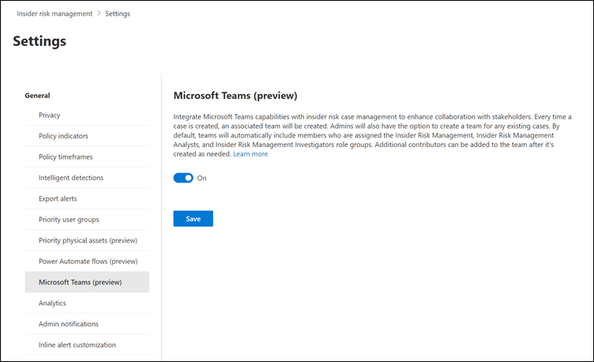

# Enable Microsoft Teams for collaborating on insider risk management cases

Compliance analysts and investigators can use Microsoft Teams to collaborate on Microsoft Purview Insider Risk Management cases. They can communicate with other stakeholders on Teams to:

- Coordinate and review response activities for cases in private Teams channels
- Securely share and store files and evidence related to individual cases
- Track and review response activities by analysts and investigators

After Teams is enabled for insider risk management, a dedicated team is created every time an alert is confirmed and a case is created. By default, the team automatically includes all members of the *Insider Risk Management*, *Insider Risk Management Analysts*, and *Insider Risk Management Investigators* role groups (up to 100 initial users). Additional organization contributors can be added to the team after it's created and as appropriate. 

For existing cases created before enabling Teams, analysts and investigators can choose to create a new team when working on a case, if needed. Once you resolve the associated case in insider risk management, the team is automatically archived (moved to hidden and read-only).

Learn more: [Overview of teams and channels in Microsoft Teams](/MicrosoftTeams/teams-channels-overview).

## Enable Teams support 

1. In the [Microsoft Purview compliance portal](https://compliance.microsoft.com), go to **Insider risk management**, and then select the **Settings** button.
2. Select **Microsoft Teams (preview)**.
3. Turn the setting on.
4. Select **Save**.

   

## Create a team for existing cases

If you enable Teams support for insider risk management after you have existing cases, you'll need to manually create a team for each case, as needed. Users need permission to create Microsoft 365 Groups in your organization to create a team from a case. For more information about managing permissions for Microsoft 365 Groups, see [Manage who can create Microsoft 365 Groups](../solutions/manage-creation-of-groups.md).

> [!NOTE]
> After enabling Teams support in insider risk management settings, when a new case is created, a new team will automatically be created. 

1. In the [Microsoft Purview compliance portal](https://compliance.microsoft.com), go to **Insider risk management** > **Cases**, and then select an existing case.
2. On the case action menu, select **Create Microsoft Team**.
3. In the **Team name** field, enter a name for the new Microsoft Teams team.
4. Select **Create Microsoft team**, and then select **Close**.

Depending on the number of users assigned to insider risk management role groups, it may take 15 minutes for all investigators and analysts to be added to the team.
