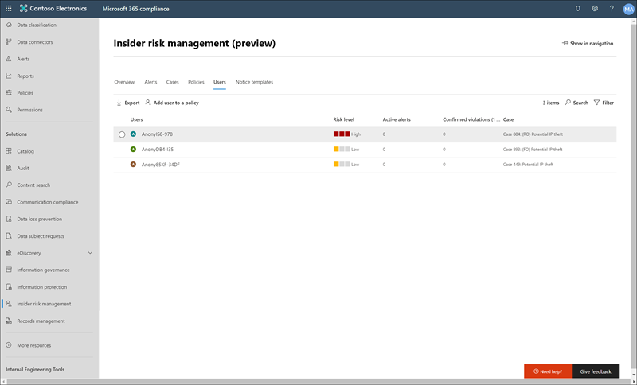

# Insider risk management users (preview)

Insider risk management users are employees in your organization that are included in one or more insider risk management policies. Use the **Users dashboard** to quickly review risk information about employees and to add an employee to an existing insider risk management policy. Each user included in an insider risk management policy has the following information displayed on the **Users dashboard**:

- **Users**: The user name for a user.
- **Risk level**: 
- **Active alerts**: The number of active alerts for all policies.
- **Confirmed violations**: The number of cases resolved as *confirmed policy violation* for the user.
- **Case**: The current active case for the user.

## View user details

To view more details about risk activity for a user, open the user details pane by double-clicking a user in the **Users dashboard**. On the details pane, you can view the following information:

- **User profile** tab
    - **Name and title**: The name and position title for the user.
    - **User email**: The email address for the user.
    - **Alias**: The network alias for the user.
    - **Organization or department**: The organization or department for the user.

- **User activity** tab
    - **History of recent user activity**: Lists both policy triggering events and risk indicators for user activities. A triggering event may be the acceptance of a resignation date or the last scheduled date of work for the employee. Risk indicators are activities that are determined to have an element of risk and that are matched to policies that the user is included in. Events and risk activities are listed with the most recent item listed first.

## Add a user to a policy

To add a user to an insider risk management policy, you'll either use the new policy wizard or the **Users** tab in the **Insider risk management** solution in the Microsoft 365 compliance center.

Complete the following steps to add a user to an existing insider risk policy:

1. In the [Microsoft 365 compliance center](https://compliance.microsoft.com), go to **Insider risk management** and select the **Users** tab.
2. Select **Add a user to a policy** on the toolbar.
3. On the **Add a new user** dialog, start typing a user name in the **User** field. Select the user you want to add to a policy.
4. Select the dropdown arrow for the **Policy** field to display configured insider risk management policies. Select the policy to add the user to.
5. Use the **Monitoring window** slider control to define the...... The range for the monitoring window is 5 to 30 days.
6. Select **Add** and then **Confirm** to add the user to the policy.
