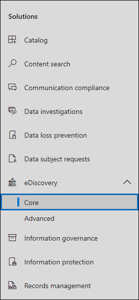
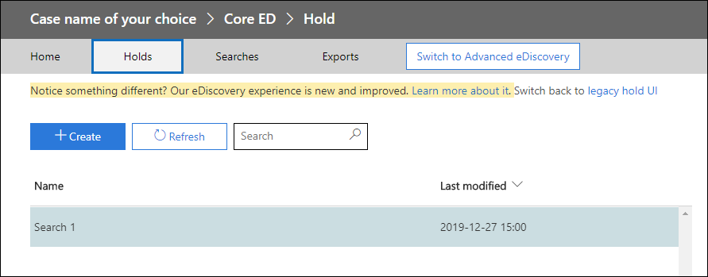
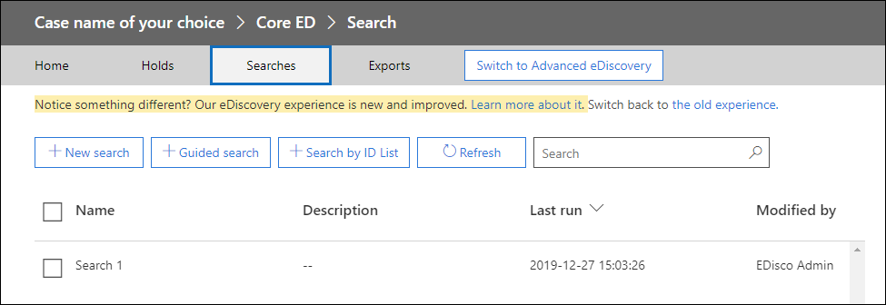

# Migrate legacy eDiscovery searches and holds to the Microsoft 365 compliance center

The Microsoft 365 compliance center provides an improved experience for eDiscovery usage, including: higher reliability, better performance and many features tailored to eDiscovery workflows including cases to organize your content by matter, review sets to review content and analytics to help cull data for review such as near-duplicate grouping, email threading, themes analysis and predictive coding.

To help customers take advantage of the new and improved functionality, this help topic will provide basic guidance on how to migrate searches and holds from the Exchange admin center to the Microsoft 365 compliance center.

> [!NOTE]
> Because there are many different scenarios, this article provides general guidance to transition searches and holds to a core eDiscovery case in the Microsoft 365 compliance center. Using eDiscovery cases aren't always required, but they add an extra layer of security by letting you assign permissions to control who has access to the eDiscovery cases in your organization.

## Before you begin

  - You have to be a member of the eDiscovery Manager role group in the Office 365 Security & Compliance Center to run the script described in this topic. You also have to be a member of the Discovery Management role group in the Exchange admin center.

  - The script provides no error handling. The primary purpose of the script examples is provide an overview of the individual moving parts.

  - The script creates a new Content Search, but doesn't start it.

  - This script provides guidance on how to create a hold, the hold policy will be applied through an asynchronous process. When creating a hold, you must create both a CaseHoldPolicy and CaseHoldRule, otherwise the hold will not be created and content locations will not be placed on hold.

  - The sample script provided in this topic isn't supported under any Microsoft standard support program or service. The sample script is provided AS IS without warranty of any kind. Microsoft further disclaims all implied warranties including, without limitation, any implied warranties of merchantability or of fitness for a particular purpose. The entire risk arising out of the use or performance of the sample script and documentation remains with you. In no event shall Microsoft, its authors, or anyone else involved in the creation, production, or delivery of the scripts be liable for any damages whatsoever (including, without limitation, damages for loss of business profits, business interruption, loss of business information, or other pecuniary loss) arising out of the use of or inability to use the sample scripts or documentation, even if Microsoft has been advised of the possibility of such damages.

## Step 1: Login to the Exchange Admin Center and Microsoft 365 Compliance center with PowerShell

The first step is to login to the Exchange Admin Center and the Microsoft 365 Compliance center. You can copy the below script, paste into a PowerShell window and run. You will be prompted for the appropriate credentials when you run this part of the script.
 

```powershell
$UserCredential = Get-Credential
$sccSession = New-PSSession -ConfigurationName Microsoft.Exchange -ConnectionUri https://ps.compliance.protection.outlook.com/powershell-liveid -Credential $UserCredential -Authentication Basic -AllowRedirection
Import-PSSession $Session -AllowClobber -DisableNameChecking
$exoSession = New-PSSession -ConfigurationName Microsoft.Exchange -ConnectionUri https://ps.outlook.com/powershell-liveid/ -Credential $UserCredential -Authentication Basic -AllowRedirection
Import-PSSession $exoSession -AllowClobber -DisableNameChecking
```


## Step 2: Get a list of searches from the Exchange Admin Center using Get-MailboxSearch

After you've authenticated, you can retrieve the search of searches by simply calling Get-MailboxSearch. Copy and paste the following command into PowerShell and execute, a list of searches will be listed with their names and In Place Hold status.

 
```powershell
Get-MailboxSearch
```

The output will roughly look like the following


## Step 3: Get the output of the search you want to migrate

Once again, you will use Get-MailboxSearch, but this time to get the important values of the search. You can store the parameters in a variable for use later, this example will store the results and then print them out. Using | FL will print out the results in the $search variable formatted as a list.

 

```powershell
$search = Get-MailboxSearch -Identity Search 1
$search | FL
```
 

The output will look roughly like the following


NOTE: This in-place hold period is indefinite (ItemHoldPeriod: Unlimited). This is typical for eDiscovery usage. If the hold has any other value, this is likely used as a preservation policy. Instead of using the eDiscovery cmdlets in the Microsoft 365 Compliance Center, you should instead use [New-HoldCompliancePolicy](https://docs.microsoft.com/powershell/module/exchange/policy-and-compliance-retention/new-holdcompliancepolicy?view=exchange-ps) and [New-HoldComplianceRule](https://docs.microsoft.com/powershell/module/exchange/policy-and-compliance-retention/new-holdcompliancerule?view=exchange-ps). The usages will be similar to New-CaseHoldPolicy & New-CaseHoldRule, but you will be able to specify a timeline and action. Also note, New-HoldCompliancePolicy and New-HoldComplianceRule do not require the use of a compliance case.

## Step 4: Create a case in the Microsoft 365 Compliance center

Next, in order to create an eDiscovery hold, you are required to create a case. The following example creates a case with a name of your choice, you will need to replace \[Case Name\] with the case name of your liking. We will store the search in a variable for use later. You can view all of the properties of the case with $case | FL after the case is created.


```powershell
$case = New-ComplianceCase -Name "[Case name of your choice]"
```


 

## Step 5: Create the hold using CaseHoldPolicy & CaseHoldRule

After the case is created, you can create the hold and associate with the case using the following command. It's important to remember that you must create both a CaseHoldPolicy and CaseHoldRule. If the CaseHoldRule is not created with the policy, the hold will not be created and content will not be placed on hold.

```powershell
$policy = New-CaseHoldPolicy -Name $search.Name -Case $case.Identity -ExchangeLocation $search.SourceMailboxes
$rule = New-CaseHoldRule -Name $search.Name -Policy $policy.Identity
```


## Step 6: Verify the hold policy

To make sure there were no issues in creating the hold, it's always a good thing to check to make sure the hold distribution status is successful. To do this, you can simply call Get-CaseHoldPolicy. Note, because calling the $policy variable doesn't automatically update the status, you will need to re-run the cmdlet to make sure distribution is successful. Case hold policies will successfully synchronize in anywhere from 5 minutes, but can take up to 24 hours.

```powershell
Get-CaseHoldPolicy -Identity $policy.Identity | select name, DistributionStatus
```


## Step 6: Create the search

The last step is to create the search. After you are done, you can run the search or just leave it as is to be run at a later time.

```powershell
New-ComplianceSearch -Name $search.Name -ExchangeLocation $search.SourceMailboxes -ContentMatchQuery $search.SearchQuery -Case $case.name
```


## Step 7: Verify the case, hold and search in the Microsoft 365 Compliance center

Just one more step to make sure that everything is setup correctly. You can visit the Microsoft 365 compliance center at [https://compliance.microsoft.com](https://compliance.microsoft.com). Once there, click on the eDiscovery tab, then eDiscovery.



You will find the Hold under the Holds tab. If you click on the hold, you can see details about the hold including who the hold is applied to and the distribution status.



The Search will be listed under the Searches tab.



## More information

  - For more information about the Exchange Admin Center In-Place eDiscovery & Holds functionality, [learn more](https://docs.microsoft.com/exchange/security-and-compliance/in-place-ediscovery/in-place-ediscovery).

  - For more information about the Microsoft 365 Compliance center, [learn more](https://docs.microsoft.com/microsoft-365/compliance/).

  - For more information about the PowerShell cmdlets available in the Microsoft 365 Compliance center, [learn more](https://docs.microsoft.com/powershell/module/exchange/?view=exchange-ps).
