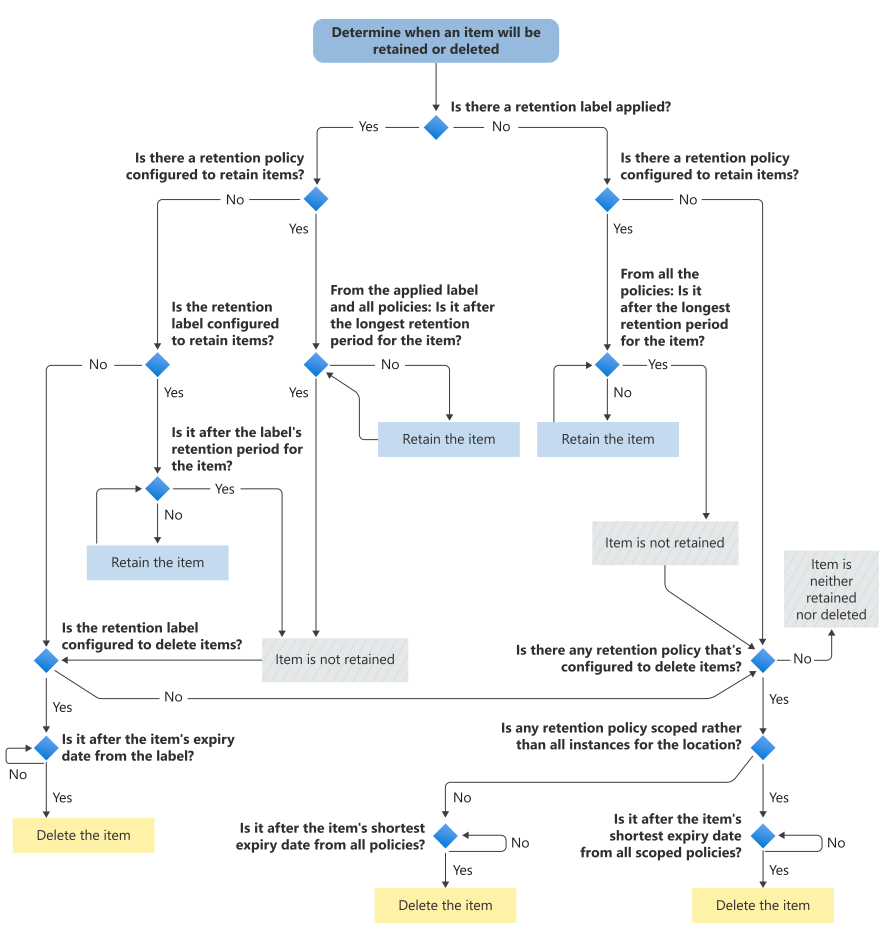

# Flowchart to determine when an item will be retained or permanently deleted

[!include[Purview banner](../includes/purview-rebrand-banner.md)]

>*[Microsoft 365 licensing guidance for security & compliance](/office365/servicedescriptions/microsoft-365-service-descriptions/microsoft-365-tenantlevel-services-licensing-guidance/microsoft-365-security-compliance-licensing-guidance).*

Use the following flowchart to apply the [principles of retention](retention.md#the-principles-of-retention-or-what-takes-precedence) to an item to determine if the system will retain it or permanently delete it as a result of a retention label or retention policy.

This logic flow is used for an item when either of the following conditions apply:

- There is more than one retention policy applied
- There is a retention label and one or more retention policies

When an item is subject to an eDiscovery hold (or the older technologies of Litigation hold or In-Place Hold), it will always be retained before the decision flows for retention policies and a retention label.

If any of the terms used in this flowchart are unfamiliar to you, see [Learn about retention policies and retention labels](retention.md).

   

> [!NOTE]
> It's important to distinguish between the longest retention period for the item vs. the longest specified period in a retention policy or label. And similarly, between the shortest expiry date for the item vs. the shortest specified period in a retention policy.
> 
> For more information, see the explanation after the graphic in the [principles of retention](retention.md#the-principles-of-retention-or-what-takes-precedence) section.
