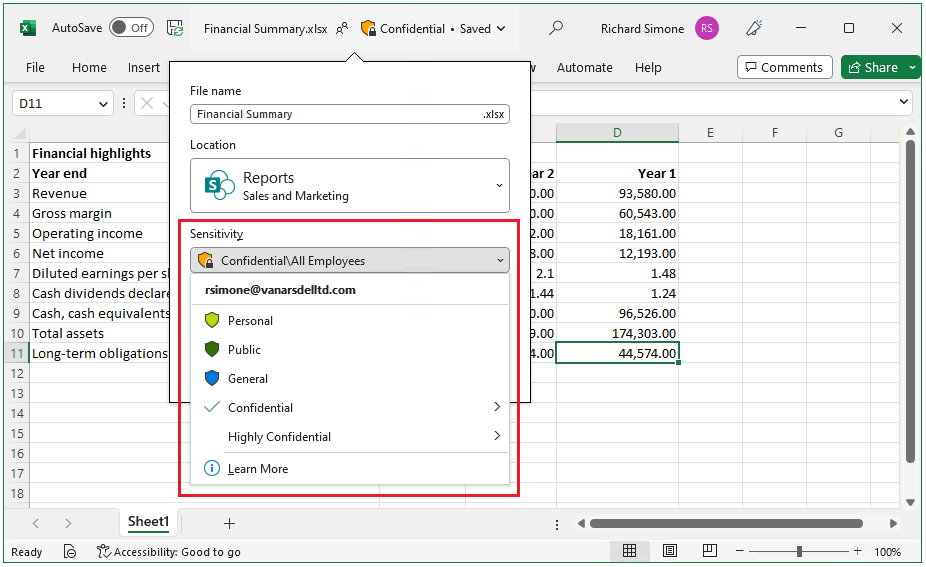
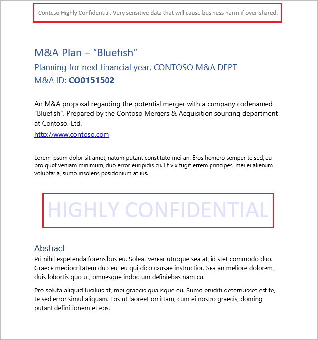
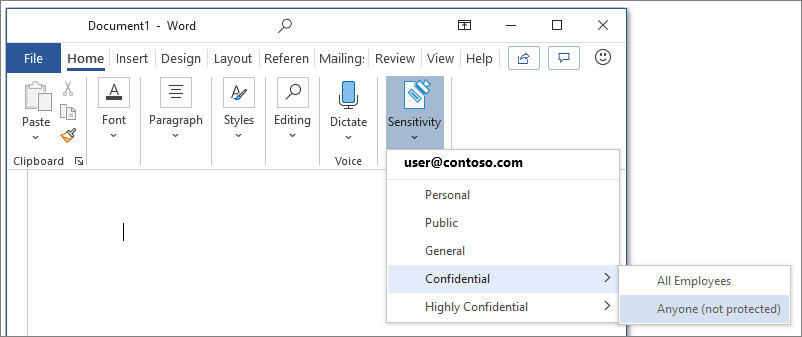
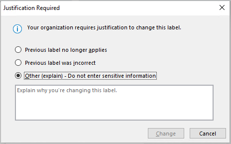
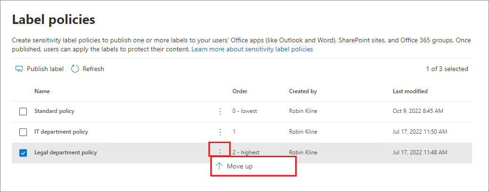

# Learn about sensitivity labels

>*[Microsoft 365 licensing guidance for security & compliance](/office365/servicedescriptions/microsoft-365-service-descriptions/microsoft-365-tenantlevel-services-licensing-guidance/microsoft-365-security-compliance-licensing-guidance).*

> [!NOTE]
> If you're looking for information about sensitivity labels that you see in your Office apps, see [Apply sensitivity labels to your files and email in Office](https://support.microsoft.com/topic/apply-sensitivity-labels-to-your-files-and-email-in-office-2f96e7cd-d5a4-403b-8bd7-4cc636bae0f9).
>
> The information on this page is for IT administrators who can create and configure those labels.

To get their work done, people in your organization collaborate with others both inside and outside the organization. This means that content no longer stays behind a firewall—it can roam everywhere, across devices, apps, and services. And when it roams, you want it to do so in a secure, protected way that meets your organization's business and compliance policies.

Sensitivity labels from Microsoft Purview Information Protection let you classify and protect your organization's data, while making sure that user productivity and their ability to collaborate isn't hindered.

The following example from Excel shows some sensitivity labels that have been made available to users. In this case, the **Highly Confidential** label has been applied to the spreadsheet, but users can change the label by using the **Sensitivity** button from the **Home** tab on the Ribbon.

To apply sensitivity labels, users must be signed in with their Microsoft 365 work or school account.

> [!NOTE]
> For US Government tenants, sensitivity labels are supported for all platforms.
>
> If you use the Azure Information Protection unified labeling client and scanner, see the [Azure Information Protection Premium Government Service Description](/enterprise-mobility-security/solutions/ems-aip-premium-govt-service-description).

You can use sensitivity labels to:
  
- **Provide protection settings that include encryption and content markings.** For example, apply a "Confidential" label to a document or email, and that label encrypts the content and applies a "Confidential" watermark. Content markings include headers and footers as well as watermarks, and encryption can also restrict what actions authorized people can take on the content.

- **Protect content in Office apps across different platforms and devices.** Supported by Word, Excel, PowerPoint, and Outlook on the Office desktop apps and Office on the web. Supported on Windows, macOS, iOS, and Android.

- **Protect content in third-party apps and services** by using Microsoft Defender for Cloud Apps. With Defender for Cloud Apps, you can detect, classify, label, and protect content in third-party apps and services, such as SalesForce, Box, or DropBox, even if the third-party app or service doesn't read or support sensitivity labels.

- **Protect containers** that include Teams, Microsoft 365 Groups, and SharePoint sites. For example, set privacy settings, external user access and external sharing, and access from unmanaged devices.

- **Protect meetings and chat** by labeling (and optionally, encrypting) meeting invites and any responses, and enforce Teams-specific options for the meeting and chat. 

- **Extend sensitivity labels to Power BI**: When you turn on this capability, you can apply and view labels in Power BI, and protect data when it's saved outside the service.

- **Extend sensitivity labels to assets in Microsoft Purview Data Map**: When you turn on this capability, currently in preview, you can apply your sensitivity labels to files and schematized data assets in Microsoft Purview Data Map. The schematized data assets include SQL, Azure SQL, Azure Synapse, Azure Cosmos DB, and AWS RDS.

- **Extend sensitivity labels to third-party apps and services.** Using the Microsoft Information Protection SDK, third-party apps can read sensitivity labels and apply protection settings.

- **Label content without using any protection settings.** You can also just apply a label as a result of identifying the sensitivity of the data. This action provides users with a visual mapping of your organization's data sensitivity, and the labels can generate usage reports and activity data for data that has different levels of sensitivity. Based on this information, you can always choose to apply protection settings later.

In all these cases, sensitivity labels from Microsoft Purview can help you take the right actions on the right content. With sensitivity labels, you can identify the sensitivity of data across your organization, and the label can enforce protection settings that are appropriate for the sensitivity of that data. That protection then stays with the content.

For more information about these and other scenarios that are supported by sensitivity labels, see [Common scenarios for sensitivity labels](get-started-with-sensitivity-labels.md#common-scenarios-for-sensitivity-labels). New features are being developed all the time that support sensitivity labels, so you might also find it useful to check the [Microsoft 365 roadmap](https://www.microsoft.com/microsoft-365/roadmap?filters=Microsoft%20Information%20Protection&searchterms=label).

[!INCLUDE [purview-preview](../includes/purview-preview.md)]

## What a sensitivity label is

When you assign a sensitivity label to content, it's like a stamp that's applied and is:

- **Customizable.** Specific to your organization and business needs, you can create categories for different levels of sensitive content in your organization. For example, Personal, Public, General, Confidential, and Highly Confidential.

- **Clear text.** Because a label is stored in clear text in the metadata for files and emails, third-party apps and services can read it and then apply their own protective actions, if required.

- **Persistent.** Because the label is stored in metadata for files and emails, the label stays with the content, no matter where it's saved or stored. The unique label identification becomes the basis for applying and enforcing policies that you configure.

When viewed by users in your organization, a sensitivity label appears like a tag on apps that they use and can be easily integrated into their existing workflows.

Each item that supports sensitivity labels can have a single sensitivity label applied to it. Documents and emails can have both a sensitivity label and a [retention label](retention.md#retention-labels) applied to them.

> [!div class="mx-imgBorder"]
> 

## What sensitivity labels can do

After a sensitivity label is applied to an email, meeting invite (in preview), or document, any configured protection settings for that label are enforced on the content. You can configure a sensitivity label to:

- **Encrypt** emails, meeting invites, and documents to prevent unauthorized people from accessing this data. You can additionally choose which users or group have permissions to perform which actions and for how long. For example, you can choose to allow all users in your organization to modify a document while a specific group in another organization can only view it. Alternatively, instead of administrator-defined permissions, you can allow your users to assign permissions to the content when they apply the label. 
    
    For more information about the **Encryption** settings when you create or edit a sensitivity label, see [Restrict access to content by using encryption in sensitivity labels](encryption-sensitivity-labels.md).

- **Mark the content** when you use Office apps, by adding watermarks, headers, or footers to email, meeting invites, or documents that have the label applied. Watermarks can be applied to documents but not email or meeting invites. Example header and watermark:
    
    
    
    Dynamic markings are also supported by using variables. For example, insert the label name or document name into the header, footer, or watermark. For more information, see [Dynamic markings with variables](sensitivity-labels-office-apps.md#dynamic-markings-with-variables).
    
    Need to check when content markings are applied? See [When Office apps apply content marking and encryption](sensitivity-labels-office-apps.md#when-office-apps-apply-content-marking-and-encryption).
    
    If you have templates or workflows that are based on specific documents, test those documents with your chosen content markings before you make the label available for users. Some string length restrictions to be aware of:
    
    Watermarks are limited to 255 characters. Headers and footers are limited to 1024 characters, except in Excel. Excel has a total limit of 255 characters for headers and footers but this limit includes characters that aren't visible, such as formatting codes. If that limit is reached, the string you enter isn't displayed in Excel.

- **Protect content in containers such as sites and groups** when you enable the capability to [use sensitivity labels with Microsoft Teams, Microsoft 365 groups, and SharePoint sites](sensitivity-labels-teams-groups-sites.md).
    
    You can't configure protection settings for groups and sites until you enable this capability. This label configuration doesn't result in documents or emails being automatically labeled but instead, the label settings protect content by controlling access to the container where content can be stored. These settings include privacy settings, external user access and external sharing, and access from unmanaged devices.

- **Apply the label automatically to files and emails, or recommend a label.** Choose how to identify sensitive information that you want labeled, and the label can be applied automatically, or you can prompt users to apply the label that you recommend. If you recommend a label, the prompt displays whatever text you choose. For example:
    
    
    
    For more information about the **Auto-labeling for files and emails** settings when you create or edit a sensitivity label, see [Apply a sensitivity label to content automatically](apply-sensitivity-label-automatically.md) for Office apps, and [Labeling in Microsoft Purview Data Map](/azure/purview/create-sensitivity-label).

- **Set the default sharing link type** for SharePoint sites and individual documents. To help prevent users oversharing, set the [default scope and permissions](sensitivity-labels-default-sharing-link.md) for when users share documents from SharePoint and OneDrive.

For more label configurations, see [Manage sensitivity labels for Office apps](sensitivity-labels-office-apps.md).

### Label scopes

When you create a sensitivity label, you're asked to configure the label's scope, which determines two things:
- Which label settings you can configure for that label
- The availability of the label to apps and services, which includes whether users can see and select the label

This scope configuration lets you have sensitivity labels that are just for items such as documents and emails, and can't be selected for containers. Similarly, sensitivity labels that are just for containers and can't be selected for documents and emails. You can also select the scope for schematized data assets for Microsoft Purview Data Map:

:::image type="content" source="../media/sensitivity-labels-scopes.png" alt-text="Scope options for sensitivity labels..":::

The **Items** scope can further be refined to [files  and emails](sensitivity-labels-office-apps.md#scope-labels-to-just-word-excel-and-powerpoint-or-to-just-outlook), and to [meetings](sensitivity-labels-meetings.md) that includes calendar events, Teams meetings options, and Team chat. For example, use this refinement when you want a sensitivity label to be available for emails only.

By default, the **Items** scope is always selected for a new label. The other scopes are selected by default when the features are enabled for your tenant:

- **Groups & sites**: See [Enable sensitivity labels for containers and synchronize labels](sensitivity-labels-teams-groups-sites.md#how-to-enable-sensitivity-labels-for-containers-and-synchronize-labels)

- **Schematized data assets**: See [Automatically label your content in Microsoft Purview Data Map](/azure/purview/create-sensitivity-label)

If you change the defaults so not all scopes are selected, you see the first page of the configuration settings for scopes you haven't selected, but you can't configure the settings. For example, if the scope for items isn't selected, you can't select the options on the next page:

For these pages that have unavailable options, select **Next** to continue. Or, select **Back** to change the label's scope.

### Label priority (order matters)

When you create your sensitivity labels in the Microsoft Purview compliance portal, they appear in a list on the **Information Protection** \> **Labels** page. In this list, the order of the labels is important because it reflects their priority. You want your most restrictive sensitivity label, such as Highly Confidential, to appear at the **bottom** of the list, and your least restrictive sensitivity label, such as Public, to appear at the **top**.

You can apply just one sensitivity label to an item such as a document, email, or container. If you set an option that requires your users to provide a justification for changing a label to a lower classification, the order of this list identifies the lower classifications. However, this option doesn't apply to sublabels that share the priority of their parent label.

The ordering of sublabels is used with [automatic labeling](apply-sensitivity-label-automatically.md), though. When you configure auto-labeling policies, multiple matches can result for more than one label. Then, the last sensitive label is selected, and then if applicable, the last sublabel. When you configure sublabels themselves (rather than auto-labeling policies) for automatic or recommended labeling, the behavior is a little different when sublabels share the same parent label. For example, a sublabel configured for automatic labeling is preferred over a sublabel configured for recommended labeling. For more information, see [How multiple conditions are evaluated when they apply to more than one label](apply-sensitivity-label-automatically.md#how-multiple-conditions-are-evaluated-when-they-apply-to-more-than-one-label).

### Sublabels (grouping labels)

With sublabels, you can group one or more labels below a parent label that a user sees in an Office app. For example, under Confidential, your organization might use several different labels for specific types of that classification. In this example, the parent label Confidential is simply a text label with no protection settings, and because it has sublabels, it can't be applied to content. Instead, users must choose Confidential to view the sublabels, and then they can choose a sublabel to apply to content.

Sublabels are simply a way to present labels to users in logical groups. Sublabels don't inherit any settings from their parent label, except for their label color. When you publish a sublabel for a user, that user can then apply that sublabel to content and containers, but can't apply just the parent label.

Don't choose a parent label as the default label, or configure a parent label to be automatically applied (or recommended). If you do, the parent label can't be applied.

Example of how sublabels display for users:

### Editing or deleting a sensitivity label

If you delete a sensitivity label from the admin portal, the label is not automatically removed from content, and any protection settings continue to be enforced on content that had that label applied.

If you edit a sensitivity label, the version of the label that was applied to content is what's enforced on that content.

## What label policies can do

After you create your sensitivity labels, you need to publish them to make them available to people and services in your organization. The sensitivity labels can then be applied to Office documents and emails, and other items that support sensitivity labels. 

Unlike retention labels, which are published to locations such as all Exchange mailboxes, sensitivity labels are published to users or groups. Apps that support sensitivity labels can then display them to those users and groups as applied labels, or as labels that they can apply.

When you configure a label policy, you can:

- **Choose which users and groups see the labels.** Labels can be published to any specific user or email-enabled security group, distribution group, or Microsoft 365 group (which can have [dynamic membership](/azure/active-directory/users-groups-roles/groups-create-rule)) in Azure AD.

- **Specify a default label** for unlabeled documents, emails and meeting invites, new containers (when you've [enabled sensitivity labels for Microsoft Teams, Microsoft 365 groups, and SharePoint sites](sensitivity-labels-teams-groups-sites.md)), and also a default label for [Power BI content](/power-bi/admin/service-security-sensitivity-label-default-label-policy). You can specify the same label for all five types of items, or different labels. Users can change the applied default sensitivity label to better match the sensitivity of their content or container.
    
    > [!NOTE]
    > Default labeling for existing documents is newly supported for built-in labeling for Office apps. For more information about the rollout per app and minimum versions, see the [capabilities table](sensitivity-labels-versions.md#sensitivity-label-capabilities-in-word-excel-and-powerpoint) for Word, Excel, and PowerPoint.
    
    Consider using a default label to set a base level of protection settings that you want applied to all your content. However, without user training and other controls, this setting can also result in inaccurate labeling. It's usually not a good idea to select a label that applies encryption as a default label to documents. For example, many organizations need to send and share documents with external users who might not have apps that support the encryption or they might not use an account that can be authorized. For more information about this scenario, see [Sharing encrypted documents with external users](sensitivity-labels-office-apps.md#sharing-encrypted-documents-with-external-users).
    
    > [!IMPORTANT]
    > When you have [sublabels](#sublabels-grouping-labels), be careful not to configure the parent label as a default label.

- **Require a justification for changing a label.** If a user tries to remove a label or replace it with a label that has a lower-order number, you can require the user provides a justification to perform this action. For example, a user opens a document labeled Confidential (order number 3) and replaces that label with one named Public (order number 1). For Office apps, this justification prompt is triggered once per app session when you use built-in labeling, and per file when you use the Azure Information Protection unified labeling client. Administrators can read the justification reason along with the label change in [activity explorer](data-classification-activity-explorer.md).

    

- **Require users to apply a label** for the different types of items and the containers that support sensitivity labels. Also known as mandatory labeling, these options ensure a label must be applied before users can save documents and send emails or meeting invites, create new groups or sites, and when they use unlabeled content for Power BI.
    
    For documents and emails, a label can be assigned manually by the user, automatically as a result of a condition that you configure, or be assigned by default (the default label option previously described). An example prompt when a user is required to assign a label:

    
    
    For more information about mandatory labeling for documents and emails, see [Require users to apply a label to their email and documents](sensitivity-labels-office-apps.md#require-users-to-apply-a-label-to-their-email-and-documents).
    
    For containers, a label must be assigned at the time the group or site is created.
    
    For more information about mandatory labeling for Power BI, see [Mandatory label policy for Power BI](/power-bi/admin/service-security-sensitivity-label-mandatory-label-policy).
    
    Consider using this option to help increase your labeling coverage. However, without user training, these settings can result in inaccurate labeling. In addition, unless you also set a corresponding default label, mandatory labeling can frustrate your users with the frequent prompts.

- **Provide help link to a custom help page.** If your users aren't sure what your sensitivity labels mean or how they should be used, you can provide a Learn More URL that appears at the bottom of the **Sensitivity label** menu in the Office apps:

    

For more label policy configurations, see [Manage sensitivity labels for Office apps](sensitivity-labels-office-apps.md).

After you create a label policy that assigns new sensitivity labels to users and groups, users start to see those labels in their Office apps. Allow up to 24 hours for the latest changes to replicate throughout your organization.

There's no limit to the number of sensitivity labels that you can create and publish, with one exception: If the label applies encryption that specifies the users and permissions, there's a maximum of 500 labels supported with this configuration. However, as a best practice to lower admin overheads and reduce complexity for your users, try to keep the number of labels to a minimum. Real-world deployments have proved effectiveness to be noticeably reduced when users have more than five main labels or more than five sublabels per main label.

### Label policy priority (order matters)

You make your sensitivity labels available to users by publishing them in a sensitivity label policy that appears in a list on the **Label policies** page. Just like sensitivity labels (see [Label priority (order matters)](#label-priority-order-matters)), the order of the sensitivity label policies is important because it reflects their priority: The label policy with lowest priority is shown at the top of the list with the **lowest** order number, and the label policy with the highest priority is shown at the bottom of the list with the **highest** order number.

A label policy consists of:

- A set of labels.
- The users and groups that will be assigned the policy with labels.
- The scope of the policy and policy settings for that scope (such as default label for files and emails).

You can include a user in multiple label policies, and the user will get all the sensitivity labels and settings from those policies. If there's a conflict in settings from multiple policies, the settings from the policy with the highest priority (highest order number) is applied. In other words, the highest priority wins for each setting.

If you're not seeing the label policy setting behavior that you expect for a user or group, check the order of the sensitivity label policies. You might need to move the policy down. To reorder the label policies, select a sensitivity label policy > choose the Actions ellipsis for that entry > **Move down** or **Move up**. For example:

From our screenshot example that shows three label policies, all users are assigned the standard label policy, so it's appropriate it has the lowest priority (lowest order number of 0). Only users in the IT department are assigned the second policy that has the order number 1. For these users, if there are any conflicts in settings between their policy and the standard policy, the settings from their policy wins because it has a higher order number. 

Similarly for users in the legal department, who are assigned the third policy with distinct settings. It's likely these users will have more stringent settings, so it's appropriate that their policy has the highest order number. It's unlikely a user from the legal department will be in a group that's also assigned to the policy for the IT department. But if they are, the order number 2 (highest order number) ensures the settings from the legal department always take priority if there's a conflict.

> [!NOTE]
> Remember: If there is a conflict of settings for a user who has multiple policies assigned to them, the setting from the assigned policy with the highest order number is applied.

## Sensitivity labels and Azure Information Protection

The sensitivity labels that are built into Microsoft 365 Apps on Windows, macOS, iOS, and Android look and behave very similarly across these devices to provide users with a consistent labeling experience. However, on Windows computers, you can also use the [Azure Information Protection (AIP) client](/azure/information-protection/rms-client/aip-clientv2). The AIP Office add-in component from this client is now in [maintenance mode](https://techcommunity.microsoft.com/t5/security-compliance-and-identity/azure-information-protection-and-the-information-protection/ba-p/3671070) and when installed, is no longer the default labeling client for the latest Office apps.

If you're using the AIP add-in for labeling in Office apps, we recommend you move to built-in labeling. For more information, see [Migrate the Azure Information Protection (AIP) add-in to built-in labeling for Office apps](sensitivity-labels-aip.md).

## Sensitivity labels and the Microsoft Information Protection SDK

Because a sensitivity label is stored in the metadata of a document, third-party apps and services can read from and write to this labeling metadata to supplement your labeling deployment. Additionally, software developers can use the [Microsoft Information Protection SDK](/information-protection/develop/overview#microsoft-information-protection-sdk) to fully support labeling and encryption capabilities across multiple platforms. To learn more, see the [General Availability announcement on the Tech Community blog](https://techcommunity.microsoft.com/t5/Microsoft-Information-Protection/Microsoft-Information-Protection-SDK-Now-Generally-Available/ba-p/263144). 

You can also learn about [partner solutions that are integrated with Microsoft Purview Information Protection](https://techcommunity.microsoft.com/t5/Azure-Information-Protection/Microsoft-Information-Protection-showcases-integrated-partner/ba-p/262657).

## Deployment guidance

For deployment planning and guidance that includes licensing information, permissions, deployment strategy, a list of supported scenarios, and end-user documentation, see [Get started with sensitivity labels](get-started-with-sensitivity-labels.md).

To learn how to use sensitivity labels to comply with data privacy regulations, see [Deploy information protection for data privacy regulations with Microsoft 365](../solutions/information-protection-deploy.md).
