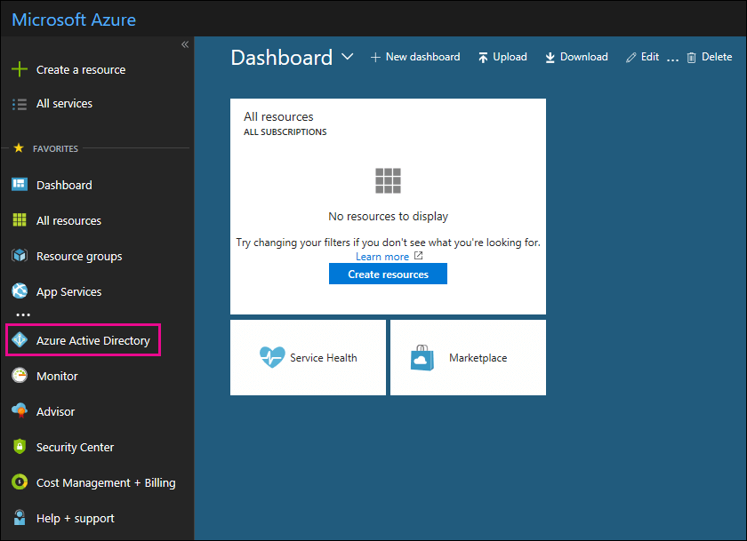

# Use your free Azure Active Directory subscription in Office 365

If your organization has a paid subscription to Office 365, Microsoft Dynamics CRM Online, Enterprise Mobility Suite, or other Microsoft services, you have a free subscription to Microsoft Azure Active Directory. You and other admins can use Azure AD to create and manage user and group accounts. To use Azure AD, just go to the Azure portal and sign in using your Office 365 account.

## Before you begin

Use a private browsing session (not a regular session) to access the Azure portal (in step 1 below) because this will prevent the credential that you are currently logged on with from being passed to Azure. To open an InPrivate Browsing session in Internet Explorer or a Private Browsing session in Mozilla FireFox, just press CTRL+SHIFT+P. To open a private browsing session in Google Chrome (called an incognito window), press CTRL+SHIFT+N.

## Access Azure Active Directory

1. Go to [portal.azure.com](https://portal.azure.com) and sign in with your Office 365 work or student account.

2. In the left navigation pane in the Azure portal, click **Azure Active Directory**.

    

    The **Azure Active Directory** admin center is displayed.

## More information

- A free Azure Active Directory subscription does not include the Sign-ins activity report. To record sign-in activity (which can be useful in the event of a data breach), you need an Azure Active Directory Premium subscription. For more information, see [How long does Azure AD store the data?](https://docs.microsoft.com/azure/active-directory/reports-monitoring/reference-reports-data-retention#how-long-does-azure-ad-store-the-data).

- You can also access the **Azure Active Directory** admin center from the Microsoft 365 admin center. In the left navigation pane of the Microsoft 365 admin center, click **Admin centers** \> **Azure Active Directory**.

- For information about managing users and groups and performing other directory management tasks, see [Manage your Azure AD directory](https://docs.microsoft.com/azure/active-directory/active-directory-administer).
