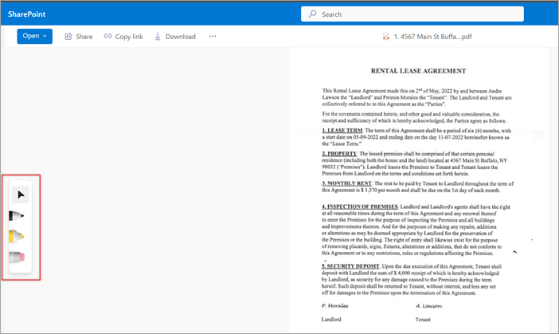

# Comment and collaborate using annotations in Microsoft Syntex

Use the annotations feature in Microsoft Syntex to add notes and comments to your content in document libraries — either for yourself or for collaborating with others. You can use annotations without modifying the original files, so the original records are preserved.

Annotation tools currently include pen and highlighter, where can choose the colors you want to use, and an eraser for removing ink strokes and previous annotations. The feature is currently available for .pdf and .tiff file types. More annotation tools and file types will be added in future releases.

> [!NOTE]
> This feature is available only for users who are licensed for Syntex. 

## To use annotations

1. From a SharePoint document library, open the file you want to annotate.

    

2. On the right side of the document page, select the annotation icon () to begin using the annotations feature.

    

3. On the left side of the document page, select the annotation tool you want to use.

    
