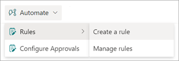

# Create a rule to automate content processing in Microsoft Syntex

After you create a document library, you can use Microsoft Syntex to create rules to automate tasks such as sending someone a notification when data changes in the content or a new file is created in the library.

You'll choose a condition that triggers the rule and the action that the rule will take. For example, the following procedure creates a rule to trigger a notification when a file is updated.

## To create a rule

1. In the document library, select **Automate** > **Rules** > **Create a rule**.

   