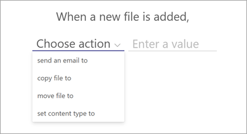
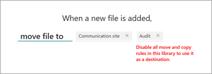

# Create a rule to move or copy a file from one document library to another in Microsoft Syntex

Microsoft Syntex lets you build simple rules-driven actions in document libraries based on metadata. From a document library, you can create rules to automate tasks such as sending someone a notification when metadata changes in a file, when a new file is created in the library, or when files are moved or copied based on metadata extracted by Syntex models. 

You'll choose a condition that triggers the rule and the action that the rule will take. 
For example, you can create a rule to move files tagged with a specific customer to a specific library or folder. This helps you structure your content architecture with the power of AI-driven processing.

Document libraries can have multiple move and copy rules to support moving and copying files to different destination libraries based on metadata criteria. 

> [!NOTE]
> This feature is available only for users who are licensed for Syntex.

## Move or copy a file

To move or copy a file from one document library to another, follow these steps.

1. In the document library, select **Automate** > **Rules** > **Create a rule**.

   

2. On the **Create a rule** page, select a condition that triggers the rule and the action that the rule will take. In this case, select **A new file is added**.

   

    Your selection here creates a rule statement that you'll complete in the next step.

3. To complete the rule statement, under **When a new file is added**:

    1. Select **choose action**, and then:

        - To move a file, select **Move file to**.
        - To copy a file, select **Copy file to**.

       

    2. Select **choose a site**, and then select the site that contains the document library you want the file moved or copied to.

       

    3. Select **choose a library**, and then select the document library you want the file moved or copied to.

       

       You can't set up a rule to move or copy a file to a library that already has a move  or copy rule applied. If you try, you'll receive a message saying that you need to disable all move or copy rules on the destination library. To disable a rule, see [Manage a rule](#manage-a-rule).

       

4. Select **Create**.

## Manage a rule

1. In the document library, select **Automate** > **Rules** > **Manage rules**.

   

2. On the **Manage rules** page, turn on or off a rule or [create a new rule](#move-or-copy-a-file) to automate actions on the document library.

   

## View the activity feed of a document library

When a file is moved or copied, you will see an update in the source library activity feed.

In the document library, in the upper-right corner of the page, select the **Details** pane to view the history, activity, and rules applied to the library.

   

<!---
1. In the document library, select **Automate** > **Rules** > **Create a rule**.

   

2. On the **Create a rule** page, select a condition that triggers the rule and the action that the rule will take.

   

3. 

## To manage rules

1. In the document library, select **Automate** > **Rules** > **Manage rules**.

   

2. On the **Manage rules** page, turn on or off a rule or create a new rule to automate actions on the document library.

   

--->