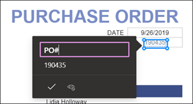

# Create a Form Processing model (Preview)
> [!Note] 
> The content in this article is for Project Cortex Private Preview. [Find out more about Project Cortex]().

Using [AI Builder](https://docs.microsoft.com/ai-builder/overview) - a feature in Microsoft PowerApps - Project Cortex users can create a [form processing model](form-processing-overview.md) directly from a SharePoint document library. 

To create a Form Processing model:

1. In your document library, select the **Automate** menu, select **AI Builder**, and then select **Create a Form Processing model**.

     
2. In the **New form processing model** pane, in the  **Name** field, type a name for your model (for example, *Purchase Orders*).

      

3. When you create a form processing model, you are creating a new SharePoint content type. A SharePoint content type represents a category of documents that have common characteristics and share a collection of columns or metadata properties for that particular content. SharePoint Content Types are managed through the [Content types gallery]().

Click **Advanced settings** if you want to map this model to an existing content type in the SharePoint Content types gallery to use its schema. 

4. Your model will create a new view in your document library for your extracted data. If you do not want it to the default view, deselect **Set the view as default**.
5. Select **Create**.
6. Your browser will open a new PowerApps AI Builder forms processing model page.  

      
 

7. Click **Add documents** to begin adding example documents that are analyzed to determine what named value pairs can be extracted. You can choose either **Upload from local storage**, **SharePoint**, or **Azure Blob storage**. You will need to use at least five files for training.
8. After adding your files, select **Analyze** to check for any information that is common is all files. Note that this may take several minutes to complete.  
 
      

9. After they have been analyzed, in the **Select the form fields you want to save** page, click the file to see the fields that were detected. 

      

10. The next page will display one of your sample files and will highlight all common fields that were automatically detected by the system.  

      

11. Select the fields you want to save, and select the checkbox to confirm your selection. For example, in the Purchase Order model, you can choose to select the *Date*, *PO*, and *Total* fields.  Note that you can also choose to rename a field if needed.  

      

12. If a field was not detected by analysis, you can still choose to add it. Highlight the information you want to extract, and in the name box type in the name you want to give it. Then select the check. Note that you will need to confirm undetected fields in your remaining example files.
13. Click **Confirm fields** after you have selected the fields you want to save.  
 
      
 
14. On the **Select the form fields you want to save** page, it will show the number of fields you have selected. Select **Done**.
14. On the **Model Summary** page, the saved fields will show in the **Selected fields** section. Select **Train** to begin training on your example files. Note that this may take a few minutes to complete. 
      
17. When you see the notification that training has completed, select **Go to details page**. 
18. On the **Model details** page, you can choose to test how your model works by selecting **Quick test**. This lets you drag and drop files to the page and see if the fields are detected.
19. If you are satisfied with the results of your model, select **Publish** to make it available for use.
20. After the model published, select **Use model**. This creates a PowerAutomate Flow that will run in your SharePoint document library that will extract the fields that have been identified in the model. Select **Create Flow**.  
21. When you see **Your flow has been successfully created**, select **Go to SharePoint** to go to your document library.
22. On your document library, notice that the fields you selected now display as columns in your model view. 

      

    Also note that the information link next to **Documents** will note that a forms processing model is applied to this document library.

       

23. Upload files to your document library. Any files that the model identifies will list the files in your view, and will display the extracted data in the columns. 

       

## See Also
  

