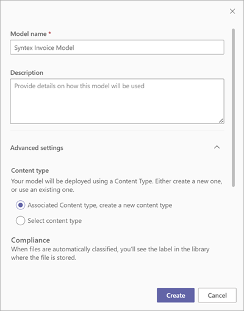
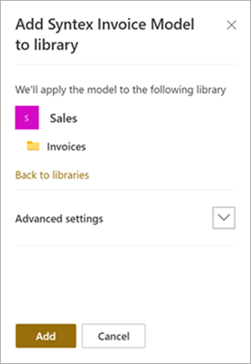

# Create a model on a local SharePoint site with Microsoft SharePoint Syntex

**Applies to:**
> [!div class="checklist"]
> * All custom models
> * All prebuilt models

<!---
|Applies to  |
|---------|
|> [!div class="checklist"]  > * All custom models  > * All prebuilt models    |

> [!div class="checklist"]
> * All custom models
> * All prebuilt models

> [!NOTE]
> The article applies to: > [!div class="checklist"]
> * All custom models
> * All prebuilt models
--->

SharePoint Syntex provides an option to create and train models locally on your own SharePoint site. These models can be used only on the site where they're created. 

By activating document classification and extraction on your SharePoint site, SharePoint Syntex lets you classify files in document libraries, extract information from new files, and automate activities based on extracted information.

When you activate local model creation, the following lists and libraries will be added to your site:

- Models document library
- Training files document library
- Explanation templates list
- Model usage list

This feature is available only for creating all [model types](model-types-overview.md). 

## Create a model on a local site

1. From a SharePoint document library, select the files you want to analyze, and then select **Classify and extract**.

     

2. The first time you use this feature, you're activating SharePoint Syntex on your site. You'll see the following message.

     

    > [!NOTE]
    > You must have the Manage Web Site permission to perform administration tasks and manage content for the site. This would be a site owner. Once the feature is activated, anyone with the Manage Lists permission will be able to create and manage models.

3. Select **Activate** to continue. You'll see the following message.

     

4. Select **Create a model**.

5. On the **Create a model** panel, type the name of the model, select the model type, and then select **Create**.

     

6. Proceed to [train your **Classify and extract by text pattern** model](apply-a-model.md) or to [configure your prebuilt model](prebuilt-models.md) using the files that you selected.

7. When done, the **Add to library** panel opens.

     

8. On the **Add to library** panel, you'll see the name of your SharePoint site and the document library that the model will be applied to. If you want to apply the model to a different library, select **Back to libraries**, and choose the library you want to use. Then select **Add**.

9. On the model home page, in the **Where the model is applied on this site** section, you can see the libraries that have the model applied. To apply the model to other libraries on the site, select **Apply model**. 

     

