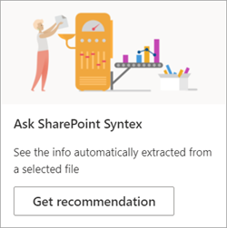

# Publish and discover models in Microsoft SharePoint Syntex

You can make your trained document understanding models available for others to view and use directly from the SharePoint document library. 

You can also find and evaluate trained models in other content centers that were created by others in your organization. You can select the model that is most useful for classifying your files or extracting specific information from them. 

> [!NOTE]
> This feature is not yet available for form processing models.

## Make your model discoverable to others

To make your trained model available for others to use:

1. On the **Models** page for your model, select **Model settings**.

2. On the **Model settings** panel, in the **Sites where this model is available** section, select where you want the model to be visible for other users to apply:

   - **Not visible** – The model will not be available for others to use.
   - **On all sites** – The model will be available in the content type gallery for others to use.
   - **Only on specific sites** – You can choose which site or sites in which the model will be available. If you select this option, click in the text box to search for and choose the sites to which you want the model applied. You will only see sites for which you have access.

## Discover other trained models

To find trained models that might be suitable for your content:

1. In the document library for your model, select **Automate** > **View document understanding models**.

2. On the **Review models and apply new ones** page:

   - On the **Applied** tab, see the models that have been applied to your library. You can select to view details to confirm extractors and other settings.
   - On the **Available** tab, see the trained models that are available to be applied to your library.

    

### Apply a trained model to your library

You can evaluate trained models against your content to help you find the most appropriate one. To select a model that you want to apply to your library:

1. On the **Available** tab, review the models in the list.

    

2. Select the model that you think will get you the best results, and then select **Apply to library**.

### Get a recommendation for a trained model

If you are unsure which model is the best fit for your files, you can ask for a recommendation. Your recommendation will include up to 10 models.

1. On the **Review models and apply new ones** page, select the **Available** tab.

2. On the first tile, select **Get recommendation**.

    

3. On the **Select one or more models** page, select the models that you think might be the best fit, and then select **Next**.

    

4. On the **Select a file** page, select a file of the same or similar type that will be stored in your library.

5. On the **Review recommendation results** page, under **Our recommendation**, you'll see the recommended file. You don't have to apply the recommended model. You can choose to apply another model if you think it's a better fit.

6. Select the model that you think will get you the best results, and then select **Apply to library**.

### Remove an applied model

To remove an applied model from your document library:

1. On the **Review models and apply new ones** page, on the **Applied** tab, see the models that have been applied to your library.

2. Select the model you want to remove, and then select **Remove from library**.

## See also

[Apply a document understanding model](apply-a-model.md)

[Document understanding overview](document-understanding-overview.md)