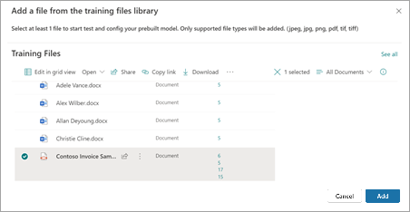
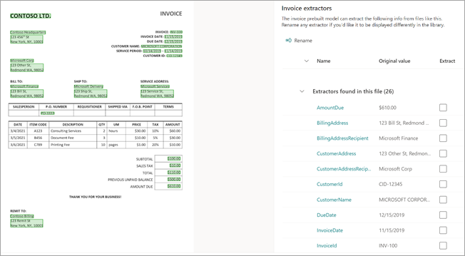
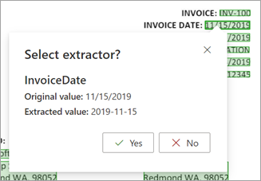
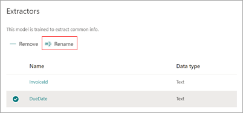

# Use a trained model to extract information from receipts in Microsoft SharePoint Syntex

The trained *receipts model* in SharePoint Syntex analyzes and extracts key information from sales receipts. The API recognizes printed and handwritten receipts and [extracts key receipt information](/azure/applied-ai-services/form-recognizer/concept-receipt#field-extraction), such as merchant name, merchant phone number, transaction date, tax, and transaction total.

To use a receipts model, follow these steps:

- Step 1: [Create a receipts model](#create-a-receipts-model)
- Step 2: [Upload an example file to analyze](#upload-an-example-file-to-analyze)
- Step 3: [Select extractors for your model](#select-extractors-for-your-model)
- Step 4: [Apply the model](#apply-the-model)

## Create a receipts model

Follow the instructions in [Create a model in SharePoint Syntex](create-syntex-model.md) to create a trained receipts model. Then continue with the following steps to complete your model.

## Upload an example file to analyze

1. On the **Models** page, in the **Add a file to analyze** section, select **Add file**.

     

2. On the **Files to analyze the model** page, select **Add** to find the file you want to use.

     

3. On the **Add a file from the training files library** page, select the file, and then select **Add**.

     

4. On the **Files to analyze the model** page, select **Next**.

## Select extractors for your model

On the extractor details page, you'll see the document area on the right and the **Extractors** panel on the left. The **Extractors** panel shows the list of extractors that have been identified in the document.

    

The entity fields that are highlighted in green in the document area are the items that were detected by the model when it analyzed the file. When you select an entity to extract, the highlighted field will change to blue. If you later decide not to include the entity, the highlighted field will change to gray. The highlights make it easier to see the current state of the extractors you have selected.

> [!TIP]
> You can use the scroll wheel on your mouse or the controls at the bottom of the document area to zoom in or out as needed to read the entity fields.

### Select an extractor entity

You can select an extractor either from the document area or from the **Extractors** panel, depending on your preference.
 
- To select an extractor from the document area, select the entity field.

     

- To select an extractor from the **Extractors** panel, select the checkbox to the right of the entity name.

     

When you select an extractor, a **Select extractor?** box is displayed in the document area. The box shows the extractor name, the original value, and the option to select it as an extractor. For certain data types such as numbers or dates, it will also show an extracted value.

    

The original value is what is actually in the document. The extracted value is what will be written into the column in SharePoint. When the model is applied to a library, you can use column formatting to specify how you want it to look in the document.

Continue to select additional extractors you want to you use. You can also add other files to analyze for this model configuration.

### Rename an extractor

You can rename an extractor either from the model home page or from the **Extractors** panel. You might consider renaming selected extractors because these names will be used as the column names when the model is applied to the library.

To rename an extractor from the model home page:

1. In the **Extractors** section, select the extractor you want to rename, and then select **Rename**.

     

2. On the **Rename entity extractor** panel, enter the new name of the extractor, and then select **Rename**.

To rename an extractor from the **Extractors** panel:

1. Select the extractor you want to rename, and then select **Rename**.

     

2. In the **Rename extractor** box, enter the new name of the extractor, and then select **Rename**.

## Apply the model

- To save changes and return to the model home page, on the **Extractors** panel, select **Save and exit**.

- If you're ready to apply the model to a library, in the document area, select **Next**. On the **Add to library** panel, choose the library to which you want to add the model, and then select **Add**.

## Change the view in a document library

[!INCLUDE [Change the view in a document library](../includes/change-library-view.md)]

