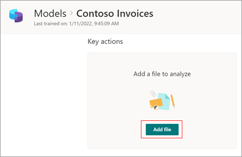

# Use a prebuilt model to classify documents in Microsoft SharePoint Syntex

Prebuilt models are pretrained to recognize documents and the structured information in the documents. You can immediately apply prebuilt models to libraries as they are. They don't need additional training or labeling.

You can also customize a prebuilt model, review it to see how it works on your documents, and customize the names to match your documents or naming conventions. 

Currently, there are two prebuilt models available: invoice and receipt. Additional prebuilt models will be available in future releases.

> [!NOTE]
> You can use retention labels in these prebuilt models. However, sensitivity labels are not supported at this time.

## Create a prebuilt model

Follow these steps to create a prebuilt model to classify documents in SharePoint Syntex.

1. From the **Models** page, select **Create a model**.

     

2. On the **Create a model** panel, in the **Name** field, type the name of the model.

     

3. In the **Model type** section, select one of the prebuilt models:
   - **Invoice processing prebuilt**
   - **Receipt processing prebuilt**

   If you want to create a traditional, untrained document understanding model instead of a prebuilt model, select **Custom document understanding**.

4. Select **Create**.

## Add a file to analyze the prebuilt model

1. On the **Models** page, in the **Add a file to analyze** section, select **Add file**.

     

1. **Files to analyze the model** page, select a file (invoice or receipt) to analyze and select detected distractors.

2. 

6. More TBD.

