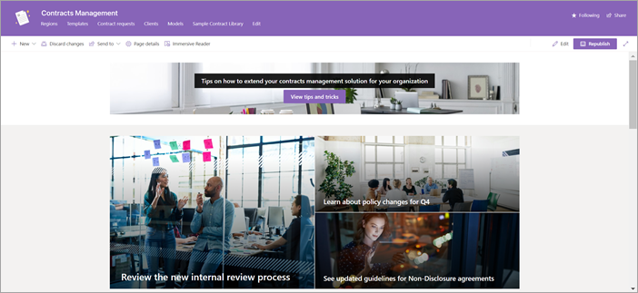
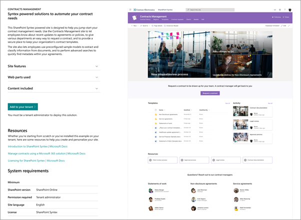
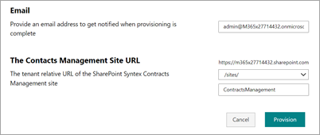

# Use the Contracts Management site template for Microsoft SharePoint Syntex

The Contracts Management site is a ready-to-deploy and customizable SharePoint site template that helps your organization maximize the value of SharePoint Syntex. The site is designed to let you create a professional site to manage, process, and track the status of contracts in your organization.

## Features of the site

The Contract Management site includes pre-populated pages, web parts, and site navigation. The site can be customized to incorporate your organization's own branding, employee information, policy and planning information, workflow, contacts, and resources.

The site uses the power of a SharePoint Syntex model running on a SharePoint document library to classify documents and extract metadata. The site provides prebuilt document libraries to get you started quickly, but you can also create your own as needed. The site includes the following featured libraries:

- **Regions** – Classify contract documents by geographical area, country, or region.

- **Templates** – Select the appropriate contract template for the type of contract, such as non-disclosure agreements, service agreements, and statements of work.

- **Contract requests** – Launch a contract request directly to your contracts team.

- **Clients** – Find client information in one convenient location.

- **Models** – Use this library to classify documents and extract metadata. Users can create their own models to fit their needs and add them to this library.

- **Sample contracts library** – Find files that were classified and have had metadata extracted using the SharePoint Syntex model. 

There is a separate view in the library where you can track other metadata such as status, and that uses document library formatting to show it in a more visual way.

## Provision the site

The Contracts Management site can be provisioned from the [SharePoint look book service](https://lookbook.microsoft.com/).

> [!NOTE]
> You must be a global administrator or SharePoint administrator in Microsoft 365 to provision the site. You also must have a SharePoint Syntex license to add this site template to your organization.

1. From the main page of the [SharePoint look book](https://lookbook.microsoft.com/), on the **View the designs** menu, select **SharePoint Syntex** > **SharePoint Syntex Contracts Management**.

2. On the **Contracts Management** page, select **Add to your tenant**.

    

3. Enter your email address (for a notification of when your site is ready to use), the site URL you want to use, and the title you want to use for your site. 

    

4. Select **Provision**, and in a short time your site will be ready for you to use. You’ll get an email (sent to the email address you provided) indicating that your request to provision the Contracts Management site template is completed.

5. Select **Open site**, and you’ll see your Contracts Management site. From here, you can explore the site and customize the pages and content. 

For more information about provisioning from the SharePoint look book service, see [Provision a new learning pathways solution](/office365/customlearning/custom_provision).

## Customize the site

Before you share the Contracts Management site with other users, you'll want to customize the site to meet your requirements. 

### Customize the look and feel of your site

Customize the following elements of your site to fit the need of your organization:

- Update the [branding](https://support.microsoft.com/office/customize-your-sharepoint-site-320b43e5-b047-4fda-8381-f61e8ac7f59b) on the Contracts Management site to align with your organization.
- Customize the [Hero web part](https://support.microsoft.com/office/use-the-hero-web-part-d57f449b-19a0-4b0d-8ce3-be5866430645) to include images of real sites in your organization where possible.
- Customize the [People web part](https://support.microsoft.com/office/show-people-profiles-on-your-page-with-the-people-web-part-7e52c5f6-2d72-48fa-a9d3-d2750765fa05) to include contact information for the contract managers or others.
- Customize the [Text web part](https://support.microsoft.com/office/add-text-and-tables-to-your-page-with-the-text-web-part-729c0aa1-bc0d-41e3-9cde-c60533f2c801) to add paragraphs to and formatting options like styles, bullets, indentations, highlighting, and links.
- Customize the [Image web part](https://support.microsoft.com/office/use-the-image-web-part-a63b335b-ad0a-4954-a65d-33c6af68beb2) to add an image to a page.
- Customize the [Quick Links web part](https://support.microsoft.com/office/use-the-quick-links-web-part-e1df7561-209d-4362-96d4-469f85ab2a82) to organize and display links to other resources.
- Add [other web parts](https://support.microsoft.com/office/using-web-parts-on-sharepoint-pages-336e8e92-3e2d-4298-ae01-d404bbe751e0) to your site as needed.
- Customize the [page layouts](https://support.microsoft.com/office/add-sections-and-columns-on-a-sharepoint-modern-page-fc491eb4-f733-4825-8fe2-e1ed80bd0899) as needed.
- Add [new pages](https://support.microsoft.com/office/create-and-use-modern-pages-on-a-sharepoint-site-b3d46deb-27a6-4b1e-87b8-df851e503dec) to add additional support or informational resources.

### Customize the site navigation

You have control of the site navigation for the Contracts Management site. Use the following resources to help you make changes that align with your organization:

- Customize the [site navigation](https://support.microsoft.com/office/customize-the-navigation-on-your-sharepoint-site-3cd61ae7-a9ed-4e1e-bf6d-4655f0bf25ca).
- [Associate this site with a hub](https://support.microsoft.com/office/associate-a-sharepoint-site-with-a-hub-site-ae0009fd-af04-4d3d-917d-88edb43efc05).
- Use [audience targeting](https://support.microsoft.com/office/target-navigation-news-and-files-to-specific-audiences-33d84cb6-14ed-4e53-a426-74c38ea32293) to target specific navigational links to specific users. 
- [Delete unwanted pages](https://support.microsoft.com/office/delete-a-page-from-a-sharepoint-site-1d4197b8-31b6-460d-906b-3fb492a51db1) if you need to.

### Add other workflows

The Contracts Management site contains the components to help you get started, but you can also add additional components, such as:

- Use a [Power Automate flow](/power-automate/getting-started) to trigger a workflow when a new contract is added to the **Contract requests** library.
- Build additional [SharePoint Syntex models](/microsoft-365/contentunderstanding/#models).
- Use the [content assembly](content-assembly.md) feature on the **Templates** library.
- Create a [contracts management solution](solution-manage-contracts-in-microsoft-365.md) by using SharePoint Syntex together with other components of Microsoft 365.

## Share the site with others

[Share your site with others](https://support.microsoft.com/office/share-a-site-958771a8-d041-4eb8-b51c-afea2eae3658). Partner with others in your organization to ensure the Contracts Management site is widely known and adopted.

Key success factors to managing the Contracts Management site:

- Celebrate the launch of your Contracts Management site.
- Create and post news announcing the new resource.
- Ensure users have an outlet for questions and feedback.
- Use insights from [site analytics](https://support.microsoft.com/office/view-usage-data-for-your-sharepoint-site-2fa8ddc2-c4b3-4268-8d26-a772dc55779e) to promote content on the home page, update navigation, or rewrite content for clarity.
- Review the Contracts Management site as needed to ensure content is fresh and still relevant.

