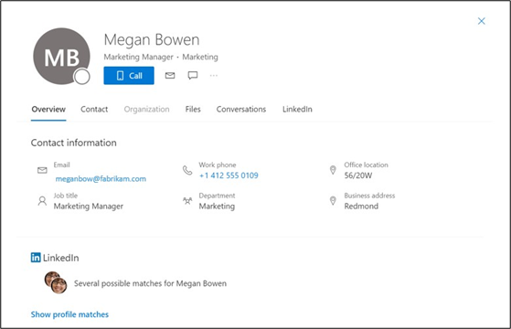

# Microsoft 365 Multi-Tenant Organization People Search (private preview)

The Multi-Tenant Organization (MTO) People Search is a collaboration feature that enables search and discovery of people across multiple tenants. A tenant admin can enable cross-tenant synchronization that will allow users to be synced to another tenant and be discoverable in its global address list. Once enabled, users will be able to search and discover synced user profiles from the other tenant and view their corresponding people cards.

>[!NOTE]
>This Private Preview program is designed to offer select customers the opportunity to try out the multi-tenant people search feature. You can then validate the scenario and provide feedback to the product development team. The purpose of this article is to:
>
>- Give an overview of the feature
>- Define use cases that we currently support as part of the preview
>- Provide instructions on how you can configure and test the feature

> _Fig 1: Azure AD sync illustration_

## Example scenario

Megan's user account has been synced from the _Fabrikam_ tenant to the target tenant, _Contoso_. Nestor from Contoso would like to search and view Megan's people card in Teams. After Megan's account has been synced, Nestor can search and discover Megan's people card in any of the Microsoft 365 apps.

> _Fig 2: User can view a limited people card_

### In-tenant view of people card

The people card shows all the user's attributes including the profile picture when viewing a user's people card within the same tenant.

> _Fig 3: User can view extended people card within the same tenant_

## Known limitations

- The Microsoft Teams audio and video call buttons will direct the call to the user's home tenant Teams instance (Fabrikam) and not the Teams instance target tenant (Contoso).
- The current experience provides limited information on the people card (basic contact information, job title and office location).

## Prerequisites

To test the MTO People Search feature, it is assumed that you already have the following settings:

- Two Azure AD/Microsoft 365 tenants
- Both tenants have the **Azure AD Cross-tenant Synchronization** feature enabled (currently in private preview - make sure you sign up for both preview features)
- Provisioned users from home to target tenants.

## Use Cases

Multi-tenant organization people search is supported across a range of scenarios and Microsoft 365 applications. Some of the scenarios you can test and validate are described below:

1. **Microsoft Outlook (OWA, desktop and mobile app)**

   - Nestor (<nestor@contoso.com>) searches for "Megan" on the centralized search bar in OWA and gets the results and can view Megan's people card with limited profile information.
   - Nestor types in "Megan" in the _To_ line of the email and can send an email to Megan after getting the results for <megan@fabrikam.com>.
   - Nestor \@mentions "Megan" in the body of the email and can get the result for <megan@fabrikam.com>.
   - Nestor types in "Megan" in the _cc_ line of the email and can get the result for <megan@fabrikam.com>.
   - Nestor can hover and/or click on Megan's profile picture/initials to view Megan's limited people card.

2. **Microsoft OneDrive/SharePoint**

   - Nestor (<nestor@contoso.com>) searches for "Megan" in the centralized search bar on SharePoint and can get the result for <megan@fabrikam.com>.
   - Nestor can hover and/or click on Megan's profile picture/initials to view Megan's limited people card.
   - Nestor can share and collaborate on Office documents with Megan.

3. **Microsoft Teams (Web, desktop and mobile app)**

   - Nestor (<nestor@contoso.com>) searches for "Megan" on the Teams people picker and can view Megan's limited people card.
   - Nestor searches for "Megan" on the Teams power bar and can view Megan's limited people card Team membership.

4. **Bing for Business**

   - Nestor (<nestor@contoso.com>) searches for "Megan" on the search bar and can view Megan's limited people card (<megan@fabrikam.com>).

## Key terminology

- _Home tenant_: The tenant you want to search from. The direction of the search is _outbound_.

- _Resource tenant_: The tenant you want to search in. The direction of the search is _inbound_.

  A tenant can be both home and resource tenant simultaneously.

- _Cross-Tenant synchronization_ is a feature that enables multi-tenant organizations to grant users access to applications in other tenants within the organization. It achieves this by synchronizing internal member users from a home tenant into a resource tenant as external B2B users.
