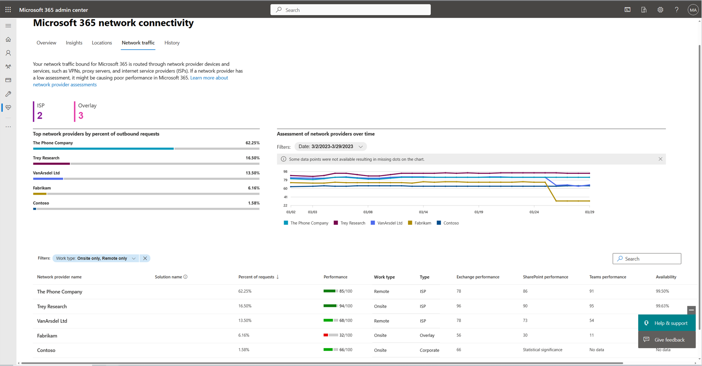
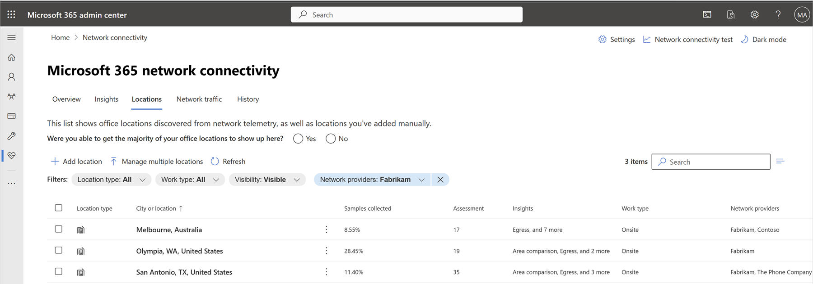
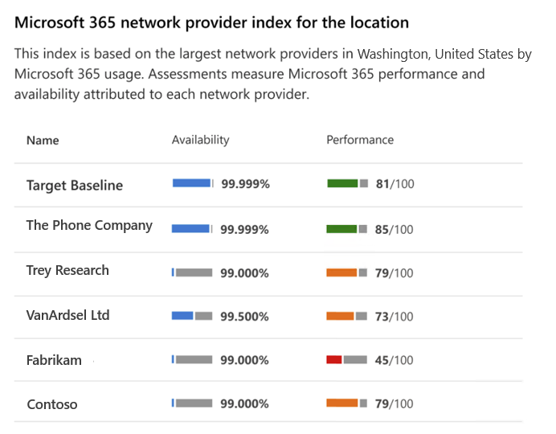

# Network provider connectivity attribution in the Microsoft 365 Admin Center (PREVIEW)

## The network provider table

In the Microsoft 365 Admin Center you can view network providers in use by your users and we apportion network connectivity performance and availability experienced by your users to each. To access these reports in the Microsoft 365 Admin Center, select the **Health | Network connectivity** menu.

> [!div class="mx-imgBorder"]
> 

When you navigate to the Network traffic tab you will see information about connectivity solutions from network providers that have been detected between Office 365 users and Microsoft's network.

Network providers are identified as either of the following:

* **ISP** - Internet Service Provider that provides data transmission media such as terrestrial ISP, cellular ISP, or satellite ISP
* **Overlay** – An additional detected network provider providing other services such as VPN, Cloud Proxy, SD-WAN, and SASE
* **Corporate** – The customer owns detection attributes for network providers

The top five network providers by network requests from your users are shown on the left. On the right is a historical chart showing the performance assessment of each of the top five network providers over time. You can adjust the time range back as far as two years though the default is one month.

In the lower part of the page shows a table of all significant detected network providers. It can show these attributes for each network provider:

* **Network provider name** - The network provider name from public contributions
* **Solution name** – Listed if a network provider has multiple network solutions which are measured separately
* **Percent of requests** – The percentage of requests for the specific provider for all your users
* **Performance** – The network assessment performance out of 100 attributed to this network provider
* **Work type** – Shows either remote, onsite, or remote and onsite
* **Type** – Shows either ISP, Overlay, or Corporate
* **Exchange Performance** – Exchange network assessment out of 100
* **SharePoint Performance** – SharePoint network assessment out of 100
* **Teams Performance** – Teams network assessment out of 100
* **SharePoint Throughput** – SharePoint throughput aggregate with error margin in Megabytes per second
* **Exchange Latency** – Exchange TCP latency aggregate with error margin in milliseconds
* **Teams packet loss** – Teams UDP Packet loss in percent aggregate with error margin
* **Teams jitter** – Teams UDP Jitter with error margin in milliseconds
* **Teams latency** – Teams UDL latency with error margin in milliseconds
* **Availability** – The network availability as a percentage attributed to this network provider
* **Exchange Availability** – Exchange specific availability
* **SharePoint Availability** – SharePoint specific availability
* **Teams Availability** – Teams specific availability

You can filter the table of network providers by connections from onsite corporate office locations or remote worker locations such as homes, cafés, hotels.

If you click the network provider name a flyout will appear showing details about that network provider.

The flyout shows more information about a particular network provider. If this network provider is in the Microsoft 365 network partner program, then a **Setup info** section will be shown with a link to configuration instructions that the network provider shares for optimal connectivity to Microsoft 365.

The flyout also has a Location section which contains a link to open the **Network connectivity | Location** table filtered for this network provider.
If the network provider selected has an identified network insight causing poor Microsoft 365 user experience, then the flyout text will provide recommendations for improvement.

## Network providers by location

The table of locations can be filtered by specific network providers. The table will be filtered to only show locations where the specified network provider is detected. If multiple network providers are selected in the filter, then locations where any of them were detected are shown.

> [!div class="mx-imgBorder"]
> 

A network providers column is included in the table where network providers are shown as fit. The network providers are all shown in the details tab.

## Network Provider Index Chart for the location

The Network Provider Index Chart (NPI Chart) shows in an office location summary and lists large network providers that are being used by Office 365 customers in the same country and state as your office. We include availability and performance information attributed to these providers. This chart also shows a target baseline that shows what good performance observed in the same country and state looks like.

> [!div class="mx-imgBorder"]
> 

Below the NPI Chart is a list of network providers detected for your users at this specific office location. The Table of network providers for this location has the following fields:

* Network provider name
* Solution name
* Percent of requests
* Availability
* Performance

## Related topics

[Network connectivity in the Microsoft 365 admin center](office-365-network-mac-perf-overview.md)

[Network provider program data calculations](office-365-network-mac-perf-nppdata.md)

[Microsoft 365 network assessment](office-365-network-mac-perf-score.md)

[Microsoft 365 network connectivity test tool](office-365-network-mac-perf-onboarding-tool.md)