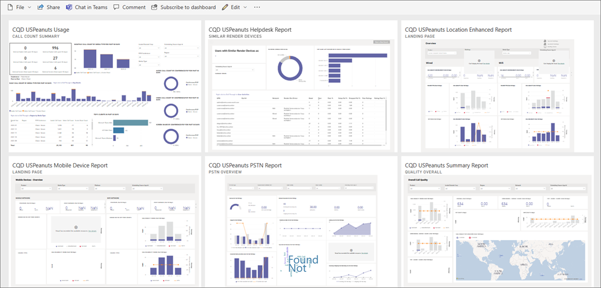

# Microsoft Teams Virtual Appointments in Call Quality Dashboard

Call Quality Dashboard (CQD) is a self-service data environment that empowers you to access data on Teams usage throughout your organization, build reports to analyze call quality, and troubleshoot call issues. CQD tracks several hundred data points on your organization's Teams calls and stores them in a database that you can easily access using the Microsoft Call Quality connector for Power BI.

When you access this data, you can use it to analyze high-level metrics such as daily call errors and total call volume. You can also use it to determine things such as why a participant dropped a call or why [a particular building](/microsoftteams/cqd-upload-tenant-building-data) has an unusually high rate of dropped calls. You can perform this analysis in Power BI by developing reports that can be published to the web, where they can automatically receive updated data at scheduled refresh times or at nearly real-time refresh rates. Once the reports are published to the web, you can distribute links within your organization and set permissions to allow users to explore the data themselves. This also allows users to export the underlying information to Excel.

> [!NOTE]
> Call Quality Dashboard is designed to be a quality and reliability analysis tool that relies on diagnostic telemetry returns from Teams service and client endpoints. Because of the unreliable nature of diagnostic telemetry, there may be slight variances in call counts or certain metrics. Keep this is mind as you use Call Quality Dashboard for [usage-focused reporting](/microsoftteams/cqd-frequently-asked-questions#im-trying-to-use-cqd-for-usage-type-reports-and-find-that-some-of-the-data-is-incomplete----why-is-that).

> [!NOTE]
> Power BI reports published to the web are only accessible to authorized admins.

## Get started

To begin, you'll want to get familiar with [using Call Quality Dashboard](/microsoftteams/turning-on-and-using-call-quality-dashboard). You'll need [appropriate admin credentials](/microsoftteams/turning-on-and-using-call-quality-dashboard#assign-admin-roles-for-access-to-cqd) to [sign into CQD](https://cqd.teams.microsoft.com) and begin working with your data.

You can also access CQD from Teams Admin Center:
1. From the menu bar, select **Analysis & Reports**.
1. Then, choose **Call Quality Dashboard**.

One you've logged into CQD, you can begin to analyze data from the existing dashboards. You can find these in the dropdown menu at the top of the page. You can also use [Power BI desktop](/p/power-bi-desktop/9ntxr16hnw1t#activetab=pivot:overviewtab) to create highly customizable reports. Use the [CQD Power BI template files](/microsoftteams/cqd-data-and-reports#import-the-cqd-report-templates) to get started. These template files contain many of the most frequently requested call quality metrics and charts.

## Working with CQD data in Power BI

Before you begin analyzing organizational call quality data, you'll need to [install](/p/power-bi-desktop/9ntxr16hnw1t#activetab=pivot:overviewtab) and [learn to use](https://powerbi.microsoft.com/learning/) Power BI desktop. To access the CQD database through Power BI, you'll need to [download and install the Microsoft Call Quality connector](/microsoftteams/cqd-power-bi-connector). Make sure to install the connector in the appropriate Documents folder.

Once you've installed the connector, you'll be able to access your CQD data in Power BI.

> [!TIP]
> You can get a head start by using the [CQD Power BI template files](/microsoftteams/cqd-data-and-reports#import-the-cqd-report-templates). The template files are already connected to the CQD data source. You still need to have the connector installed to use the template files.

### Start a report from scratch

If you choose not to use the template files, you can create a Power BI report from scratch.

1. Follow the [setup](/microsoftteams/cqd-power-bi-connector#setup) and [building queries](/microsoftteams/cqd-power-bi-connector#building-queries) instructions in the CQD connector documentation.
1. Select **Get Data** in Power BI.
1. Search the connectors for **Microsoft Call Quality**.

## Use cases

You can analyze Teams data in several different ways.

- **[Teams Admin Center](https://admin.teams.microsoft.com/):** You can find a pre-made and easy to read set of reports and insights inside Teams Admin Center. However, you can't extensively customize these reports.
- **[Call Quality Dashboard](https://cqd.teams.microsoft.com/):** Here you can filter and customize reports that provide quick answers to many frequently asked questions.
- **[Call Quality connector for Power BI](/microsoftteams/cqd-power-bi-query-templates):** Using Power BI gives you the most customizable options for creating reports. Here you can use CQD data to understand user behavior, see usage patterns, and resolve individual call issues. You can use Power BI to supplement the aforementioned dashboards with answers that aren't available in the pre-made reports.

## Virtual appointments data

You can also use CQD to gather and analyze data specific to Virtual Appointments.

### Differentiate EHR and Bookings appointments

You can view the point of origin of a scheduled call by using the **Scheduling Source App ID** column. You can find this in the **Fields** list. Then drag and drop the slicer onto the canvas.

EHR connector appointments have the ID e97edbaf-39b2-4546-ba61-0a24e1bef890.
Bookings appointments have the ID 0eaa6b95-4a35-4a5d-9919-e4fc61fb4bdb.

> [!NOTE]
> Scheduling Source App ID isn't one of the default slicers in the PBIT templates.

