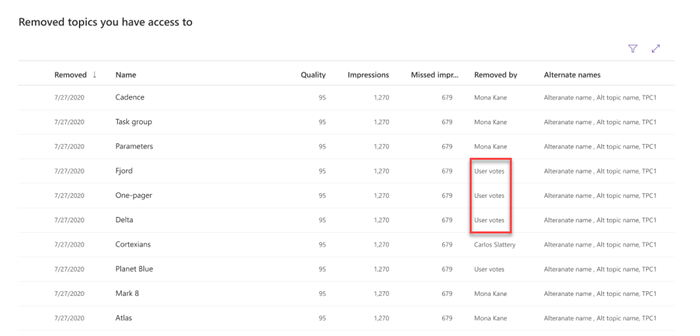
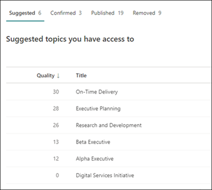

# Manage topics in the topic center in Microsoft Viva Topics

 

> [!VIDEO https://www.microsoft.com/videoplayer/embed/RE4LxDx]  

 

In the Viva Topics topic center, a knowledge manager can view the **Manage topics** page to review topics that have been identified in the source locations as specified by your knowledge admin.  

     

## Topics stages

Knowledge managers help to guide discovered topics through the various topic lifecycle stages: **Suggested**, **Confirmed**, **Published**, and **Removed**.

    

- **Suggested**: A topic has been identified by AI and has enough supporting resources, connections, and properties. (These are marked as a **Suggested Topic** in the UI.)

- **Confirmed**: A topic that has been suggested by AI is validated. Topic validation must be confirmed by a knowledge manager. For a topic to be confirmed, there must be a net of two positive votes received from users who voted using the feedback mechanism on the topic card. For example, if one user voted positive and one user voted negative for a particular topic, you would still need two more positive votes for the topic to be confirmed.
 
- **Published**: A confirmed topic that has been curated: manual edits have been made to improve its quality.

- **Removed**: A topic is rejected by a knowledge manager and will no longer be visible to viewers. A topic can be removed in any state (suggested, confirmed, or published). For a topic to be removed, there must be a net of two negative votes received from users who voted using the feedback mechanisms on the topic card. For example, if one user voted negative and one user voted positive for a particular topic, you would still need two more negative votes for the topic to be removed. When a published topic is removed, the page with the curated details will need to be deleted manually through the Pages Library of the topic center.

On the **Manage topics** page, a knowledge manager can see whether a topic was confirmed or removed by user votes or by a specific person. For example, for topics removed by user votes, the reason is shown in the **Removed by** column as **User votes** rather than a person's name. 

    

> [!Note] 
> On the **Manage topics** page, each knowledge manager will only be able to see topics where they have access to the underlying files and pages connected to the topic. This permission trimming will be reflected in the list of topics that appear in the **Suggested**, **Confirmed**, **Published**, and **Removed** tabs. The topic counts, however, show the total counts in the organization regardless of permissions.

## Requirements

To manage topics in the topic center, you need to:
- Have a Viva Topics license.

- Have the [**Who can manage topics**](./topic-experiences-user-permissions.md) permission. Knowledge admins can give users this permission in the Viva Topics topic permissions settings. 

You will not be able to view the **Manage topics** page in the topic center unless you have the **Who can manage topics** permission.

In the topic center, a knowledge manager can review topics that have been identified in the source locations you specified, and can either confirm or remove them. A knowledge manager can also create and publish new topic pages if one was not found in topic discovery, or edit existing ones if they need to be updated.

## Review suggested topics

On the **Manage topics** page, topics that were discovered in your specified SharePoint source locations will be listed on the **Suggested** tab. If needed, a knowledge manager can review unconfirmed topics and choose to confirm or remove them.

    

To review a suggested topic:

1. On the **Manage topics** page, select the **Suggested** tab, and then select the topic to open the topic page.

2. On the topic page, review the topic page, and select **Edit** if you need to make any changes to the page. Publishing any edits will move this topic to the **Published** tab.

3. After reviewing the topic, go back to the **Manage topics** page. For the selected topic, you can:

   - Select the check mark to confirm the topic.
    
   - Select the **x** if you want to remove the topic.

    Confirmed topics will be removed from the **Suggested** list and will now display in the **Confirmed** list.

    Removed topics will be removed from the **Suggested** list and will now display in the **Removed** tab.

### Quality score

Each topic that appears on the **Suggested** topics page has a quality score assigned to it. The quality score is a reflection of the amount of information that the average user will see for the information on the topic, keeping in mind that each user might see more or less information because of the permissions they might or might not have on the information in a topic. 

The quality score can help give insight to the topics with the most information and can be useful for finding topics that may need to be manually edited. For example, a topic with a lower quality score might be the result of some users not having SharePoint permissions to pertinent files or sites that AI has included in the topic. A contributor could then edit the topic to include the information (when appropriate), which will then be viewable to all users who can view the topic.

### Impressions

The **Impressions** column displays the number of times a topic has been shown to end users. This includes views through topic answer cards in search and through topic highlights. It does not reflect the click-through on these topics, but that the topic has been displayed. The **Impressions** column will show for topics in the **Suggested**, **Confirmed**, **Published**, and **Removed** tabs on the **Manage topics** page.

## Confirmed topics

On the **Manage topics** page, topics that were discovered in your specified SharePoint source locations and have been confirmed by a knowledge manager or "crowdsourced" confirmed by a net two or more people (balancing negative user votes against positive user votes) through the card feedback mechanism will be listed in the **Confirmed** tab. If needed, a user with permissions to manage topics can review confirmed topics and choose to reject them.

To review a confirmed topic:

1. On the **Confirmed** tab, select the topic to open the topic page.

2. On the topic page, review the topic page, and select **Edit** if you need to make any changes to the page.

Note that you can still choose to reject a confirmed topic. To do this, go to the selected topic on the **Confirmed** tab, and select the **x** if you want to reject the topic.

## Published topics

Published topics have been edited so that specific information will always appear to whoever encounters the page. Manually created topics are listed here as well.

   
