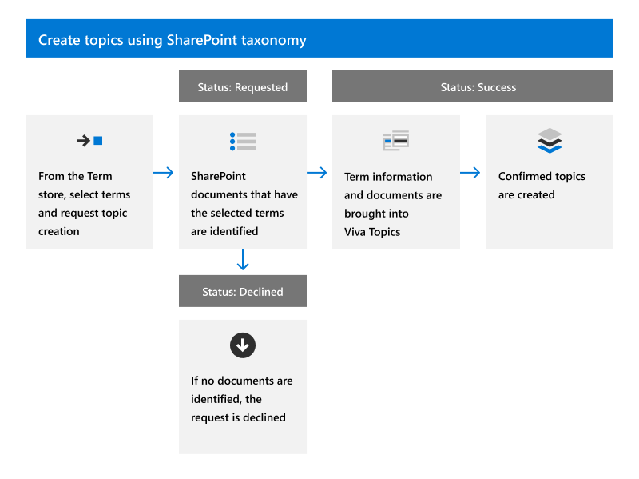
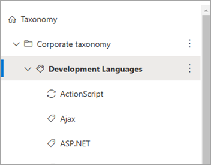
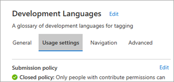
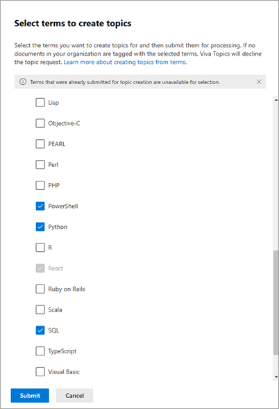

# Use SharePoint taxonomy terms to create topics in Microsoft Viva Topics

You can use SharePoint taxonomy terms to help guide AI to create topics in Viva Topics. 
The SharePoint taxonomy service provides global terms that are available to all sites. Users can create topics that correspond with concepts that are represented as terms. 

You must have edit permissions to the global terms you want to use to perform these tasks.

> [!Note]
> This feature is available only for users who are licensed for Viva Topics.

## How it works

When someone requests to create a topic from a term, the taxonomy service relays information about the term to Viva Topics for the creation of a corresponding topic. This information includes the following:

- Name (default label)
- Synonyms
- Description
- Files tagged with the term

The topic that gets created uses the original name from the term, considers the synonyms to be the topic’s alternate names, and uses the description from the term for the topic description. The files that are tagged with the taxonomy term are considered “suggested” files on the topic. The AI then continues to discover additional content for the topic.

> [!Note]
> For topic creation to succeed, the taxonomy term must have at least one file tagged with it. If it doesn’t, the system declines the request.

After a topic is created from a term, the term continues to exist in the SharePoint term store and is unaffected by topic creation. You’ll continue to be able to use it in SharePoint lists and libraries.

If a term is deleted, the deletion doesn’t automatically remove the topic. If Viva Topics identifies content related to the topic that’s not solely from the term and its tagged content, the topic continues to exist.

If a term’s default label or description changes, Viva Topics evaluates the changes and updates the topic information if it determines that the change is appropriate. The content that’s tagged with the term is also passed periodically to Viva Topics. If there’s no longer any content tagged with the term, and Viva Topics hasn’t identified any other content associated with the topic, the topic might be removed.

Updates to the topic don't affect the original term.

## Initiate a topic creation request

You can request a single term or multiple terms in a term set. You initiate the topic creation request in the modern SharePoint term store. Users who can edit the term set have permission to initiate the request. These users include term store admins, group managers, and contributors.

### Request a single term

1. In the SharePoint admin center, in the left navigation, select **Term store**.

     

2. On the **Term store** page, search for and select the term you want to use.

    

3. On the term page, select the **Usage settings** tab.

    

4. In the **Create topic from this term** section, select **Request topic**.

    

### Request multiple terms in a term set

1. In the SharePoint admin center, in the left navigation, select **Term store**.

     

2. On the **Term store** page, search for and select the term set you want to use.

    

3. On the term page, select the **Usage settings** tab.

    

4. In the **Create topics from terms** section, select **Get started**.

    

   If you’ve raised requests in the past, the option that appears is **Create terms for creation**.

    

    1. On the **Select terms to create topics** page, the hierarchy of terms within this term set is available for selection.

        

    2. To select specific terms, select each term individually.

    3. You can also select all immediate children of a node in the hierarchy. 

5. After you select the terms for which you want to create topics, select **Submit**.

    Viva Topics creates the request and queues it to be processed. Viva Topics evaluates the terms and their associated resources and creates new topics or merges with existing topics. After the initial request, the topic will be created within 24 hours.

## View the status of the topic creation request

Requests for topic creation from a taxonomy term fall into one of three states: Requested, Success, or Declined.

- **Requested** – Indicates that the request is queued and the service is gathering all the required term info. A new request might remain in the Requested state for a few hours before it moves to one of the two final states.

- **Success** – Indicates that the request was successfully relayed to Viva Topics with all necessary term information. Viva Topics creates the corresponding topic within the next 24 hours.

- **Declined** – Indicates that the request can’t be processed because there aren’t any files that are tagged with the term. There should be at least one file tagged for the request to succeed. If files later get tagged with the term, you can manually create a new request for the term.

In the term store, you can view the status of requests by:

- Going to an individual term.
- Viewing all the requests for a specific term set.

### View the status for a single term

1. On the **Term store** page, search for and select the term for which you want to view the status.

2. On the term page, select the **Usage settings** tab.

3. In the **Create topic from this term** section, view the status of the request.

**--Insert screenshots from final UX--**

### View the status for multiple terms in a term set

1. On the **Term store** page, search for and select the term set for which you want to view the status.
2. On the term page, select the **Usage settings** tab.

    In the **Create topics from terms** section, you can see the total number of requests, how many are linked to topics, and how many were declined.

3. Select **View all requests**.
4. On the **All requested terms for topic creation** panel, view the status of the term requests.
5. If you have many requests, select **Load more** to keep loading additional items.
6. To review requests that are in a particular state, use the filter option on the **Status** column.

**--Insert screenshots from final UX--**

<!---

## Identify topics created from terms

After Viva Topics processes a request and creates a topic, you can see a topic card when you hover over a term name in the list of requests for the term set.

Also, if you go to individual terms, and select the **Usage settings** tab, the **Create topic from this term** section shows a topic card when you hover over the name.

**--Insert screenshot from final UX - topic card on hover--**

Topic pages also indicate that the taxonomy is one of the sources for the topic.

**--Insert screenshot from final UX - source string in topic page--**

--->
