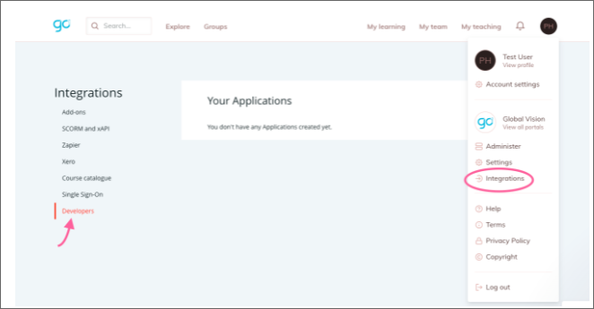
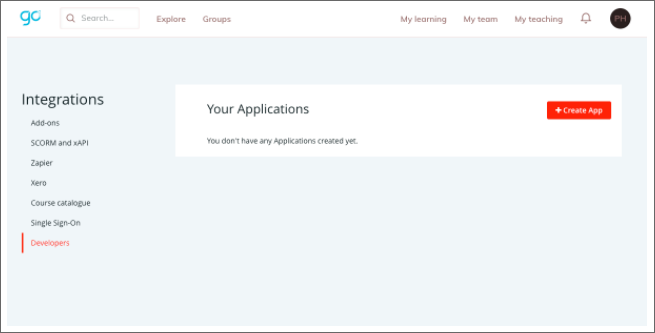
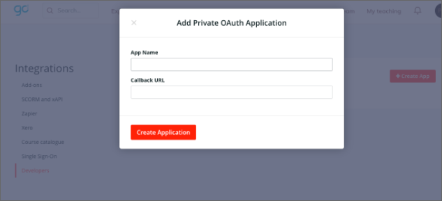

# Configure Go1 as a learning content source for Microsoft Viva Learning (Preview)

>[!NOTE]
>Content accessible through Viva Learning is subject to terms other than the Microsoft Product Terms. Go1 content and any associated services are subject to Go1’s privacy and service terms.

Go1 provides access to thousands of courses from top content providers. [Learn more about Go1](https://www.go1.com/go1-microsoft-viva). Follow these steps so add Go1 as a content source in Viva Learning.

## Create a developer's app in Go1

First, you'll need to follow these steps to create an app in your Go1 Portal. This app will generate your API keys, which you can use to authenticate with Go1 and make requests to the API.

1. Sign in to your Go1 Portal as an administrator.
2. Select **Integrations** from the menu options.
3. Select **Developers**.

    

4. Select the **Create App** button.

    

5. Enter a name for the app, for example, "My-go1-viva-integration".
6. Enter a call back URL, for example, "Mycompany.mygo1.com".

    

7. Save the information you entered.
8. Your information will display with the Secret hidden. Select the ellipses (**...**), then select **View Secret** to display the Secret.
9. Copy the following values.
    1. **Client's Host URL:** This is your Go1 Portal URL. It will look like "https://mycompany.mygo1.com".
    2. **Client ID:** You can find your ID in your Go1 Portal under the **Integrations/Developer** menu options.
    3. **Secret:** You can find your Secret in your Go1 Portal under the **Integrations/Developer** menu options.

## Complete configuration in the Microsoft 365 admin center

Copy and paste the values that you've retrieved from your Go1 Portal into the Go1 setup screen in your Microsoft 365 Admin center.

Learn more about creating a private developer's app for Go1 [here].
