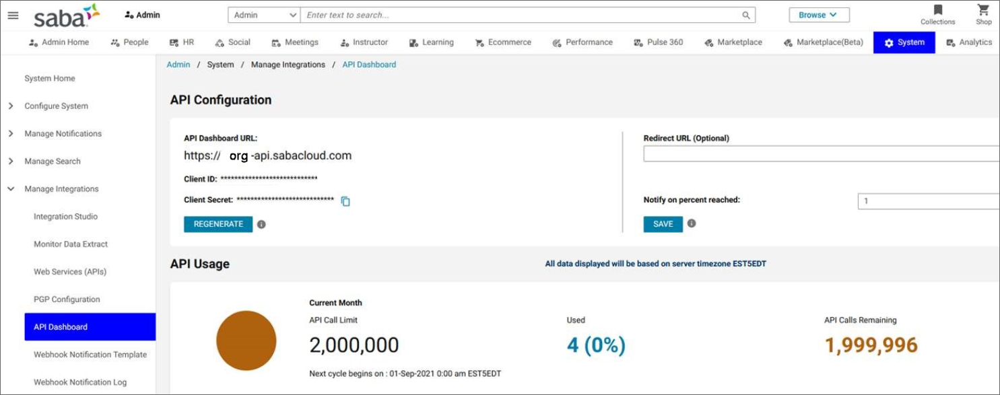
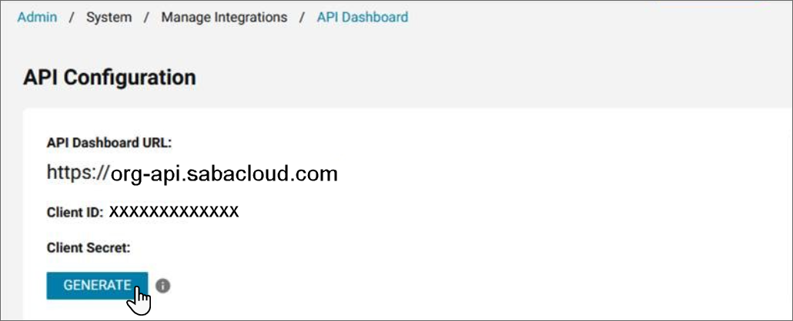
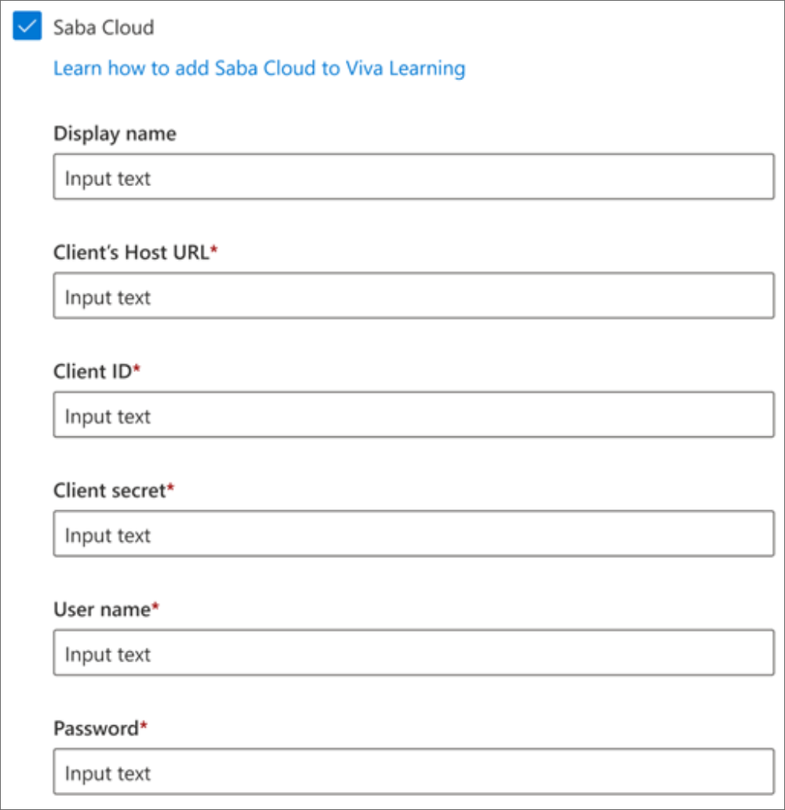

# Configure Saba as a learning content source for Microsoft Viva Learning (Preview)

This article will show you how to configure Saba as a third-party content source for Microsoft Viva Learning. You'll need to be a Saba System Admin or Super User to perform these steps.

## Client’s Host URL

This is your primary Saba Cloud URL (e.g. "org".sabacloud.com). If your API dashboard URL is org-api.sabacloud.com, your Host URL will be org.sabacloud.com. The API Dashboard URL can be found by going to **Saba Cloud** > **Admin** > **System Admin** > **Manage Integrations** > **API Dashboard**. Find the API Dashboard URL, then remove "https://" and "-api" to get your Host URL.

## Client Id and Client Secret

In the same screen where you got the host URL, copy the Client Id and secret if they've already been generated. If  the Client secret isn't there yet, select the **GENERATE** button to generate it.

## Username and Password

Provide the username and password of an administrative account for Microsoft Viva to use to pull Courses, Completions and related information from Saba Cloud via REST API. This account should ideally be a Super user. If they aren't a super user, they must at least have “Learning Admin - Catalog Builder” and “Human Capital Admin” roles (or equivalent custom security roles) in Saba.

## Last steps

Post the required configuration details on your M365 admin center under the Saba Cloud learning source option.  

Please note:  For Saba Cloud integration, you need to have a sabacloud.com domain in your Host URL. If you have a different domain name, you'll need to raise a support ticket for allowing your domain name. <!-- daisy get link-->

## Data residency

Tenant metadata is stored centrally in our data stores & not stored in geo-specific data stores.

## Roles & Permissions

Currently, all the users within an organization will be able to discover all the tenant specific courses. However,they'll only be able to access and consume the courses that they have access to. User specific content discovery (based on roles & permissions) is planned to be rolled out in the future. <!-- daisy confirm how we talk about the future-->
