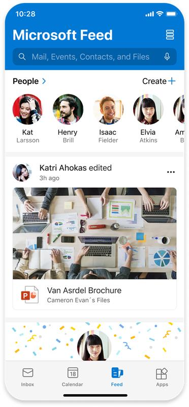
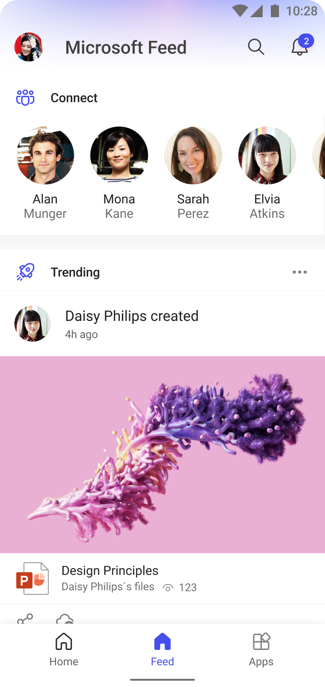
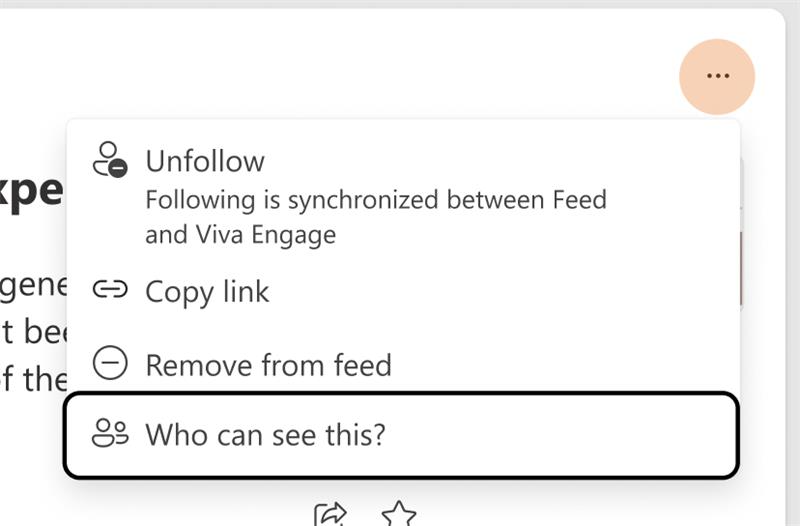

# Overview of Microsoft Feed

Microsoft Feed is powered by Microsoft Graph and aims to help users discover and learn about people and interests relevant to their work. Microsoft Feed shows users a mix of content and activity from across Microsoft 365. Users might, for example, see updates to documents they’re working on with others, links shared with them in Teams chats, suggested tasks to follow up, highlights about colleagues, and much more.

Read more about how the feed works here:  [Discover and learn with Microsoft Feed](https://support.microsoft.com/en-us/office/discover-and-learn-with-microsoft-feed-9c190800-e348-46b7-9d46-41c628b80ebb)

## Where can users see Microsoft Feed?

In **Microsoft 365** (previously Office.com), while signed in with a work or school account, select **Feed** from the left navigation bar.

In **Microsoft Edge**, while signed in with a work or school account, select the **Work Feed** page when opening a new tab.

In **Outlook Mobile**, while signed in with a work or school account, select the Feed Tab from the bottom navigation bar.

In **Microsoft 365 Mobile**, while signed in with a work or school account, select the Feed Tab from the bottom navigation bar.

See the section *Find your way around* in [Discover and learn with Microsoft Feed](https://support.microsoft.com/en-us/office/discover-and-learn-with-microsoft-feed-9c190800-e348-46b7-9d46-41c628b80ebb) for more information.

## Privacy in Microsoft Feed

The information in Microsoft Feed is tailored to each user. Users will only see documents or other content they have access to or that was shared directly with them. This can be documents that are stored in a shared folder in OneDrive or on a SharePoint site that the user has access to, or a link that someone shared in an email conversation or a Teams chat.

Microsoft Feed doesn’t change any permissions, so each user has a unique feed based on what they already have access to. Documents and information are not stored in Microsoft Feed, and changing permissions must be done from where the information is stored, such as in OneDrive or SharePoint.  To learn more, see [Share OneDrive files and folders - Microsoft Support](https://support.microsoft.com/en-us/office/share-onedrive-files-and-folders-9fcc2f7d-de0c-4cec-93b0-a82024800c07) and [Set up secure file and document sharing and collaboration with Teams in Microsoft 365 | Microsoft Learn](../solutions/setup-secure-collaboration-with-teams)

We have also added this feature where users can see who has access to a document by clicking on 'Who can see this' behind the three-dot menu (...) on the document card as shown below:

## What controls are available?

Microsoft Feed is built on Microsoft 365 and implicitly respects all settings and restrictions enabled by admins and users, such as People Insights (see more information on how to [Customize people insights privacy in Microsoft Graph](/graph/insights-customize-people-insights-privacy)), and Item Insights (see more information on how item insights setting works [Item insights overview](/graph/item-insights-overview)).

In addition, Microsoft Feed respects the settings in the "Visibility section" in LinkedIn Settings & Privacy (when a user chooses to restrict the visibility of their profile information outside of LinkedIn). To learn more, see [Off-LinkedIn Visibility | LinkedIn Help](https://www.linkedin.com/help/linkedin/answer/a1340507), and [Disconnecting Your LinkedIn and Microsoft Accounts and Managing Your Data | LinkedIn Help](https://www.linkedin.com/help/linkedin/answer/a552108).

## Disabling the Feed

As a tenant admin, if you want to disable the Feed, you can do so by following the steps in the sections below which disable the Feed in the respective endpoints: 

* Disabling the Feed in Microsoft 365 (previously Office.com)
* Disabling the Feed in Microsoft Edge
* Disabling the Feed in Outlook Mobile
* Disabling the Feed in Microsoft 365 Mobile

## Disabling the Feed in Microsoft 365 (previously Office.com)

In Microsoft 365 (previously Office.com), as a tenant admin, if you want to disable the experience there, you can contact Microsoft via a service request to turn off Microsoft Feed. This will remove the Feed icon from the left navigation of Microsoft 365.

1.    [Sign in to Microsoft 365](https://admin.microsoft.com) with your Microsoft 365 admin account.
2.    **Select Support** > **New service request.**
3.    If you're in the admin center, select **Support** > **New service request.**
4.    To re-enable the feature, you can create a **New service request.**

## Disabling the Feed in Microsoft Edge

In Microsoft Edge, while signed in with a work or school account, as a tenant admin, if you want to disable the new experience, you can choose to *not show* Microsoft 365 content on the Microsoft Edge new tab page:

1.    Sign in to the [Microsoft 365 admin center](https://admin.microsoft.com)
2.    Go to **Org settings** > **News.**
3.    Under **News**, select **Microsoft Edge new tab page**.
4.    *Clear* the box that says **Show Microsoft 365 content on the Microsoft Edge new tab page.**
5.    To re-enable the feature, check the box that says **Show Microsoft 365 content on the Microsoft Edge new tab page.**

## Disabling the Feed in Outlook Mobile

In **Outlook Mobile**, if you want to disable the experience there, you can find the instructions here: [https://learn.microsoft.com/en-gb/exchange/clients-and-mobile-in-exchange-online/outlook-for-ios-and-android/outlook-for-ios-and-android-configuration-with-microsoft-intune#general-app-configuration-settings](/exchange/clients-and-mobile-in-exchange-online/outlook-for-ios-and-android/outlook-for-ios-and-android-configuration-with-microsoft-intune)

## Disabling the Feed in Microsoft 365 Mobile

In **Microsoft 365 Mobile** you can now enable/disable Microsoft 365 Feed by configuring the below setting in the Intune portal. These app settings can be deployed using an [app configuration policy](/mem/intune/apps/app-configuration-policies-use-ios) in Intune.  They key value pair for the configuration is as below:

* ***Key***:  **com.microsoft.office.officemobile.Feed.IsAllowed**
* ***Value***:
    * **true** **(Default)** - Feed is enabled for the tenant
    * **false** - disables Feed for the tenant

For more information about adding configuration keys, see [Add app configuration policies for managed iOS/iPadOS devices](/mem/intune/apps/app-configuration-policies-use-ios)

## Provide feedback

We would love to hear from you! To let us know what you think of this feature, you can reach us by:

1.    Responding to our Message Center post with feedback. This option is only available for tenant admins with access to the Microsoft Admin Center in Microsoft 365.
2.    In Microsoft 365 (previously Office.com), and on Microsoft Edge, you can provide general in-product feature feedback when viewing Microsoft Feed by clicking on ***Feedback*** in the lower right-hand corner.

## Frequently Asked Questions (FAQ)

1. **What documents can users see in Microsoft Feed?**

By interacting with resources such as files in Microsoft 365, you produce signals that Microsoft aggregates and assembles into a graph for your organization. In the graph, the signal data is represented as relationships between you and the other resources. Derived from signals in the graph are insights that power a few Microsoft 365 experiences. For more information, see [Item insights in Microsoft Graph - Microsoft Graph | Microsoft Learn](/graph/item-insights-overview) and [Customize people insights privacy in Microsoft Graph](/graph/insights-customize-people-insights-privacy)

When a user creates and stores a document in a folder in OneDrive, and this folder is shared with other people, the document can be picked up and shown in those people’s feeds, even if the user hasn’t explicitly shared the document with others (yet). The same is the case if a user stores a document on a SharePoint site that others have access to.

2. **How does following work?**

Following is synchronized between Microsoft Feed and Viva Engage. Following features in Microsoft Feed are only available to users who have a Viva Engage license. If users don’t have a Viva Engage license, the **Manage network** page is not available, and the users can’t follow others from Microsoft Feed.

3. **What's the connection between** [Office Delve](https://delve.office.com) **and Microsoft Feed?**

Office Delve and Microsoft Feed are both based on Microsoft Graph. However, turning off Office Delve will not turn off Microsoft Feed.

4. **Why can I not see the Feed Tab in Outlook Mobile?**

If your organization’s administrator has turned off the Feed for your organization, you will not see the Feed tab, but you will see the Sections View instead.