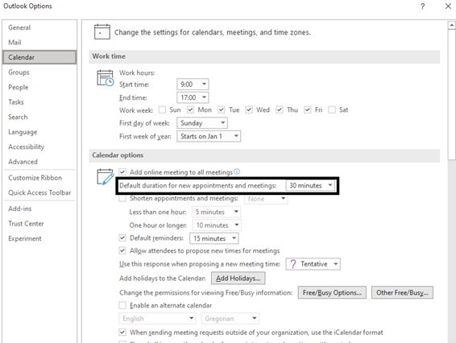
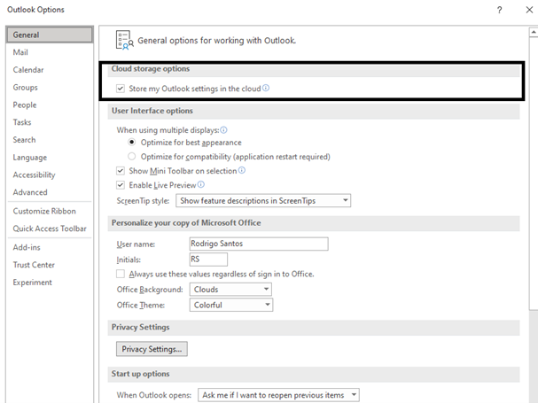

Scheduling Preferences
======================

Scheduler takes into account several Outlook preferences to schedule a meeting for an organizer. Any changes to their preference settings via Outlook clients will automatically be reflected in how Scheduler handles the subsequent requests sent to Cortana. For instance, if an organizer changes their time zone preference on the Settings page in Outlook Web, all subsequent requests by the organizer will default to the new time zone value.

Supported Settings
------------------

Time zone
---------

The time zone used when determining an appropriate time to schedule meetings. See [Add, remove, or change time zones](https://support.microsoft.com/en-us/office/add-remove-or-change-time-zones-5ab3e10e-5a6c-46af-ab48-156fedf70c04) documentation.

Work hours and days
-------------------

For most meeting types, Scheduler will schedule a time according to the organizer's work week and meeting hours preferences. See [Change your work hours and days in Outlook](https://support.microsoft.com/en-us/office/change-your-work-hours-and-days-in-outlook-a27f261d-0681-415f-8ac1-388ab21e833f) documentation.

Online meetings
---------------

You can turn on a Calendar option so that all the meetings you schedule from Outlook and Scheduler will be held online with conference details. Scheduler currently supports Teams and Skype as meeting providers. See [Make all meetings Teams meetings](https://support.microsoft.com/en-us/office/schedule-a-teams-meeting-from-outlook-883cc15c-580f-441a-92ea-0992c00a9b0f#bkmk_makeallteamsmtngs) documentation.

Default meeting duration
------------------------

If the organizer does not specify the desired meeting duration in the request, Scheduler will use the preferred meeting duration for the request. This setting is only available in the Windows Outlook client.

1. Click on **File** > **Options** 

2. Select **Calendar** in the **Navigation Pane**.

3. The default duration setting is located under **Calendar** **Options**.

Avoid back-to-back meetings
---------------------------

Outlook now has a setting that automatically starts meetings late or ends meetings early to avoid back-to-back meetings. If set, Scheduler will also shorten the meeting duration according to the preference setting. See [Change default meeting length](https://techcommunity.microsoft.com/t5/hybrid-work/change-default-meeting-length-in-outlook-avoid-back-to-back/m-p/1247361) in Outlook documentation.

Additional Note
===============

- If you use the Windows client, you must set the following option to ensure that your preferences are synced across Scheduler and other Outlook clients:

