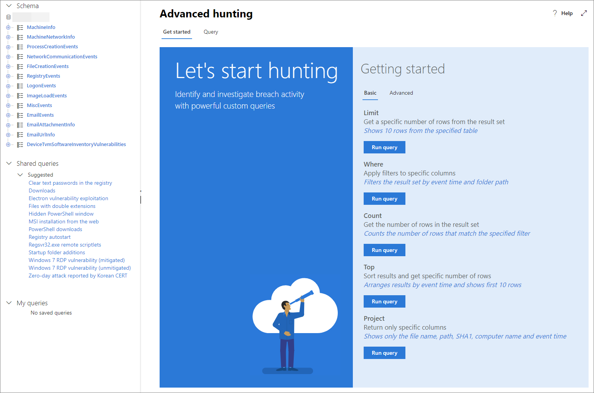

# Use shared and sample queries in advanced hunting

**Applies to**:
- Microsoft 365

## Try the sample queries to learn the language

To get you started in querying your data, you can use the basic or Advanced query examples that have some preloaded queries for you to understand the basic query syntax.

## Use shared queries
Shared queries are prepopulated queries that give you a starting point on running queries on your organization's data. It includes a couple of examples that help demonstrate the query language capabilities.

You can save, edit, update, or delete queries.

## Save and share queries
You can create or modify a query and save it as your own query or share it with users who are in the same tenant. 

1. Create or modify a query. 

2. Click the **Save query** drop-down button and select **Save as**.
    
3. Enter a name for the query. 

   

4. Select the folder where you'd like to save the query.
    - Shared queries - Allows other users in the tenant to access the query
    - My query - Accessible only to the user who saved the query
    
5. Click **Save**. 

### Update a query
These steps guide you on modifying and overwriting an existing query.

1. Edit an existing query. 

2. Click the **Save**.

### Delete a query
1. Right-click on a query you want to delete.

    

2. Select **Delete** and confirm that you want to delete the query.

## Public Advanced hunting query GitHub repository  
Check out the [Advanced hunting repository](https://github.com/Microsoft/WindowsDefenderATP-Hunting-Queries). Contribute and use example queries shared by our customers. 

>Want to experience Microsoft Defender ATP? [Sign up for a free trial.](https://www.microsoft.com/en-us/WindowsForBusiness/windows-atp?ocid=docs-wdatp-advancedhunting-belowfoldlink)

## Advanced hunting queries on threat analytics
Along with threat analytics reports, Microsoft security researchers, also provide advanced hunting queries that you can use to locate activities and indicators that can be associated with the reported threats. For more information...  

## Related topics
- [Proactively hunt for threats](advanced-hunting.md)
- [Learn the query language](advanced-hunting-language-overview.md)
- [Understand the data tables](advanced-hunting-schema-tables.md)
- [Understand the data columns](advanced-hunting-column-reference.md)
- [Find miscellaneous events](advanced-hunting-misc-events.md)
- [Apply query best practices](advanced-hunting-best-practices.md)

