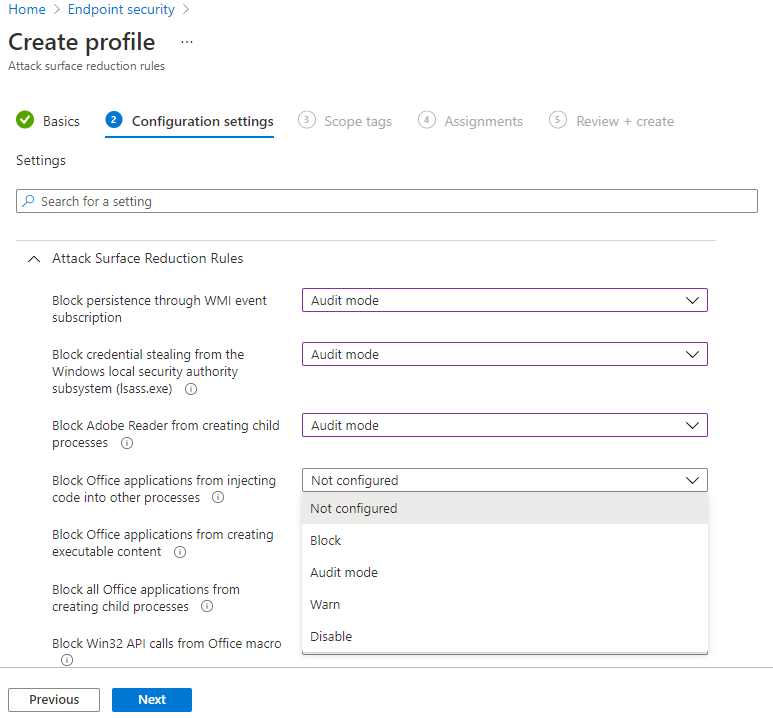
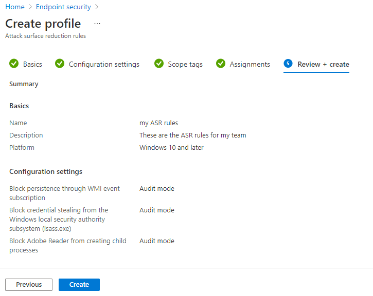

# Phase 2 - test

Begin your ASR  rules deployment with ring 1.

> [!div class="mx-imgBorder"]
> 

## Step 1: Test ASR rules using Audit

Begin the testing phase by turning on the ASR rules with the rules set to Audit, starting with your champion users or devices in ring 1. Typically, the recommendation is that you enable all the rules (in Audit) so that you can determine which rules are triggered during the testing phase. Note that rules that are set to Audit do not generally impact functionality of the entity or entities to which the rule is applied but do generate logged events for the evaluation; there is no effect on end users.

### Configure ASR Rules using MEM

You can use Microsoft Endpoint Manager (MEM) Endpoint Security to configure custom ASR rules.

1. Open [Microsoft Endpoint Manager admin center](https://endpoint.microsoft.com/#home)
2. Go to **Endpoint Security** > **Attack surface reduction**.
3. Select **Create Policy**.
4. In **Platform**, select **Windows 10 and later**, and in **Profile**, select **Attack surface reduction rules**.
  
    > [!div class="mx-imgBorder"]
    > 

5. Click **Create**.
6. In the **Basics** tab of the **Create profile** pane, in **Name** add a name for your policy. In **Description** add a description for your ASR rules policy.
7. In the **Configuration settings** tab, under **Attack Surface Reduction Rules**, set all rules to **Audit mode**.

    > [!div class="mx-imgBorder"]
    > 

    >[!Note]
    >There are variations in some ASR rules mode listings; _Blocked_ and _Enabled_ provide the same functionality.

8. [Optional] In the **Scope tags** pane, you can add tag information to specific devices. You can also use role-based access control and scope tags to make sure that the right admins have the right access and visibility to the right Intune objects. Learn more: [Use role-based access control (RBAC) and scope tags for distributed IT in Intune](/mem/intune/fundamentals/scope-tags).
9. In the **Assignments** pane, you can deploy or "assign" the profile to your user or device groups. Learn more: [Assign device profiles in Microsoft Intune](/mem/intune/configuration/device-profile-assign#exclude-groups-from-a-profile-assignment)
10. Review your settings in the **Review + create** pane. Click **Create** to apply the rules.

   > [!div class="mx-imgBorder"]
   > 

Your new attack surface reduction policy for ASR rules is listed in **Endpoint security | Attack surface reduction**.

   > [!div class="mx-imgBorder"]
   > 

## Step 2: Understand the Attack surface reduction rules reporting page in the Microsoft 365 Defender portal

The ASR  rules reporting page is found in **Microsoft 365 Defender portal** > **Reports** > **Attack surface reduction rules**. This page has three tabs:

- Detections
- Configuration
- Add exclusions

### Detections tab

Provides a 30-day timeline of detected audit and blocked events.

> [!div class="mx-imgBorder"]
> 

The Attack Surface reduction rules pane provides an overview of detected events on a per-rule basis.

>[!Note]
>There are some variations in ASR rules reports. Microsoft is in the process of updating the behavior of the ASR rules reports to provide a consistent experience.

> [!div class="mx-imgBorder"]
> 

Click **View detections** to open the **Detections** tab.

> [!div class="mx-imgBorder"]
> 

The **GroupBy** and **Filter** pane provide the following options:

The **GroupBy** returns results set to the following groups:

- No grouping
- Detected file
- Audit or block
- Rule
- Source app
- Device
- User
- Publisher

> [!div class="mx-imgBorder"]
> 

**Filter** opens the **Filter on rules** page, which enables you to scope the results to only the selected ASR rules:

> [!div class="mx-imgBorder"]
> 

>[!Note]
>If you have a Microsoft Microsoft 365 Security E5 or A5, Windows E5 or A5 license, the following link opens the Microsoft Defender 365  Reports > [Attack surface reductions](https://security.microsoft.com/asr?viewid=detections) > Detections tab.

### Configuration tab

Lists – on a per-computer basis – the aggregate state of ASR rules: Off, Audit, Block.

> [!div class="mx-imgBorder"]
> 

On the Configurations tab, you can check – on a per-device basis – which ASR rules are enabled, and in which mode, by selecting the device for which you want to review ASR rules.

> [!div class="mx-imgBorder"]
> 

The **Get started** link opens the Microsoft Endpoint Manager admin center, where you can create or modify an endpoint protection policy for ASR:

> [!div class="mx-imgBorder"]
> 

In Endpoint security | Overview, select **Attack surface reduction**:

> [!div class="mx-imgBorder"]
> 

The Endpoint Security | Attack surface reduction pane opens:

> [!div class="mx-imgBorder"]
> 

>[!Note]
>If you have a Microsoft Defender 365 E5 (or Windows E5?) license, this link will open the Microsoft Defender 365  Reports > Attack surface reductions > [Configurations](https://security.microsoft.com/asr?viewid=configuration) tab.

### Add exclusions

This tab provides a method to select detected entities (for example, false positives) for exclusion. When exclusions are added, the report provides a summary of the expected impact.

>[!Note]
> Microsoft Defender Antivirus AV exclusions are honored by ASR rules.  See [Configure and validate exclusions based on extension, name, or location](configure-extension-file-exclusions-microsoft-defender-antivirus.md).

> [!div class="mx-imgBorder"]
> 

> [!Note]
>If you have a Microsoft Defender 365 E5 (or Windows E5?) license, this link will open the Microsoft Defender 365  Reports > Attack surface reductions > [Exclusions](https://security.microsoft.com/asr?viewid=exclusions) tab.

### Use PowerShell as an alternative method to enable ASR rules

You can use PowerShell - as an alternative to MEM - to enable ASR rules in audit mode to view a record of apps that would have been blocked if the feature was fully enabled. You can also get an idea of how often the rules will fire during normal use.

To enable an attack surface reduction rule in audit mode, use the following PowerShell cmdlet:

```PowerShell
Add-MpPreference -AttackSurfaceReductionRules_Ids <rule ID> -AttackSurfaceReductionRules_Actions AuditMode
```

Where `<rule ID>` is a [GUID value of the attack surface reduction rule](attack-surface-reduction-rules-reference.md).

To enable all the added attack surface reduction rules in audit mode, use the following PowerShell cmdlet:

```PowerShell
(Get-MpPreference).AttackSurfaceReductionRules_Ids | Foreach {Add-MpPreference -AttackSurfaceReductionRules_Ids $_ -AttackSurfaceReductionRules_Actions AuditMode}
```

> [!TIP]
> If you want to fully audit how attack surface reduction rules will work in your organization, you'll need to use a management tool to deploy this setting to devices in your network(s).

You can also use Group Policy, Intune, or mobile device management (MDM) configuration service providers (CSPs) to configure and deploy the setting. Learn more in the main [Attack surface reduction rules](attack-surface-reduction.md) article.

## Use Windows Event Viewer Review as an alternative to the attack surface reduction rules reporting page in the Microsoft 365 Defender portal

To review apps that would have been blocked, open Event Viewer and filter for Event ID 1121 in the Microsoft-Windows-Windows Defender/Operational log. The following table lists all network protection events.

Event ID | Description
-|-
 5007 | Event when settings are changed
 1121 | Event when an attack surface reduction rule fires in block mode
 1122 | Event when an attack surface reduction rule fires in audit mode

## Additional topics in this deployment collection

[ASR rules deployment overview](attack-surface-reduction-rules-deployment.md)

[Phase 1: Plan](attack-surface-reduction-rules-deployment-plan.md)

[Phase 3: Implement](attack-surface-reduction-rules-deployment-implement.md)

[Phase 4: Operationalize](attack-surface-reduction-rules-deployment-operationalize.md)
