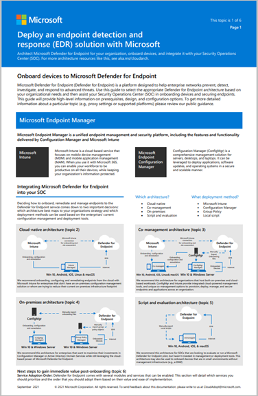

# Deploy Microsoft Defender for Endpoint in rings

[!INCLUDE [Microsoft 365 Defender rebranding](../../includes/microsoft-defender.md)]

**Applies to:**
- [Microsoft Defender for Endpoint](https://go.microsoft.com/fwlink/p/?linkid=2154037)
- [Microsoft 365 Defender](https://go.microsoft.com/fwlink/?linkid=2118804)

> Want to experience Defender for Endpoint? [Sign up for a free trial.](https://signup.microsoft.com/create-account/signup?products=7f379fee-c4f9-4278-b0a1-e4c8c2fcdf7e&ru=https://aka.ms/MDEp2OpenTrial?ocid=docs-wdatp-assignaccess-abovefoldlink)

Deploying Microsoft Defender for Endpoint can be done using a ring-based deployment approach.

The deployment rings can be applied in the following scenarios:

- [New deployments](#new-deployments)
- [Existing deployments](#existing-deployments)

## New deployments

A ring-based approach is a method of identifying a set of endpoints to onboard and verifying that certain criteria is met before proceeding to deploy the service to a larger set of devices. You can define the exit criteria for each ring and ensure that they are satisfied before moving on to the next ring.

Adopting a ring-based deployment helps reduce potential issues that could arise while rolling out the service. By piloting a certain number of devices first, you can identify potential issues and mitigate potential risks that might arise.

Table 1 provides an example of the deployment rings you might use.

**Table 1**:

 

****

|Deployment ring|Description|
|---|---|
|Evaluate|Ring 1: Identify 50 systems for pilot testing|
|Pilot|Ring 2: Identify the next 50-100  endpoints in production environment|
|Full deployment|Ring 3: Roll out service to the rest of environment in larger increments|
|

### Exit criteria

An example set of exit criteria for these rings can include:

- Devices show up in the device inventory list
- Alerts appear in dashboard
- [Run a detection test](run-detection-test.md)
- [Run a simulated attack on a device](attack-simulations.md)

### Evaluate

Identify a small number of test machines in your environment to onboard to the service. Ideally, these machines would be fewer than 50 endpoints.

### Pilot

Microsoft Defender for Endpoint supports a variety of endpoints that you can onboard to the service. In this ring, identify several devices to onboard and based on the exit criteria you define, decide to proceed to the next deployment ring.

The following table shows the supported endpoints and the corresponding tool you can use to onboard devices to the service.

| Endpoint     | Deployment tool                       |
|--------------|------------------------------------------|
| **Windows**  |  [Local script (up to 10 devices)](configure-endpoints-script.md)   NOTE: If you want to deploy more than 10 devices in a production environment, use the Group Policy method instead or the other supported tools listed below.   [Group Policy](configure-endpoints-gp.md)    [Microsoft Endpoint Manager/ Mobile Device Manager](configure-endpoints-mdm.md)     [Microsoft Endpoint Configuration Manager](configure-endpoints-sccm.md)   [VDI scripts](configure-endpoints-vdi.md)   [Integration with Azure Defender](configure-server-endpoints.md#integration-with-azure-defender)  |
| **macOS**    | [Local script](mac-install-manually.md)   [Microsoft Endpoint Manager](mac-install-with-intune.md)   [JAMF Pro](mac-install-with-jamf.md)   [Mobile Device Management](mac-install-with-other-mdm.md) |
| **Linux Server** | [Local script](linux-install-manually.md)   [Puppet](linux-install-with-puppet.md)   [Ansible](linux-install-with-ansible.md)|
| **iOS**      | [Microsoft Endpoint Manager](ios-install.md)                                |
| **Android**  | [Microsoft Endpoint Manager](android-intune.md)               |

### Full deployment

At this stage, you can use the [Plan deployment](deployment-strategy.md) material to help you plan your deployment.

Use the following material to select the appropriate Microsoft Defender for Endpoint architecture that best suites your organization.

|**Item**|**Description**|
|:-----|:-----|
|  [PDF](https://download.microsoft.com/download/5/6/0/5609001f-b8ae-412f-89eb-643976f6b79c/mde-deployment-strategy.pdf)  \| [Visio](https://download.microsoft.com/download/5/6/0/5609001f-b8ae-412f-89eb-643976f6b79c/mde-deployment-strategy.vsdx) | The architectural material helps you plan your deployment for the following architectures: <ul><li> Cloud-native </li><li> Co-management </li><li> On-premise</li><li>Evaluation and local onboarding</li></ul>

## Existing deployments

### Windows endpoints

For Windows and/or Windows Servers, you select several machines to test ahead of time (before patch Tuesday) by using the **Security Update Validation program (SUVP)**.

For more information, see:

- [What is the Security Update Validation Program](https://techcommunity.microsoft.com/t5/windows-it-pro-blog/what-is-the-security-update-validation-program/ba-p/275767)
- [Software Update Validation Program and Microsoft Malware Protection Center Establishment - TwC Interactive Timeline Part 4](https://www.microsoft.com/security/blog/2012/03/28/software-update-validation-program-and-microsoft-malware-protection-center-establishment-twc-interactive-timeline-part-4/)

### Non-Windows endpoints

With macOS and Linux, you could take a couple of systems and run in the Beta channel.

> [!NOTE]
> Ideally at least one security admin and one developer so that you are able to find compatibility, performance and reliability issues before the build makes it into the Current channel.

The choice of the channel determines the type and frequency of updates that are offered to your device. Devices in Beta are the first ones to receive updates and new features, followed later by Preview and lastly by Current.

In order to preview new features and provide early feedback, it is recommended that you configure some devices in your enterprise to use either Beta or Preview.

> [!WARNING]
> Switching the channel after the initial installation requires the product to be reinstalled. To switch the product channel: uninstall the existing package, re-configure your device to use the new channel, and follow the steps in this document to install the package from the new location.
