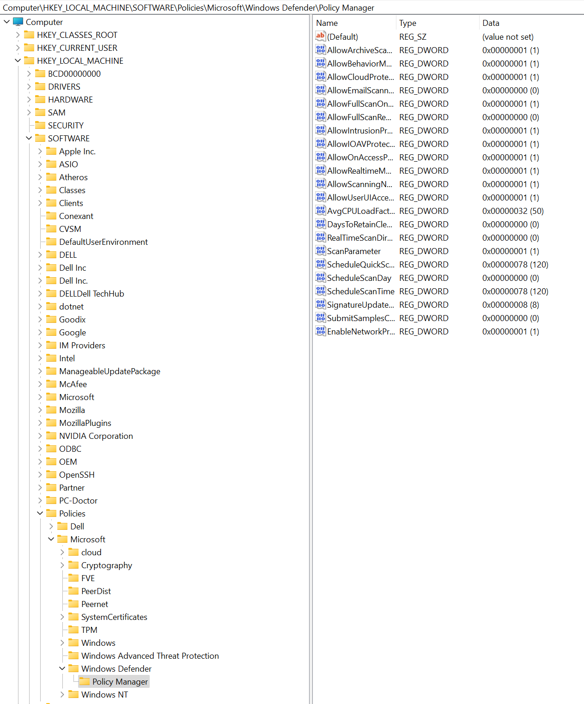

# Turn on network protection

[!INCLUDE [Microsoft 365 Defender rebranding](../../includes/microsoft-defender.md)]

**Applies to:**
- [Microsoft Defender for Endpoint](https://go.microsoft.com/fwlink/p/?linkid=2154037)
- [Microsoft 365 Defender](https://go.microsoft.com/fwlink/?linkid=2118804)

> [!TIP]
> Want to experience Defender for Endpoint? [Sign up for a free trial.](https://signup.microsoft.com/create-account/signup?products=7f379fee-c4f9-4278-b0a1-e4c8c2fcdf7e&ru=https://aka.ms/MDEp2OpenTrial?ocid=docs-wdatp-assignaccess-abovefoldlink)

[Network protection](network-protection.md) helps to prevent employees from using any application to access dangerous domains that may host phishing scams, exploits, and other malicious content on the internet. You can [audit network protection](evaluate-network-protection.md) in a test environment to view which apps would be blocked before you enable it.

[Learn more about network filtering configuration options](/mem/intune/protect/endpoint-protection-windows-10#network-filtering)

## Check if network protection is enabled

Check if network protection has been enabled on a local device by using Registry editor.

1. Select the **Start** button in the task bar and type **regedit** to open Registry editor.

2. Choose **HKEY_LOCAL_MACHINE** from the side menu.

3. Navigate through the nested menus to **SOFTWARE** \> **Policies** \> **Microsoft** \> **Windows Defender** \> **Windows Defender Exploit Guard** \> **Network Protection**.

4. Select **EnableNetworkProtection** to see the current state of network protection on the device:

   - 0, or **Off**
   - 1, or **On**
   - 2, or **Audit** mode

    

## Enable network protection

Enable network protection by using any of these methods:

- [PowerShell](#powershell)
- [Mobile Device Management (MDM)](#mobile-device-management-mdm)
- [Microsoft Endpoint Manager / Intune](#microsoft-endpoint-manager-formerly-intune)
- [Group Policy](#group-policy)
- [System Center Configuration Manager (SCCM)](#system-center-configuration-manager-sccm)

### PowerShell

1. Type **powershell** in the Start menu, right-click **Windows PowerShell** and select **Run as administrator**.
2. Enter the following cmdlet:

    ```PowerShell
    Set-MpPreference -EnableNetworkProtection Enabled
    ```

3. Optional: Enable the feature in audit mode using the following cmdlet:

    ```PowerShell
    Set-MpPreference -EnableNetworkProtection AuditMode
    ```

    Use `Disabled` instead of `AuditMode` or `Enabled` to turn off the feature.

### Mobile device management (MDM)

Use the [./Vendor/MSFT/Policy/Config/Defender/EnableNetworkProtection](/windows/client-management/mdm/policy-csp-defender) configuration service provider (CSP) to enable or disable network protection or enable audit mode.

### Microsoft Endpoint Manager (formerly Intune)

1. Sign into the Microsoft Endpoint Manager admin center (https://endpoint.microsoft.com).

2. Go to **Devices** > **Configuration profiles** > **Create profile**.

3. In the **Create a profile** flyout, select **Endpoint protection** from the list of templates, and then select **Create**.

4. Go to **Endpoint protection** > **Basics**, provide a name for your profile, and then select **Next**.

5. In the **Configuration settings** section, go to **Microsoft Defender Exploit Guard** > **Network filtering** > **Network protection** > **Enable** or **Audit**. Select **Next**.

6. Select the appropriate **Scope tags**, **Assignments**, and **Applicability rules** as required by your organization. Admins can set more requirements.

7. Review all the information, and then select **Create**.

### Group Policy

Use the following procedure to enable network protection on domain-joined computers or on a standalone computer.

1. On a standalone computer, go to **Start** and then type and select **Edit group policy**.

    *-Or-*

    On a domain-joined Group Policy management computer, open the [Group Policy Management Console](https://technet.microsoft.com/library/cc731212.aspx), right-click the Group Policy Object you want to configure and select **Edit**.

2. In the **Group Policy Management Editor**, go to **Computer configuration** and select **Administrative templates**.

3. Expand the tree to **Windows components** \> **Microsoft Defender Antivirus** \> **Windows Defender Exploit Guard** \> **Network protection**.

   > [!NOTE]
   > On older versions of Windows, the group policy path may say "Windows Defender Antivirus" instead of "Microsoft Defender Antivirus."

4. Double-click the **Prevent users and apps from accessing dangerous websites** setting and set the option to **Enabled**. In the options section, you must specify one of the following options:
    - **Block** - Users can't access malicious IP addresses and domains.
    - **Disable (Default)** - The Network protection feature won't work. Users won't be blocked from accessing malicious domains.
    - **Audit Mode** - If a user visits a malicious IP address or domain, an event will be recorded in the Windows event log. However, the user won't be blocked from visiting the address.

> [!IMPORTANT]
> To fully enable network protection, you must set the Group Policy option to **Enabled** and also select **Block** in the options drop-down menu.

Confirm network protection is enabled on a local computer by using Registry editor:

1. Select **Start** and type **regedit** to open **Registry Editor**.

2. Navigate to **HKEY_LOCAL_MACHINE\SOFTWARE\Policies\Microsoft\Windows Defender\Windows Defender Exploit Guard\Network Protection\EnableNetworkProtection**

3. Select **EnableNetworkProtection** and confirm the value:
   - 0=Off
   - 1=On
   - 2=Audit

### System Center Configuration Manager (SCCM)

1. To enable network protection, open the SCCM console.

2. Go to **Assets and Compliance** > **Endpoint Protection** > **Windows Defender Exploit Guard**. 

3. Right-click **Windows Defender Exploit Guard**. 

4. Click **Create Exploit Guard Policy**. This opens **MDEG-NP - Audit mode**. 

5. Under **Enable Exploit Guard components**, turn on **Network Protection**.  

## See also

- [Network protection](network-protection.md)

- [Network protection and the TCP three-way handshake](network-protection.md#network-protection-and-the-tcp-three-way-handshake)

- [Evaluate network protection](evaluate-network-protection.md)

- [Troubleshoot network protection](troubleshoot-np.md)
