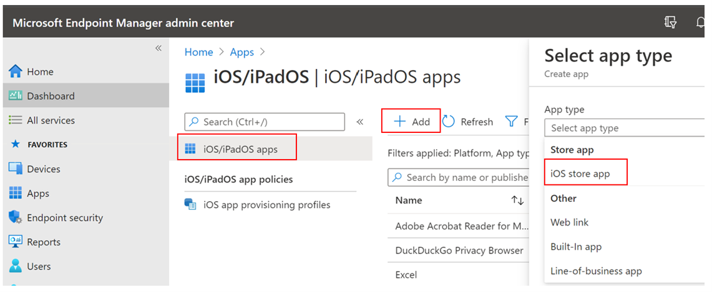
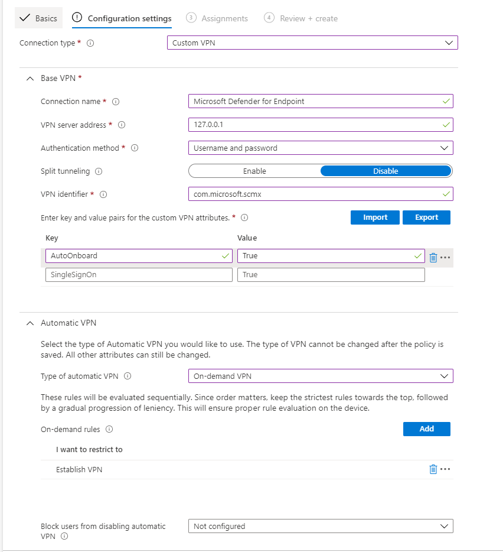
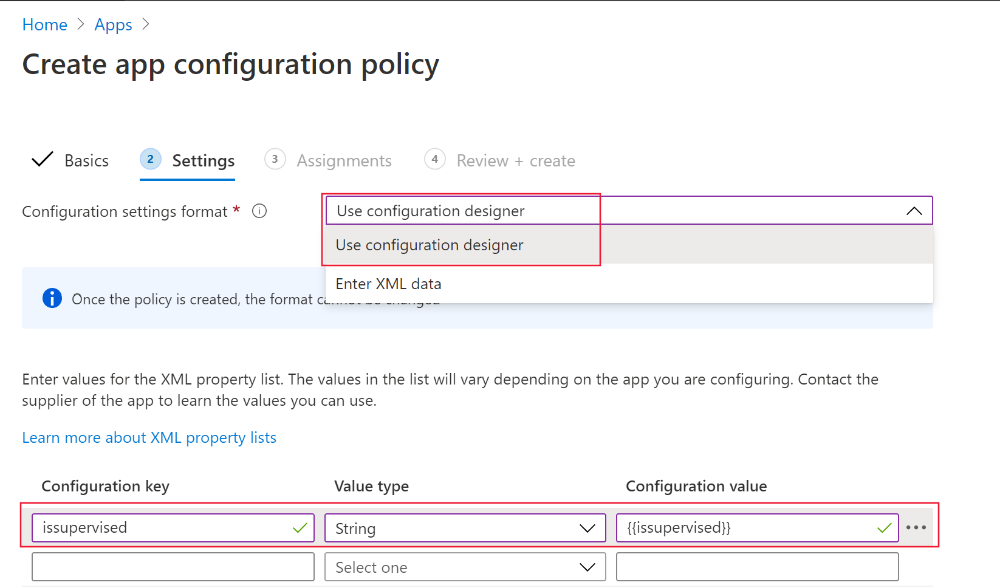

# Deploy Microsoft Defender for Endpoint on iOS

[!INCLUDE [Microsoft 365 Defender rebranding](../../includes/microsoft-defender.md)]

**Applies to:**
- [Microsoft Defender for Endpoint](https://go.microsoft.com/fwlink/p/?linkid=2154037)
- [Microsoft 365 Defender](https://go.microsoft.com/fwlink/?linkid=2118804)

> Want to experience Defender for Endpoint? [Sign up for a free trial.](https://www.microsoft.com/microsoft-365/windows/microsoft-defender-atp?ocid=docs-wdatp-investigateip-abovefoldlink)

This topic describes deploying Defender for Endpoint on iOS on Intune Company Portal enrolled devices. For more information about Intune device enrollment, see [Enroll iOS/iPadOS devices in Intune](/mem/intune/enrollment/ios-enroll).

## Before you begin

- Ensure you have access to [Microsoft Endpoint manager admin center](https://go.microsoft.com/fwlink/?linkid=2109431).

- Ensure iOS enrollment is done for your users. Users need to have a Defender for Endpoint license assigned in order to use Defender for Endpoint on iOS. Refer to [Assign licenses to users](/azure/active-directory/users-groups-roles/licensing-groups-assign) for instructions on how to assign licenses.

> [!NOTE]
> Microsoft Defender for Endpoint on iOS is available in the [Apple App Store](https://aka.ms/mdatpiosappstore).

## Deployment steps

Deploy Defender for Endpoint on iOS via Intune Company Portal.

### Add iOS store app

1. In [Microsoft Endpoint manager admin center](https://go.microsoft.com/fwlink/?linkid=2109431), go to **Apps** -> **iOS/iPadOS** -> **Add** -> **iOS store app** and click **Select**.

    > [!div class="mx-imgBorder"]
    > 

1. On the Add app page, click on **Search the App Store** and type **Microsoft Defender Endpoint** in the search bar. In the search results section, click on *Microsoft Defender Endpoint* and click **Select**.

1. Select **iOS 11.0** as the Minimum operating system. Review the rest of information about the app and click **Next**.

1. In the *Assignments* section, go to the **Required** section and select **Add group**. You can then choose the user group(s) that you would like to target Defender for Endpoint on iOS app. Click **Select** and then **Next**.

    > [!NOTE]
    > The selected user group should consist of Intune enrolled users.

    > [!div class="mx-imgBorder"]
    > 

1. In the *Review + Create* section, verify that all the information entered is correct and then select **Create**. In a few moments, the Defender for Endpoint app should be created successfully, and a notification should show up at the top-right corner of the page.

1. In the app information page that is displayed, in the **Monitor** section, select **Device install status** to verify that the device installation has completed successfully.

    > [!div class="mx-imgBorder"]
    > 

## Auto-Onboarding of VPN profile (Simplified Onboarding)

Admins can configure auto-setup of VPN profile. This will automatically setup the Defender for Endpoint VPN profile without having the user to do so while onboarding. Note that VPN is used in order to provide the Web Protection feature. This is not a regular VPN and is a local/self-looping VPN that does not take traffic outside the device.

1. In [Microsoft Endpoint manager admin center](https://go.microsoft.com/fwlink/?linkid=2109431), go to **Devices** -> **Configuration Profiles** -> **Create Profile**.
1. Choose **Platform** as **iOS/iPadOS** and **Profile type** as **VPN**. Click **Create**.
1. Type a name for the profile and click **Next**.
1. Select **Custom VPN** for Connection Type and in the **Base VPN** section, enter the following:
    - Connection Name = Microsoft Defender for Endpoint
    - VPN server address = 127.0.0.1
    - Auth method = "Username and password"
    - Split Tunneling = Disable
    - VPN identifier = com.microsoft.scmx
    - In the key-value pairs, enter the key **AutoOnboard** and set the value to **True**.
    - Type of Automatic VPN = On-demand VPN
    - Click **Add** for **On Demand Rules** and select **I want to do the following = Establish VPN**, **I want to restrict to = All domains**.

    

1. Click Next and assign the profile to targeted users.
1. In the *Review + Create* section, verify that all the information entered is correct and then select **Create**.

## Complete onboarding and check status

1. Once Defender for Endpoint on iOS has been installed on the device, you
    will see the app icon.

    

2. Tap the Defender for Endpoint app icon (MSDefender) and follow the on-screen instructions to complete the onboarding steps. The details include end-user acceptance of iOS permissions required by Defender for Endpoint on iOS.

3. Upon successful onboarding, the device will start showing up on the Devices list in the Microsoft 365 Defender portal.

    > [!div class="mx-imgBorder"]
    > 

## Configure Microsoft Defender for Endpoint for Supervised Mode

The Microsoft Defender for Endpoint on iOS app has specialized ability on supervised iOS/iPadOS devices, given the increased management capabilities provided by the platform on these types of devices. To take advantage of these capabilities, the Defender for Endpoint app needs to know if a device is in Supervised Mode.

### Configure Supervised Mode via Intune

Intune allows you to configure the Defender for iOS app through an App Configuration policy.

   > [!NOTE]
   > This app configuration policy for supervised devices is applicable only to managed devices and should be targeted for all managed iOS devices as a best practice.

1. Sign in to the [Microsoft Endpoint Manager admin center](https://go.microsoft.com/fwlink/?linkid=2109431) and go to **Apps** > **App configuration policies** > **Add**. Click on **Managed devices**.

    > [!div class="mx-imgBorder"]
    > 

1. In the *Create app configuration policy* page, provide the following information:
    - Policy Name
    - Platform: Select iOS/iPadOS
    - Targeted app: Select **Microsoft Defender Endpoint** from the list

    > [!div class="mx-imgBorder"]
    > 

1. In the next screen, select **Use configuration designer** as the format. Specify the following property:
    - Configuration Key: issupervised
    - Value type: String
    - Configuration Value: {{issupervised}}
    
    > [!div class="mx-imgBorder"]
    > 

1. Click **Next** to open the **Scope tags** page. Scope tags are optional. Click **Next** to continue.

1. On the **Assignments** page, select the groups that will receive this profile. For this scenario, it is best practice to target **All Devices**. For more information on assigning profiles, see [Assign user and device profiles](/mem/intune/configuration/device-profile-assign).

   When deploying to user groups, a user must sign in to a device before the policy applies.

   Click **Next**.

1. On the **Review + create** page, when you're done, choose **Create**. The new profile is displayed in the list of configuration profiles.

1. Next, for enhanced Anti-phishing capabilities, you can deploy a custom profile on the supervised iOS devices. Follow the steps below:
    - Download the config profile from [https://aka.ms/mdatpiossupervisedprofile](https://aka.ms/mdatpiossupervisedprofile)
    - Navigate to **Devices** -> **iOS/iPadOS** -> **Configuration profiles** -> **Create Profile**

    > [!div class="mx-imgBorder"]
    > 

    - Provide a name of the profile. When prompted to import a Configuration profile file, select the one downloaded above.
    - In the **Assignment** section, select the device group to which you want to apply this profile. As a best practice, this should be applied to all managed iOS devices. Click **Next**.
    - On the **Review + create** page, when you're done, choose **Create**. The new profile is displayed in the list of configuration profiles.

## Next Steps

[Configure Defender for Endpoint on iOS features](ios-configure-features.md)
