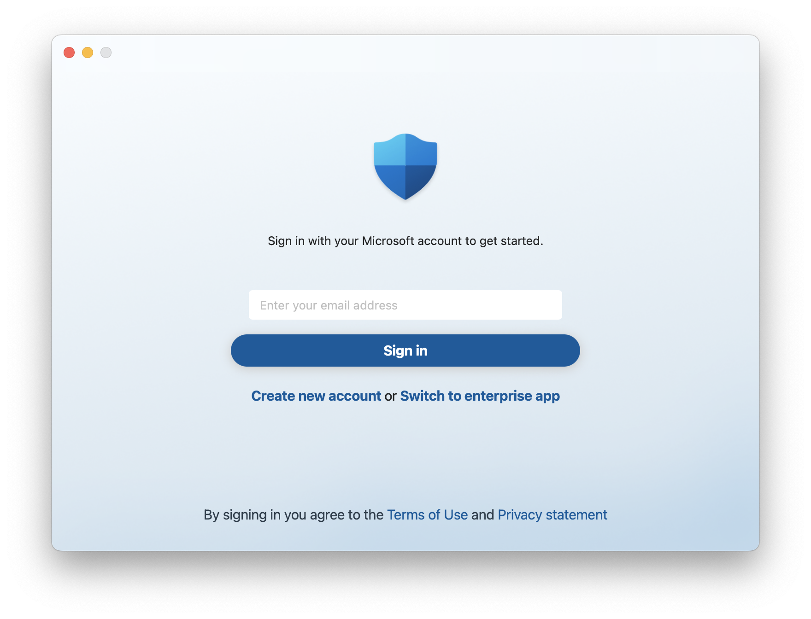

# Troubleshoot license issues for Microsoft Defender for Endpoint on macOS

[!INCLUDE [Microsoft 365 Defender rebranding](../../includes/microsoft-defender.md)]


**Applies to:**

- [Microsoft Defender for Endpoint on macOS](microsoft-defender-endpoint-mac.md)
- [Microsoft Defender for Endpoint Plan 1](https://go.microsoft.com/fwlink/p/?linkid=2154037)
- [Microsoft Defender for Endpoint Plan 2](https://go.microsoft.com/fwlink/p/?linkid=2154037)
- [Microsoft 365 Defender](https://go.microsoft.com/fwlink/?linkid=2118804)

> Want to experience Microsoft Defender for Endpoint? [Sign up for a free trial.](https://signup.microsoft.com/create-account/signup?products=7f379fee-c4f9-4278-b0a1-e4c8c2fcdf7e&ru=https://aka.ms/MDEp2OpenTrial?ocid=docs-wdatp-exposedapis-abovefoldlink)

## No license found

While you are going through [Microsoft Defender for Endpoint on macOS](microsoft-defender-endpoint-mac.md), you might get the following error:

The **x** symbol on top of the Microsoft Defender for Endpoint on macOS shield, as shown in the following screenshot:

:::image type="content" source="images/error-mde-mac-deployment.png" alt-text="The error displayed when deploying Microsoft Defender for Endpoint on macOS" lightbox="images/error-mde-mac-deployment.png":::

When you click the **x** symbol, you might options as shown in the following screenshot:

:::image type="content" source="images/x-symbol-menu-items.png" alt-text="The option listed when you click on the x symbol." lightbox="images/x-symbol-menu-items.png":::

When you click **Action needed**, you get the message as described in the following screenshot:

:::image type="content" source="images/license-not-found-message.png" alt-text="The message stating that there is no license for Microsoft 365 Enterprise subscription." lightbox="images/license-not-found-message.png":::

You will encounter this message in a different way: In the terminal, if you enter **mdatp health** without the double quotes, you might see the warning as shown in the following screenshot:

:::image type="content" source="images/no-license-found-warning.png" alt-text="The license-not-found message when using the terminal." lightbox="images/no-license-found-warning.png":::

### Cause:

The causes for the license-not-found error message could be either of the following causes:

1. You deployed and/or installed the Microsoft Defender for Endpoint on macOS package ("Download installation package"), but you might not have run the configuration script ("Download onboarding package") which contains the licensing settings.
1. The Microsoft Defender for Endpoint on macOS agent isn't up to date.
1. You haven't assigned a license to the user.

### Solution:

1. Depending on the deployment management tool used, follow the tool-specific instructions to onboard the package (register the license) as described in the following table:

    |Management  |License deployment instructions (Onboarding instructions)  |
    |---------|---------|
    |Intune     |    [Onboarding blob](mac-install-with-intune.md)      |
    |JamF     |    [Step 1: Get the Microsoft Defender for Endpoint onboarding package](mac-jamfpro-policies.md)     |
    |Other MDM     |     [License settings](mac-install-with-other-mdm.md)    |
    |Manual installation      |    [Download installation and onboarding packages](mac-install-manually.md); and [Client configuration](mac-install-manually.md#client-configuration)     |

    > [!NOTE]
    > If the onboarding package runs correctly, the licensing information will be located in `/Library/Application Support/Microsoft/Defender/com.microsoft.wdav.atp.plist`.

2. For scenarios where Microsoft Defender for Endpoint on macOS isn't up to date, you'll need to update the agent.

3. In the Microsoft 365 Defender portal (security.microsoft.com):
    1. Select **Settings**.
    1. Select **Endpoints**.
    1. Select **Licenses**.
    1. Select your license, and select **Assign licenses**.
    1. Enter the name or email address of the person to whom you want to assign this license.
    1. Check the **Microsoft Defender for Endpoint** checkbox.
    1. Select **Assign**.

On implementing these solution options (either of them), if the licensing issues have been resolved, and then you run **mdatp health**, you should see results that are shown in the following screenshot:

:::image type="content" source="images/results-after-license-issues-resolved.png" alt-text="The results that are displayed after running mdatp health, once the licensing issues have been resolved." lightbox="images/results-after-license-issues-resolved.png":::

## Sign in with your Microsoft account



### Message:

Sign in with your Microsoft account to get started.

Create new account or Switch to enterprise app.

### Cause:

You downloaded and installed [Microsoft Defender for individuals on macOS](https://www.microsoft.com/en-us/microsoft-365/microsoft-defender-for-individuals) on top of previously installed Microsoft Defender for Endpoint.

### Solution:

Click **Switch to enterprise app** to switch to Enterprise experience.

You can also suppress switching to experience for Individuals on MDM-enrolled machines by including **userInterface**/**consumerExperience** in the Defender's settings:

```json
<key>userInterface</key>
<dict>
    <key>consumerExperience</key>
    <string>disabled</string>
</dict>
```

## Recommended content

- [Manual deployment for Microsoft Defender for Endpoint on macOS](mac-install-manually.md): Install Microsoft Defender for Endpoint on macOS manually, from the command line.
- [Set up the Microsoft Defender for Endpoint on macOS policies in Jamf Pro](mac-jamfpro-policies.md): Learn how to set up the Microsoft Defender for Endpoint on macOS policies in Jamf Pro.
- [Microsoft Defender for Endpoint on Mac](microsoft-defender-endpoint-mac.md): Learn how to install, configure, update, and use Microsoft Defender for Endpoint on Mac.
- [Deploying Microsoft Defender for Endpoint on macOS with Jamf Pro](mac-install-with-jamf.md): Learn how to deploy Microsoft Defender for Endpoint on macOS with Jamf Pro.
